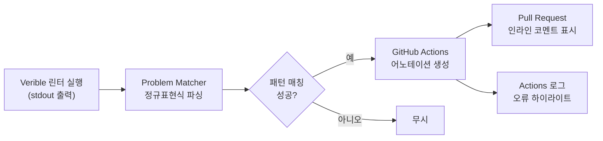

# verible-lint-matcher.json

## 개요

이 파일은 GitHub Actions에서 Verible 린터의 출력을 파싱하기 위한 **Problem Matcher** 설정 파일입니다. Problem Matcher는 도구의 표준 출력(stdout/stderr)에서 오류 및 경고 메시지를 정규표현식으로 추출하여 GitHub Actions UI의 어노테이션(Annotation)으로 표시합니다. 이를 통해 린트 오류가 발생한 파일, 라인, 컬럼 위치를 Pull Request 코드 리뷰 화면에 직접 표시할 수 있습니다.

## 블록 다이어그램



## 상세 내용

### 최상위 구조

| 키 | 타입 | 설명 |
|---|---|---|
| `problemMatcher` | 배열 | Problem Matcher 정의 목록 |

### problemMatcher 객체

| 키 | 값 | 설명 |
|---|---|---|
| `owner` | `"verible-lint-matcher"` | 이 매처의 고유 식별자. 동일한 `owner`로 새 매처를 등록하면 기존 매처를 덮어씀 |
| `pattern` | 배열 | 오류 메시지 파싱에 사용할 패턴 목록 |

### pattern 객체

| 키 | 값 | 설명 |
|---|---|---|
| `regexp` | `^(.+):(\d+):(\d+):\s(.+)$` | Verible 출력 형식에 맞춘 정규표현식 |
| `file` | `1` | 첫 번째 캡처 그룹 → 파일 경로 |
| `line` | `2` | 두 번째 캡처 그룹 → 라인 번호 |
| `column` | `3` | 세 번째 캡처 그룹 → 컬럼 번호 |
| `message` | `4` | 네 번째 캡처 그룹 → 오류 메시지 |

### 정규표현식 분석

```
^(.+):(\d+):(\d+):\s(.+)$
 ^^^^  ^^^^  ^^^^    ^^^^
 파일  라인  컬럼   메시지
```

Verible 린터의 표준 출력 형식은 다음과 같습니다:

```
src/example.sv:42:10: 오류 메시지 내용
```

이 정규표현식은 위 형식의 각 필드를 캡처 그룹으로 분리합니다.

## 의존성 및 관계

- **참조 워크플로우**: `.github/workflows/lint.yml` — `chipsalliance/verible-linter-action` 액션이 내부적으로 이 매처 파일을 사용하거나, 워크플로우 내에서 `::add-matcher::` 명령으로 등록하여 활성화합니다.
- **Verible 린터**: Google이 개발한 SystemVerilog/Verilog 구문 분석 및 린트 도구로, 이 매처가 파싱하는 출력 형식을 생성합니다.
- **GitHub Actions Problem Matcher**: GitHub Actions 러너가 지원하는 표준 기능으로, JSON 형식의 매처 파일을 통해 도구 출력을 어노테이션으로 변환합니다.
