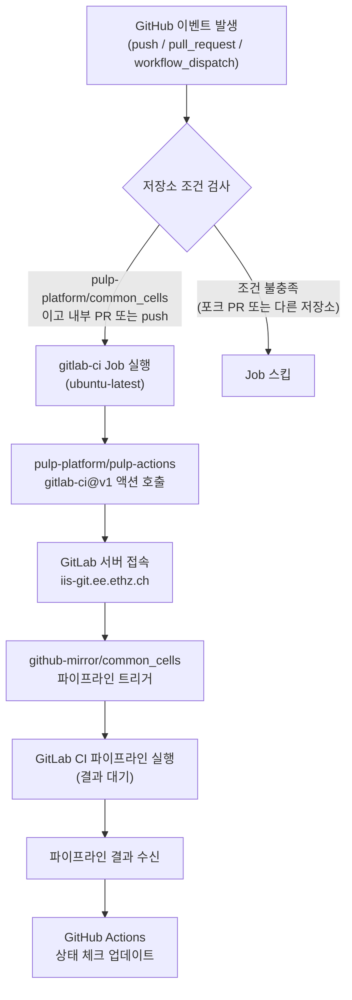

# gitlab-ci.yml

## 개요

이 파일은 GitHub Actions 워크플로우로, **GitHub 저장소의 변경사항을 ETH Zurich IIS GitLab 인스턴스의 미러 저장소에서 CI 파이프라인을 트리거하고 그 결과를 GitHub에 다시 보고하는** 브리지(Bridge) 역할을 합니다. pulp-platform 조직의 `common_cells` 저장소에서만 동작하며, 포크 저장소의 Pull Request는 처리하지 않아 시크릿 토큰 노출을 방지합니다.

- **라이선스**: Apache License 2.0 (Copyright 2023 ETH Zurich and University of Bologna)
- **작성자**: Nils Wistoff (nwistoff@iis.ee.ethz.ch)
- **참고**: [pulp-platform/pulp-actions/gitlab-ci](https://github.com/pulp-platform/pulp-actions/tree/main/gitlab-ci)

## 블록 다이어그램



## 상세 내용

### 트리거 이벤트 (`on`)

| 이벤트 | 설명 |
|---|---|
| `push` | 브랜치에 커밋이 푸시될 때 |
| `pull_request` | PR이 생성되거나 업데이트될 때 |
| `workflow_dispatch` | GitHub UI 또는 API를 통해 수동으로 트리거할 때 |

### Job: `gitlab-ci`

#### 실행 조건 (`if`)

```yaml
github.repository == 'pulp-platform/common_cells'
&& (github.event_name != 'pull_request'
    || github.event.pull_request.head.repo.full_name == github.repository)
```

두 가지 조건을 모두 만족해야 합니다:

1. **저장소 일치**: 반드시 `pulp-platform/common_cells` 저장소여야 함 (포크에서는 실행 안 됨)
2. **PR 출처 검증**: push/workflow_dispatch이거나, PR인 경우 head 브랜치가 원본 저장소에 있어야 함 (외부 포크 PR 차단 → GITLAB_TOKEN 시크릿 보호)

#### 실행 환경

| 키 | 값 |
|---|---|
| `runs-on` | `ubuntu-latest` |

#### Step: Check Gitlab CI

| 항목 | 값 | 설명 |
|---|---|---|
| `uses` | `pulp-platform/pulp-actions/gitlab-ci@v1` | PULP 플랫폼에서 제공하는 GitLab CI 브리지 액션 |
| `domain` | `iis-git.ee.ethz.ch` | ETH Zurich IIS GitLab 인스턴스의 도메인 |
| `repo` | `github-mirror/common_cells` | GitLab 상의 미러 저장소 경로 |
| `token` | `${{ secrets.GITLAB_TOKEN }}` | GitLab API 인증 토큰 (GitHub Secrets에 저장) |

### 보안 설계

- 외부 기여자(포크)의 Pull Request는 `if` 조건에 의해 차단됩니다.
- GitLab 토큰(`GITLAB_TOKEN`)이 외부 기여자의 워크플로우에 노출되는 것을 방지합니다.
- 내부 기여자(원본 저장소 멤버)의 브랜치에서 생성된 PR만 GitLab CI를 트리거합니다.

## 의존성 및 관계

| 의존 대상 | 종류 | 설명 |
|---|---|---|
| `pulp-platform/pulp-actions/gitlab-ci@v1` | GitHub Action | GitLab CI 브리지 로직을 구현한 외부 액션 |
| `iis-git.ee.ethz.ch` | 외부 서비스 | ETH Zurich IIS 내부 GitLab 인스턴스 |
| `github-mirror/common_cells` | GitLab 저장소 | GitHub 저장소의 GitLab 미러 (실제 CI 파이프라인 실행 위치) |
| `secrets.GITLAB_TOKEN` | GitHub Secret | GitLab API 접근을 위한 인증 토큰 |
| `.github/workflows/lint.yml` | 동일 저장소 | 병렬로 실행되는 린트 워크플로우 |
