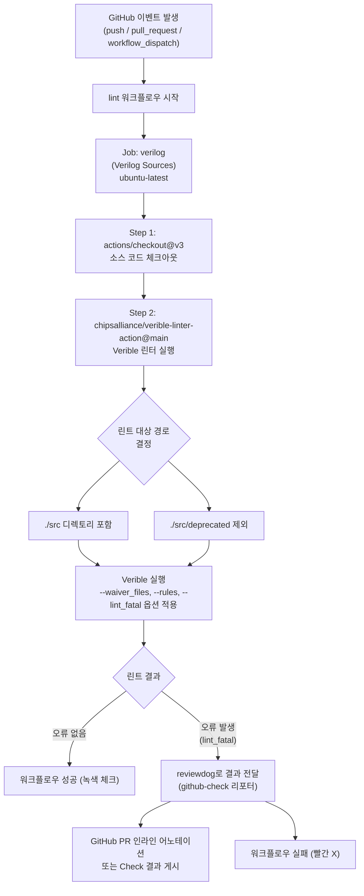

# lint.yml

## 개요

이 파일은 GitHub Actions 워크플로우로, **Verilog/SystemVerilog 소스 코드에 대해 Verible 정적 분석(린트)을 자동으로 실행**합니다. 코드 스타일 규칙 준수 여부를 검사하고, 위반 사항을 Pull Request의 인라인 코멘트 형태로 보고합니다. `./src` 디렉토리의 소스를 검사하되, 더 이상 사용하지 않는 `./src/deprecated` 경로는 제외합니다.

## 블록 다이어그램



## 상세 내용

### 트리거 이벤트 (`on`)

| 이벤트 | 설명 |
|---|---|
| `push` | 브랜치에 커밋이 푸시될 때 |
| `pull_request` | PR이 생성되거나 업데이트될 때 |
| `workflow_dispatch` | GitHub UI 또는 API를 통해 수동으로 트리거할 때 |

### Job: `verilog` — Verilog Sources

#### 실행 환경

| 키 | 값 |
|---|---|
| `name` | `Verilog Sources` |
| `runs-on` | `ubuntu-latest` |

#### Step 1: `actions/checkout@v3`

저장소 소스 코드를 Actions 러너에 체크아웃합니다. 이후 단계에서 `./src` 디렉토리에 접근하기 위해 필요합니다.

#### Step 2: `chipsalliance/verible-linter-action@main`

CHIPS Alliance에서 제공하는 Verible 린터 GitHub Action입니다.

| 파라미터 | 값 | 설명 |
|---|---|---|
| `paths` | `./src` | 린트를 수행할 대상 디렉토리 |
| `exclude_paths` | `./src/deprecated` | 린트에서 제외할 경로 (더 이상 사용하지 않는 코드) |
| `extra_args` | (아래 참조) | Verible 실행 시 전달할 추가 인수 |
| `github_token` | `${{ secrets.GITHUB_TOKEN }}` | reviewdog가 GitHub Check/코멘트를 게시하기 위한 토큰 |
| `reviewdog_reporter` | `github-check` | 결과 보고 방식: GitHub Checks API를 통해 어노테이션 표시 |

#### `extra_args` 상세 분석

```
--waiver_files lint/common_cells.style.waiver
--rules=-interface-name-style
--lint_fatal
```

| 옵션 | 설명 |
|---|---|
| `--waiver_files lint/common_cells.style.waiver` | 프로젝트 맞춤 웨이버 파일 지정. 이 파일에 정의된 규칙 예외를 허용 |
| `--rules=-interface-name-style` | `interface-name-style` 규칙을 비활성화 (인터페이스 명명 규칙 강제하지 않음) |
| `--lint_fatal` | 린트 위반이 하나라도 발생하면 비정상 종료 코드를 반환 → 워크플로우 실패 처리 |

### 결과 보고 방식

`reviewdog_reporter: github-check`를 사용하므로:
- GitHub Checks 탭에 린트 결과가 표시됩니다.
- Pull Request에서 변경된 파일의 인라인 어노테이션으로 위반 위치가 표시됩니다.
- `verible-lint-matcher.json` Problem Matcher와 함께 동작하여 출력을 파싱합니다.

## 의존성 및 관계

| 의존 대상 | 종류 | 설명 |
|---|---|---|
| `actions/checkout@v3` | GitHub Action | 소스 코드 체크아웃 |
| `chipsalliance/verible-linter-action@main` | GitHub Action | Verible 린터 실행 및 reviewdog 연동 |
| `secrets.GITHUB_TOKEN` | GitHub 내장 Secret | GitHub API 접근용 자동 발급 토큰 |
| `lint/common_cells.style.waiver` | 프로젝트 파일 | Verible 린트 규칙 예외 정의 파일 |
| `.github/verible-lint-matcher.json` | 프로젝트 파일 | Verible 출력 파싱용 Problem Matcher 정의 |
| `./src/` | 프로젝트 디렉토리 | 린트 대상 Verilog/SystemVerilog 소스 |
| `./src/deprecated/` | 프로젝트 디렉토리 | 린트 제외 대상 (레거시 코드) |
