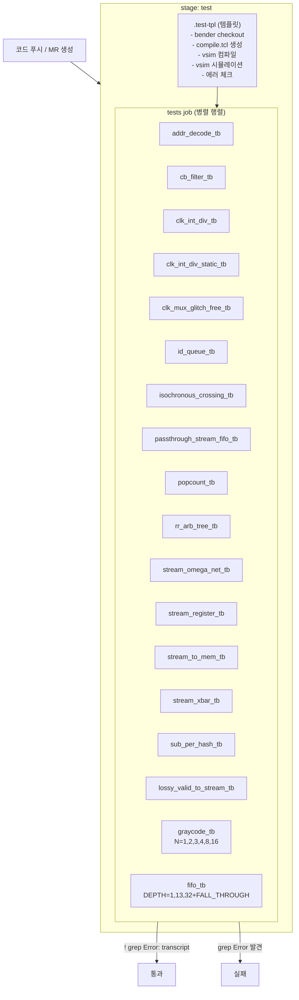
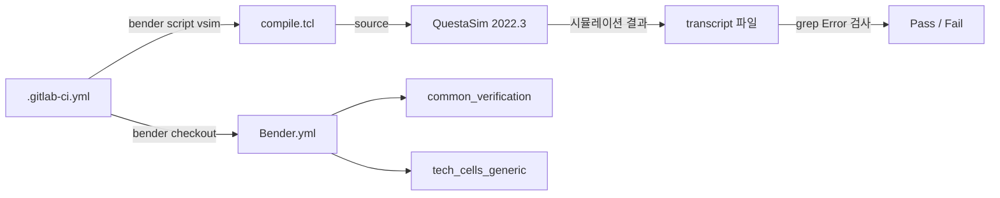

# .gitlab-ci.yml

## 개요

`.gitlab-ci.yml`은 `common_cells` 패키지의 **GitLab CI/CD** 파이프라인 설정 파일입니다. ETH Zurich의 라이선스 하에 작성되었으며(작성자: Nils Wistoff), **Questa Sim**(QuestaSim 2022.3)을 사용하여 다수의 SystemVerilog 테스트벤치를 병렬로 실행하는 자동화 테스트 파이프라인을 정의합니다.

## 블록 다이어그램



## 상세 내용

### 전역 변수 (variables)

CI 전체에서 사용하는 QuestaSim 2022.3 도구 명령어를 정의합니다.

| 변수명 | 값 | 설명 |
|--------|-----|------|
| `VSIM` | `questa-2022.3 vsim -64` | QuestaSim 시뮬레이터 (64비트 모드) |
| `VLIB` | `questa-2022.3 vlib` | 라이브러리 생성 도구 |
| `VMAP` | `questa-2022.3 vmap` | 라이브러리 매핑 도구 |
| `VCOM` | `questa-2022.3 vcom -64` | VHDL 컴파일러 (64비트 모드) |
| `VLOG` | `questa-2022.3 vlog -64` | Verilog/SV 컴파일러 (64비트 모드) |
| `VOPT` | `questa-2022.3 vopt -64` | 시뮬레이션 최적화 도구 (64비트 모드) |

### 스테이지 (stages)

| 스테이지 | 설명 |
|---------|------|
| `test` | 유일한 스테이지로, 모든 시뮬레이션 테스트를 실행 |

### 템플릿 잡 (`.test-tpl`)

`.test-tpl`은 재사용 가능한 CI 잡 템플릿입니다. `extends` 키워드로 다른 잡에서 상속합니다.

#### 템플릿 속성

| 항목 | 값 | 설명 |
|------|-----|------|
| `stage` | `test` | 소속 스테이지 |
| `needs` | (없음) | 선행 잡 없이 즉시 실행 |
| `timeout` | `10min` | 잡당 최대 실행 시간 |

#### 템플릿 변수

| 변수 | 기본값 | 설명 |
|------|--------|------|
| `TOPLEVEL` | `""` | 시뮬레이션할 최상위 모듈 이름 |
| `PARAM1` | `""` | 첫 번째 추가 파라미터 |
| `PARAM2` | `""` | 두 번째 추가 파라미터 |

#### 템플릿 스크립트 단계

```bash
# 1. Bender로 의존성 체크아웃
bender checkout

# 2. test 타겟용 QuestaSim 컴파일 스크립트 생성
bender script vsim -t test > compile.tcl

# 3. QuestaSim으로 소스 파일 컴파일 (배치 모드)
$VSIM -c -quiet -do 'source compile.tcl; quit'

# 4. 시뮬레이션 실행 (타임스케일 1ns/100ps)
$VSIM -c $TOPLEVEL -voptargs="-timescale 1ns/100ps" -do "run -all" $PARAM1 $PARAM2

# 5. 에러 검사 (transcript 파일에 "Error:" 문자열이 없어야 성공)
(! grep -n "Error:" transcript)
```

### `tests` 잡

`.test-tpl`을 상속하며, `parallel.matrix`를 사용하여 여러 테스트벤치를 **병렬**로 실행합니다.

#### 단순 병렬 테스트벤치 (파라미터 없음)

| 테스트벤치 | 검증 대상 기능 |
|-----------|--------------|
| `addr_decode_tb` | 주소 디코더 |
| `cb_filter_tb` | CB(Content-Based) 필터 |
| `clk_int_div_tb` | 클럭 정수 분주기 |
| `clk_int_div_static_tb` | 정적 클럭 정수 분주기 |
| `clk_mux_glitch_free_tb` | 글리치 프리 클럭 MUX |
| `id_queue_tb` | ID 큐 |
| `isochronous_crossing_tb` | 등시성 클럭 도메인 교차 |
| `passthrough_stream_fifo_tb` | 패스스루 스트림 FIFO |
| `popcount_tb` | 비트 팝카운트 |
| `rr_arb_tree_tb` | 라운드로빈 중재 트리 |
| `stream_omega_net_tb` | 오메가 네트워크 |
| `stream_register_tb` | 스트림 레지스터 |
| `stream_to_mem_tb` | 스트림→메모리 인터페이스 |
| `stream_xbar_tb` | 스트림 크로스바 |
| `sub_per_hash_tb` | 서브스크라이버 퍼 해시 |
| `lossy_valid_to_stream_tb` | 손실 허용 유효 신호→스트림 |

#### 파라미터화 테스트벤치

**`graycode_tb`** - 그레이 코드 변환 검증 (N 파라미터로 비트폭 변경)

| PARAM1 값 | 설명 |
|----------|------|
| `-GN=1` | 1비트 그레이 코드 |
| `-GN=2` | 2비트 그레이 코드 |
| `-GN=3` | 3비트 그레이 코드 |
| `-GN=4` | 4비트 그레이 코드 |
| `-GN=8` | 8비트 그레이 코드 |
| `-GN=16` | 16비트 그레이 코드 |

**`fifo_tb`** - FIFO 검증 (DEPTH 및 FALL_THROUGH 파라미터)

| PARAM1 값 | 설명 |
|----------|------|
| `-GDEPTH=1` | 깊이 1 FIFO |
| `-GDEPTH=13` | 깊이 13 FIFO |
| `-GDEPTH=32 -GFALL_THROUGH=1` | 깊이 32, 폴스루 모드 FIFO |

### 비활성화된 테스트 (주석 처리)

현재 비활성화된 테스트들로, 향후 재활성화가 예정되어 있습니다.

| 테스트벤치 | 비고 |
|-----------|------|
| `cdc_fifo_clearable_tb` | 전체 비활성화 |
| `cdc_2phase_tb` | `UNTIL=1000000` 파라미터 테스트 |
| `cdc_2phase_clearable_tb` | `UNTIL=1000000` 파라미터 테스트 |
| `cdc_fifo_tb` | DEPTH=1~5, GRAY=0/1 조합 테스트 |

## 의존성 및 관계



## 사용 방법

### 로컬에서 CI 스크립트 재현

```bash
# 1. 의존성 설치
bender checkout

# 2. 컴파일 스크립트 생성
bender script vsim -t test > compile.tcl

# 3. 소스 컴파일
questa-2022.3 vsim -c -quiet -do 'source compile.tcl; quit'

# 4. 특정 테스트벤치 실행
questa-2022.3 vsim -c fifo_tb -voptargs="-timescale 1ns/100ps" \
    -do "run -all" -GDEPTH=13

# 5. 에러 확인
grep -n "Error:" transcript && echo "FAIL" || echo "PASS"
```

### 새 테스트벤치 추가 방법

`.gitlab-ci.yml`의 `TOPLEVEL` 목록에 테스트벤치 이름을 추가합니다:

```yaml
- TOPLEVEL:
    - addr_decode_tb
    - your_new_tb    # 새로 추가
```
