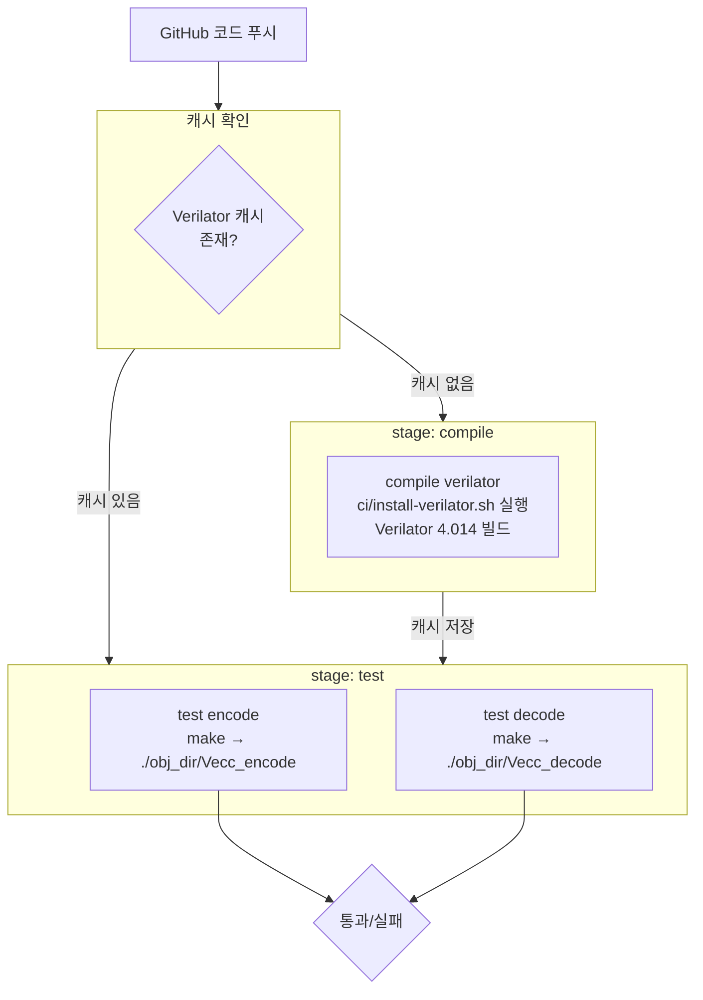
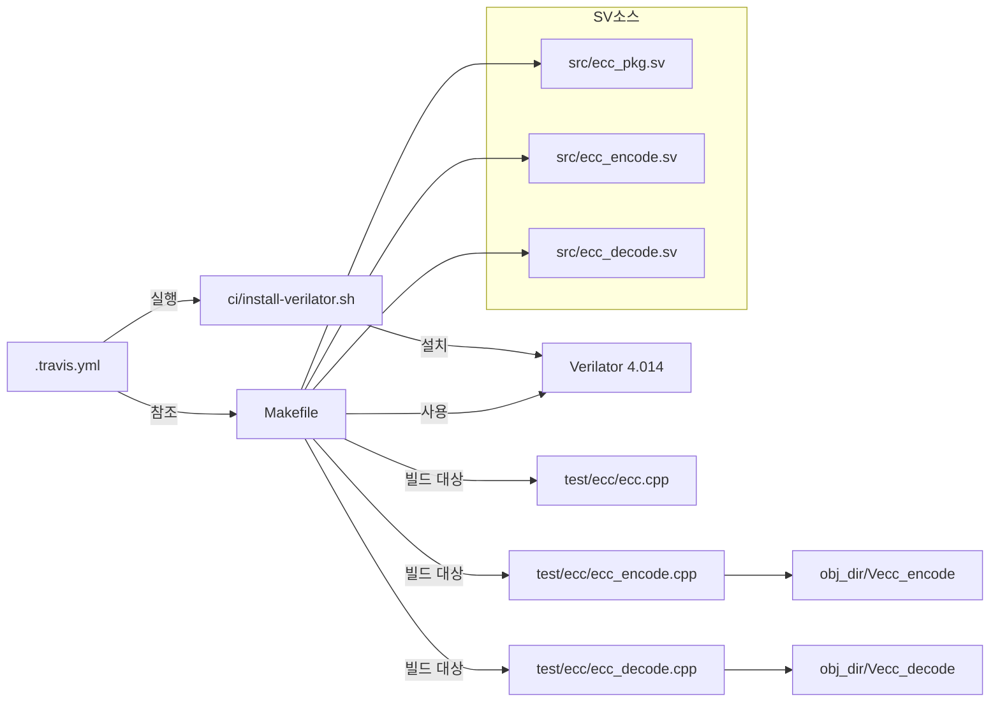

# .travis.yml

## 개요

`.travis.yml`은 `common_cells` 패키지의 **Travis CI** 파이프라인 설정 파일입니다. **C++ 언어** 기반 프로젝트로 설정되어 있으며, Verilator 4.014를 설치하고 ECC(에러 정정 코드) 인코더 및 디코더의 C++ 시뮬레이션을 검증합니다. GitLab CI(`.gitlab-ci.yml`)와 달리 Verilator + C++ 방식으로 검증을 수행합니다.

## 블록 다이어그램



## 상세 내용

### 기본 설정

| 항목 | 값 | 설명 |
|------|-----|------|
| `language` | `cpp` | C++ 프로젝트로 설정 |

### 캐시 설정 (cache)

빌드 속도 향상을 위해 패키지와 Verilator 설치 디렉토리를 캐싱합니다.

| 항목 | 값 | 설명 |
|------|-----|------|
| `apt` | `true` | APT 패키지 캐시 활성화 |
| `directories` | `$VERILATOR_ROOT` | Verilator 설치 디렉토리 캐시 |
| `timeout` | `1000` | 캐시 업로드 타임아웃(초) |

### 환경 변수 (env.global)

| 변수 | 값 | 설명 |
|------|-----|------|
| `VERILATOR_ROOT` | `/home/travis/verilator-4.014/` | Verilator 설치 경로 |

### APT 패키지 (addons.apt)

#### 소스 저장소

| 소스 | 설명 |
|------|------|
| `ubuntu-toolchain-r-test` | GCC 최신 버전 제공 PPA |

#### 설치 패키지

| 패키지 | 용도 |
|--------|------|
| `gcc-7` | GCC 7 C 컴파일러 |
| `g++-7` | GCC 7 C++ 컴파일러 |
| `gperf` | GNU 완전 해시 함수 생성기 |
| `autoconf` | 자동 설정 스크립트 생성 도구 |
| `automake` | 자동 Makefile 생성 도구 |
| `autotools-dev` | autotools 개발 유틸리티 |
| `libmpc-dev` | 다중 정밀도 복소수 라이브러리 |
| `libmpfr-dev` | 다중 정밀도 부동소수점 라이브러리 |
| `libgmp-dev` | GNU 다중 정밀도 산술 라이브러리 |
| `gawk` | GNU AWK 텍스트 처리 도구 |
| `build-essential` | 기본 빌드 도구 모음 |
| `bison` | 파서 생성기 |
| `flex` | 어휘 분석기 생성기 |
| `texinfo` | GNU 문서 시스템 |
| `python-pexpect` | Python 프로세스 제어 라이브러리 |
| `libusb-1.0-0-dev` | USB 라이브러리 |
| `default-jdk` | Java 개발 키트 |
| `zlib1g-dev` | zlib 압축 라이브러리 |
| `valgrind` | 메모리 디버깅 도구 |

> 대부분의 패키지는 Verilator 빌드 의존성입니다.

### 사전 설치 스크립트 (before_install)

```bash
# Verilator 바이너리 경로를 PATH에 추가
export PATH=$VERILATOR_ROOT/bin:$PATH

# C 헤더 파일 경로 설정
export C_INCLUDE_PATH=$VERILATOR_ROOT/include

# C++ 헤더 파일 경로 설정
export CPLUS_INCLUDE_PATH=$VERILATOR_ROOT/include

# 임시 디렉토리 생성
mkdir -p tmp
```

### 스테이지 (stages)

| 스테이지 | 실행 순서 | 설명 |
|---------|---------|------|
| `compile` | 1 | Verilator 빌드 및 설치 |
| `test` | 2 | ECC 검증 시뮬레이션 실행 |

### 잡 상세 (jobs)

#### compile 스테이지

| 잡 이름 | 스크립트 | 설명 |
|---------|---------|------|
| `compile verilator` | `ci/install-verilator.sh` | Verilator 4.014를 소스로부터 빌드·설치 |

#### test 스테이지

| 잡 이름 | 스크립트 | 설명 |
|---------|---------|------|
| `test encode` | `make && ./obj_dir/Vecc_encode > /dev/zero` | ECC 인코더 검증 |
| `test decode` | `make && ./obj_dir/Vecc_decode > /dev/zero` | ECC 디코더 검증 |

> `/dev/zero`로 표준 출력을 버리는 것은 불필요한 로그 억제를 위함입니다. 실제로는 `/dev/null`이 일반적이나, 여기서는 `/dev/zero`를 사용하고 있습니다.

## 의존성 및 관계



## 사용 방법

### 로컬에서 Travis CI 환경 재현

```bash
# 1. Verilator 설치 (ci/install-verilator.sh 참고)
export VERILATOR_ROOT="/home/travis/verilator-4.014/"
export PATH=$VERILATOR_ROOT/bin:$PATH
export C_INCLUDE_PATH=$VERILATOR_ROOT/include
export CPLUS_INCLUDE_PATH=$VERILATOR_ROOT/include

# 2. ECC 인코더 빌드 및 테스트
make ecc_encode
./obj_dir/Vecc_encode

# 3. ECC 디코더 빌드 및 테스트
make ecc_decode
./obj_dir/Vecc_decode

# 4. 전체 ECC 타겟 빌드
make all
```

### GitLab CI와의 차이점

| 항목 | Travis CI (`.travis.yml`) | GitLab CI (`.gitlab-ci.yml`) |
|------|--------------------------|------------------------------|
| 시뮬레이터 | Verilator 4.014 | QuestaSim 2022.3 |
| 언어 | C++ | SystemVerilog |
| 검증 대상 | ECC 인코더/디코더 | 다수의 모듈 테스트벤치 |
| 병렬 실행 | 2개 잡 | 20개 이상 잡 |
| 플랫폼 | GitHub (Travis CI) | GitLab CI/CD |
