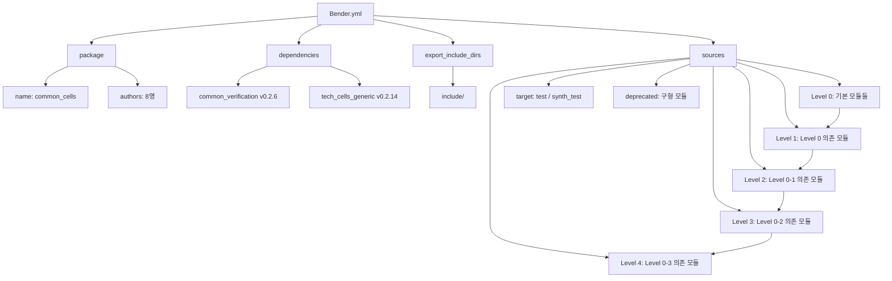
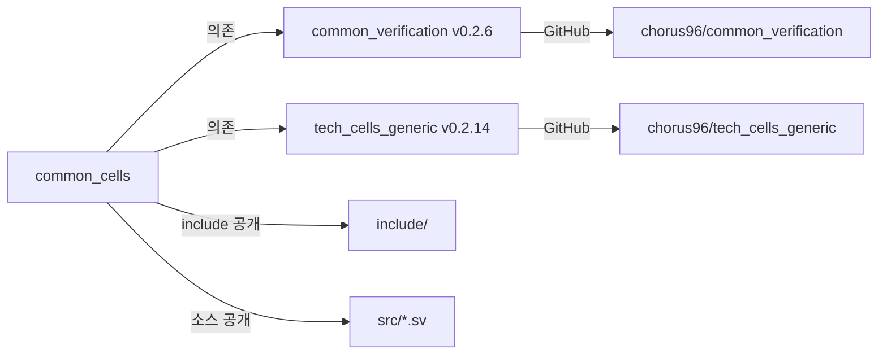

# Bender.yml

## 개요

`Bender.yml`은 ETH Zurich IIS(집적회로 및 시스템 연구소)에서 개발한 하드웨어 패키지 관리 도구인 **Bender**의 패키지 매니페스트 파일입니다. 이 파일은 `common_cells` 패키지의 메타데이터, 외부 의존성, 포함 디렉토리, 그리고 소스 파일 목록을 정의합니다. Bender는 SystemVerilog 기반 하드웨어 설계 프로젝트에서 의존성 관리 및 빌드 스크립트 생성에 활용됩니다.

## 블록 다이어그램



## 상세 내용

### 패키지 정보 (package)

| 항목 | 값 |
|------|-----|
| 이름 | `common_cells` |
| 저자 수 | 8명 |

#### 저자 목록

| 이름 | 소속/이메일 |
|------|------------|
| Florian Zaruba | zarubaf@iis.ee.ethz.ch |
| Fabian Schuiki | fschuiki@iis.ee.ethz.ch |
| Michael Schaffner | schaffner@iis.ee.ethz.ch |
| Andreas Kurth | akurth@iis.ee.ethz.ch |
| Manuel Eggimann | meggimann@iis.ee.ethz.ch |
| Stefan Mach | smach@iis.ee.ethz.ch |
| Wolfgang Roenninger | wroennin@student.ethz.ch |
| Thomas Benz | tbenz@iis.ee.ethz.ch |

### 의존성 (dependencies)

| 패키지명 | Git URL | 버전 |
|---------|---------|------|
| `common_verification` | https://github.com/chorus96/common_verification.git | 0.2.6 |
| `tech_cells_generic` | https://github.com/chorus96/tech_cells_generic.git | 0.2.14 |

- `common_verification`: 시뮬레이션 및 검증용 공통 유틸리티 패키지
- `tech_cells_generic`: 기술 독립적인 셀(clock gate, flip-flop 등) 구현 패키지

### 포함 디렉토리 (export_include_dirs)

```
include/
```

컴파일 시 헤더 파일(`registers.svh`, `assertions.svh` 등)을 탐색할 디렉토리를 외부에 공개합니다.

### 소스 파일 구조 (sources)

소스 파일은 **의존성 레벨**에 따라 계층적으로 구성됩니다.

#### 레벨 구분 원칙

| 레벨 | 설명 |
|------|------|
| Level 0 | 패키지 내 다른 파일에 의존하지 않는 기본 모듈 |
| Level 1 | Level 0 파일에만 의존하는 모듈 |
| Level 2 | Level 0, 1 파일에 의존하는 모듈 |
| Level 3 | Level 0, 1, 2 파일에 의존하는 모듈 |
| Level 4 | Level 0~3 파일에 의존하는 모듈 |

#### Level 0 주요 소스 파일

| 파일 | 기능 |
|------|------|
| `src/binary_to_gray.sv` | 바이너리→그레이 코드 변환 |
| `src/cb_filter_pkg.sv` | CB 필터 패키지 정의 |
| `src/cc_onehot.sv` | One-hot 인코더 |
| `src/cf_math_pkg.sv` | 수학 함수 패키지 |
| `src/clk_int_div.sv` | 클럭 정수 분주기 |
| `src/credit_counter.sv` | 크레딧 카운터 |
| `src/delta_counter.sv` | 델타 카운터 |
| `src/ecc_pkg.sv` | ECC(에러 정정 코드) 패키지 |
| `src/fifo_v3.sv` | FIFO 버전 3 |
| `src/gray_to_binary.sv` | 그레이→바이너리 코드 변환 |
| `src/lfsr.sv` | LFSR(선형 피드백 시프트 레지스터) |
| `src/rr_arb_tree.sv` | 라운드로빈 중재 트리 |
| `src/sync.sv` | 동기화 플립플롭 |

#### Level 1 소스 파일

| 파일 | 기능 |
|------|------|
| `src/addr_decode_dync.sv` | 동적 주소 디코더 |
| `src/boxcar.sv` | 박스카 필터 |
| `src/cdc_2phase.sv` | 2-phase CDC(Clock Domain Crossing) |
| `src/cdc_4phase.sv` | 4-phase CDC |
| `src/clk_int_div_static.sv` | 정적 클럭 정수 분주기 |
| `src/trip_counter.sv` | 트립 카운터 |

#### Level 2 소스 파일

| 파일 | 기능 |
|------|------|
| `src/addr_decode.sv` | 주소 디코더 |
| `src/addr_decode_napot.sv` | NAPOT 주소 디코더 |
| `src/multiaddr_decode.sv` | 다중 주소 디코더 |

#### Level 3 소스 파일

| 파일 | 기능 |
|------|------|
| `src/cdc_fifo_gray_clearable.sv` | 클리어 가능한 그레이 코드 CDC FIFO |
| `src/cdc_2phase_clearable.sv` | 클리어 가능한 2-phase CDC |
| `src/mem_to_banks_detailed.sv` | 메모리→뱅크 상세 매핑 |
| `src/stream_arbiter.sv` | 스트림 중재기 |
| `src/stream_omega_net.sv` | 오메가 네트워크 |

#### Level 4 소스 파일

| 파일 | 기능 |
|------|------|
| `src/mem_to_banks.sv` | 메모리→뱅크 매핑 |

### 타겟별 파일 분류 (target)

#### `not(all(xilinx,vivado_ipx))` 타겟

Xilinx Vivado IP Export 환경을 **제외한** 모든 환경에서 포함되는 파일들입니다. 대부분의 핵심 RTL 소스가 여기에 속합니다.

#### `simulation` 타겟 (Verilator 및 CVA6 제외)

```
src/deprecated/sram.sv
```

시뮬레이션 전용으로 제공되는 레거시 SRAM 모델입니다.

#### `test` 타겟

테스트벤치 파일 목록입니다.

| 테스트벤치 | 검증 대상 |
|-----------|----------|
| `test/addr_decode_tb.sv` | 주소 디코더 |
| `test/cdc_2phase_tb.sv` | 2-phase CDC |
| `test/fifo_tb.sv` | FIFO |
| `test/graycode_tb.sv` | 그레이 코드 변환 |
| `test/id_queue_tb.sv` | ID 큐 |
| `test/rr_arb_tree_tb.sv` | 라운드로빈 중재 |
| `test/stream_xbar_tb.sv` | 스트림 크로스바 |
| `test/clk_int_div_tb.sv` | 클럭 분주기 |

#### `synth_test` 타겟

합성 테스트용 파일입니다.

| 파일 | 설명 |
|------|------|
| `test/cdc_2phase_synth.sv` | CDC 합성 테스트 |
| `test/id_queue_synth.sv` | ID 큐 합성 테스트 |
| `test/stream_arbiter_synth.sv` | 스트림 중재기 합성 테스트 |
| `test/ecc_synth.sv` | ECC 합성 테스트 |
| `test/synth_bench.sv` | 합성 벤치마크 |

### 구형(Deprecated) 모듈

하위 호환성을 위해 유지되지만 신규 설계에는 사용을 권장하지 않습니다.

| 파일 | 대체 모듈 |
|------|----------|
| `src/deprecated/clock_divider_counter.sv` | `clk_int_div.sv` |
| `src/deprecated/clk_div.sv` | `clk_int_div.sv` |
| `src/deprecated/find_first_one.sv` | `lzc.sv` |
| `src/deprecated/generic_LFSR_8bit.sv` | `lfsr_8bit.sv` |
| `src/deprecated/generic_fifo.sv` | `fifo_v3.sv` |
| `src/deprecated/fifo_v1.sv` | `fifo_v3.sv` |
| `src/deprecated/fifo_v2.sv` | `fifo_v3.sv` |
| `src/deprecated/prioarbiter.sv` | `rr_arb_tree.sv` |
| `src/deprecated/pulp_sync.sv` | `sync.sv` |
| `src/deprecated/rrarbiter.sv` | `rr_arb_tree.sv` |

`src/edge_propagator_ack.sv`, `src/edge_propagator.sv`, `src/edge_propagator_rx.sv`는 구형 모듈에 의존하므로 별도 분류됩니다.

## 의존성 및 관계



## 사용 방법

### Bender 의존성 설치

```bash
bender checkout
```

### 특정 타겟으로 스크립트 생성

```bash
# Verilator용 컴파일 스크립트 생성
bender script verilator -t simulation > compile.f

# QuestaSim용 컴파일 스크립트 생성
bender script vsim -t test > compile.tcl

# 합성 테스트용 스크립트 생성
bender script vsim -t synth_test > synth_compile.tcl
```

### 다른 프로젝트에서 의존성으로 추가

```yaml
dependencies:
  common_cells: { git: "https://github.com/pulp-platform/common_cells.git", version: 1.39.0 }
```
