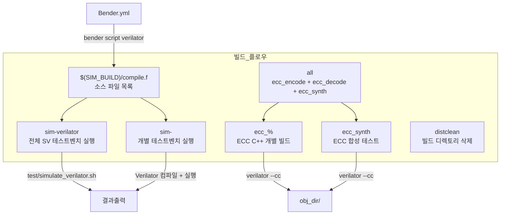
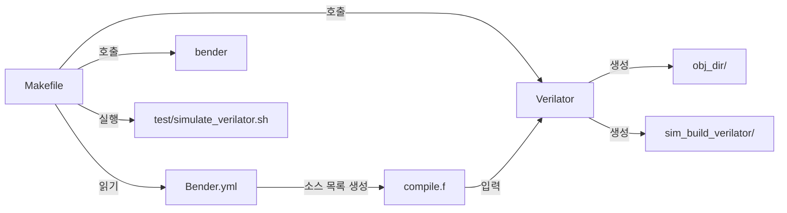

# Makefile

## 개요

`Makefile`은 `common_cells` 패키지의 빌드 및 시뮬레이션 자동화 파일입니다. **Verilator**를 기반으로 SystemVerilog 테스트벤치를 컴파일하고 실행하는 타겟들을 제공하며, ECC(에러 정정 코드) 관련 C++ 기반 검증 타겟도 포함합니다. Bender를 통해 소스 파일 목록을 자동으로 생성하여 Verilator 시뮬레이션에 활용합니다.

## 블록 다이어그램



## 상세 내용

### 변수 정의

| 변수 | 기본값 | 설명 |
|------|--------|------|
| `VERILATOR` | `verilator` | Verilator 실행 명령 경로 |
| `SIM_BUILD` | `sim_build_verilator` | 빌드 산출물 저장 디렉토리 |
| `SIM_TIMEOUT` | `180` | 시뮬레이션 타임아웃(초) |

### Verilator 공통 플래그

#### 시뮬레이션 플래그 (`VLT_SIM_FLAGS`)

| 플래그 | 설명 |
|--------|------|
| `--binary` | 독립 실행 바이너리 생성 |
| `--timing` | 타이밍 시뮬레이션 활성화 |
| `--assert` | SVA(SystemVerilog Assertion) 활성화 |
| `-DVERILATOR` | 전처리기 매크로 `VERILATOR` 정의 |

#### 경고 억제 플래그 (`VLT_SIM_WARN`)

| 플래그 | 억제 대상 경고 |
|--------|--------------|
| `--Wno-WIDTHTRUNC` | 비트폭 절삭 경고 |
| `--Wno-WIDTHEXPAND` | 비트폭 확장 경고 |
| `--Wno-TIMESCALEMOD` | 타임스케일 모듈 경고 |
| `--Wno-CASEINCOMPLETE` | case 불완전 경고 |
| `--Wno-CONSTRAINTIGN` | 제약 무시 경고 |
| `--Wno-INITIALDLY` | 초기화 지연 경고 |
| `-Wno-fatal` | 경고를 오류로 처리하지 않음 |

### 빌드 타겟 상세

#### `$(SIM_BUILD)/compile.f` (소스 파일 목록 생성)

```makefile
$(SIM_BUILD)/compile.f: Bender.yml
    mkdir -p $(SIM_BUILD)
    bender script verilator -t simulation > $@
```

- `Bender.yml`이 변경될 때마다 재생성
- `bender script verilator -t simulation` 명령으로 시뮬레이션 타겟의 소스 파일 목록을 Verilator 형식으로 출력
- 결과는 `sim_build_verilator/compile.f`에 저장

#### `sim-verilator` (전체 시뮬레이션)

```makefile
.PHONY: sim-verilator
sim-verilator: $(SIM_BUILD)/compile.f
    bash test/simulate_verilator.sh $(SIM_BUILD)
```

- 모든 지원 Verilator 시뮬레이션을 일괄 실행
- `test/simulate_verilator.sh` 스크립트를 통해 테스트 수행

#### `sim-%` (개별 테스트벤치)

```makefile
.PHONY: sim-%
sim-%: $(SIM_BUILD)/compile.f
    mkdir -p $(SIM_BUILD)/$*
    $(VERILATOR) $(VLT_SIM_FLAGS) \
        --top-module $* \
        $(VLT_PARAMS) \
        -f $(SIM_BUILD)/compile.f \
        test/$*.sv \
        -Mdir $(SIM_BUILD)/$* \
        $(VLT_SIM_WARN)
    timeout $(SIM_TIMEOUT) $(SIM_BUILD)/$*/V$* || true
```

- 패턴 규칙으로 임의의 테스트벤치 이름에 매칭
- `$*`는 `sim-` 이후의 타겟 이름 (예: `fifo_tb`)
- `$(VLT_PARAMS)`으로 제네릭 파라미터 전달 가능
- 타임아웃 초과 시 `|| true`로 실패를 무시하고 진행

#### `all` (ECC 전체 빌드)

```makefile
all: ecc_encode ecc_decode ecc_synth
```

세 가지 ECC 관련 타겟을 모두 빌드합니다.

#### `ecc_%` (ECC 개별 C++ 빌드)

```makefile
ecc_%: test/ecc/ecc_%.cpp test/ecc/ecc.cpp src/ecc_pkg.sv src/ecc_%.sv
    $(VERILATOR) --cc $^ --top-module $@ --trace --exe
    cd obj_dir && make -f V$@.mk > /dev/zero
    cd obj_dir && ./V$@
```

| 단계 | 명령 | 설명 |
|------|------|------|
| 1 | `verilator --cc ... --trace --exe` | C++ 래퍼 코드 및 Makefile 생성 |
| 2 | `make -f V$@.mk` | 생성된 Makefile로 바이너리 빌드 |
| 3 | `./V$@` | 시뮬레이션 실행 |

#### `ecc_synth` (ECC 합성 테스트)

```makefile
ecc_synth: test/ecc_synth.cpp src/ecc_pkg.sv src/ecc_encode.sv src/ecc_decode.sv test/ecc_synth.sv
    $(VERILATOR) --cc $^ --top-module $@ --trace --exe
    cd obj_dir && make -f V$@.mk > /dev/zero
    cd obj_dir && ./V$@
```

ECC 인코더와 디코더를 함께 검증하는 합성 테스트 타겟입니다.

#### `distclean` (빌드 디렉토리 초기화)

```makefile
distclean:
    rm -fr obj_dir $(SIM_BUILD)
```

- `obj_dir/`: Verilator C++ 래퍼 코드 및 바이너리
- `sim_build_verilator/`: 시뮬레이션 빌드 산출물

## 의존성 및 관계



## 사용 방법

### 전체 Verilator 시뮬레이션 실행

```bash
make sim-verilator
```

### 개별 테스트벤치 실행

```bash
# FIFO 테스트벤치 실행
make sim-fifo_tb

# 파라미터를 전달하여 실행
make sim-graycode_tb VLT_PARAMS="-GN=8"

# 스트림 크로스바 테스트벤치 실행
make sim-stream_xbar_tb
```

### ECC 검증 빌드 및 실행

```bash
# 전체 ECC 타겟 빌드
make all

# 개별 ECC 타겟 빌드
make ecc_encode
make ecc_decode
make ecc_synth
```

### Verilator 경로 커스터마이징

```bash
make sim-fifo_tb VERILATOR=/usr/local/bin/verilator
```

### 빌드 디렉토리 정리

```bash
make distclean
```

### 타임아웃 조정

```bash
make sim-cdc_2phase_tb SIM_TIMEOUT=600
```
