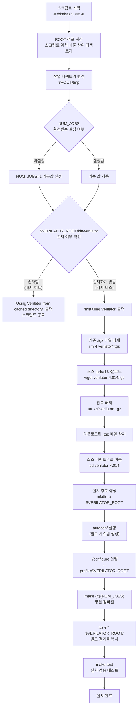

# install-verilator.sh

## 개요

이 스크립트는 **Verilator 4.014 버전을 소스에서 빌드하여 설치하는 CI 설치 스크립트**입니다. Verilator는 Verilog/SystemVerilog HDL 시뮬레이터로, `common_cells` 프로젝트의 시뮬레이션 기반 검증에 사용됩니다. 이미 설치된 경우(캐시 히트) 재설치를 건너뛰어 CI 파이프라인 실행 시간을 단축합니다.

- **위치**: `ci/install-verilator.sh`
- **실행 방식**: Bash 스크립트 (`#!/bin/bash`)
- **오류 처리**: `set -e` — 어떤 명령이라도 실패하면 즉시 스크립트 종료

## 블록 다이어그램



## 상세 내용

### 환경 변수

| 변수 | 필수/선택 | 설명 |
|---|---|---|
| `VERILATOR_ROOT` | **필수** | Verilator 설치 경로. 호출 환경에서 반드시 사전 설정 필요 |
| `NUM_JOBS` | 선택 | 병렬 컴파일 작업 수. 미설정 시 기본값 `1` 사용 |

### 스크립트 흐름 상세 설명

#### 1. 초기화

```bash
set -e
ROOT=$(cd "$(dirname "${BASH_SOURCE[0]}")/.." && pwd)
cd $ROOT/tmp
```

- `set -e`: 임의의 명령 실패 시 즉시 스크립트를 중단하여 부분 설치 방지
- `ROOT`: 스크립트가 `ci/` 하위에 위치하므로, 한 단계 상위인 프로젝트 루트를 계산
- `$ROOT/tmp`: 소스 다운로드 및 빌드 작업 디렉토리

#### 2. 병렬 빌드 설정

```bash
if [ -z ${NUM_JOBS} ]; then
    NUM_JOBS=1
fi
```

`NUM_JOBS` 환경변수가 비어있으면 단일 스레드(`1`)로 빌드합니다. CI 환경에서 사용 가능한 CPU 수를 `NUM_JOBS`에 전달하면 빌드 속도를 향상시킬 수 있습니다.

#### 3. 캐시 확인

```bash
if [ ! -e "$VERILATOR_ROOT/bin/verilator" ]; then
    # 설치 로직
else
    echo "Using Verilator from cached directory."
fi
```

`$VERILATOR_ROOT/bin/verilator` 실행 파일의 존재 여부로 설치 완료를 판단합니다. CI 시스템에서 `$VERILATOR_ROOT` 디렉토리를 캐시로 저장해두면 반복 실행 시 재빌드를 생략할 수 있습니다.

#### 4. 소스 다운로드 및 빌드

| 단계 | 명령 | 설명 |
|---|---|---|
| 정리 | `rm -f verilator*.tgz` | 이전에 남은 tarball 제거 |
| 다운로드 | `wget https://www.veripool.org/ftp/verilator-4.014.tgz` | Veripool 공식 서버에서 소스 다운로드 |
| 압축 해제 | `tar xzf verilator*.tgz` | tarball 압축 해제 |
| 정리 | `rm -f verilator*.tgz` | 압축 파일 제거 (디스크 절약) |
| 이동 | `cd verilator-4.014` | 소스 디렉토리로 진입 |
| 경로 생성 | `mkdir -p $VERILATOR_ROOT` | 설치 대상 경로 생성 |
| 빌드 시스템 | `autoconf` | `configure` 스크립트 생성 |
| 설정 | `./configure --prefix="$VERILATOR_ROOT"` | 설치 경로 지정 |
| 컴파일 | `make -j${NUM_JOBS}` | 병렬 빌드 |
| 설치 | `cp -r * $VERILATOR_ROOT/` | 빌드 결과물 전체 복사 |
| 검증 | `make test` | 설치 후 기본 테스트 실행 |

### 설치 대상 버전

| 항목 | 값 |
|---|---|
| **버전** | Verilator 4.014 |
| **다운로드 URL** | `https://www.veripool.org/ftp/verilator-4.014.tgz` |

> 참고: Verilator 4.014는 고정된 버전을 사용하여 CI 환경의 재현성을 보장합니다.

## 의존성 및 관계

| 의존 대상 | 종류 | 설명 |
|---|---|---|
| `wget` | 시스템 도구 | 소스 tarball 다운로드 |
| `tar` | 시스템 도구 | 압축 해제 |
| `autoconf` | 빌드 도구 | GNU Autotools 빌드 시스템 생성 |
| `make` | 빌드 도구 | 소스 컴파일 및 테스트 |
| `$VERILATOR_ROOT` | 환경 변수 | 호출 환경에서 반드시 설정 필요 |
| `$ROOT/tmp/` | 디렉토리 | 빌드 작업 임시 디렉토리 (사전 생성 필요) |
| `https://www.veripool.org` | 외부 서버 | Verilator 소스 배포 서버 (네트워크 접근 필요) |
| `.github/workflows/gitlab-ci.yml` | CI 워크플로우 | GitLab CI 파이프라인에서 이 스크립트를 호출할 수 있음 |
