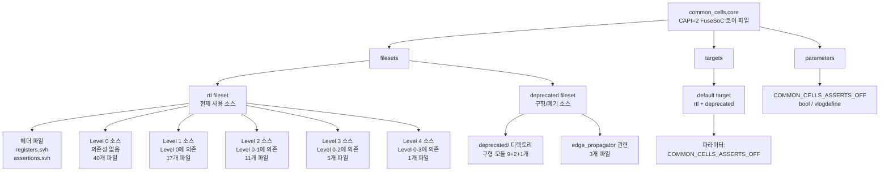

# common_cells.core

## 개요

`common_cells.core`는 [FuseSoC](https://fusesoc.readthedocs.io/) 패키지 관리 도구가 사용하는 코어 설명 파일입니다. PULP Platform에서 제공하는 `common_cells` 라이브러리(버전 1.39.0)의 모든 SystemVerilog 소스 파일 목록과 빌드 타겟, 파라미터를 정의합니다. 이 파일을 통해 FuseSoC는 common_cells 라이브러리를 다른 프로젝트의 의존성으로 자동으로 불러오고 컴파일 순서를 관리할 수 있습니다.

## 블록 다이어그램

## 상세 내용

### 코어 식별 정보

| 항목 | 값 |
|------|-----|
| CAPI 버전 | 2 |
| 코어 이름 | `pulp-platform.org::common_cells:1.39.0` |
| 설명 | Common SystemVerilog components |

### fileset: `rtl`

현재 사용 중인 주요 소스 파일들로 구성됩니다. 파일 타입은 `systemVerilogSource`이며, 헤더 파일은 `is_include_file: true`와 `include_path: include` 속성을 가집니다.

#### 헤더 파일 (Include Files)

| 파일 | 설명 |
|------|------|
| `include/common_cells/registers.svh` | 플립플롭(FF) 매크로 정의 |
| `include/common_cells/assertions.svh` | 어서션(assertion) 매크로 정의 |

#### Level 0 — 다른 파일에 의존하지 않는 독립 모듈

| 파일 | 기능 요약 |
|------|-----------|
| `src/binary_to_gray.sv` | 이진수 → 그레이 코드 변환 |
| `src/cb_filter_pkg.sv` | CB 필터 패키지 정의 |
| `src/cc_onehot.sv` | 원-핫 인코딩 검사 |
| `src/cf_math_pkg.sv` | 수학 함수 패키지 (log2 등) |
| `src/clk_int_div.sv` | 정수 클록 분주기 (동적) |
| `src/clk_int_div_static.sv` | 정수 클록 분주기 (정적) |
| `src/credit_counter.sv` | 크레딧 기반 흐름 제어 카운터 |
| `src/delta_counter.sv` | 델타 카운터 |
| `src/ecc_pkg.sv` | ECC(오류 정정 코드) 패키지 |
| `src/edge_propagator_tx.sv` | 에지 전파기 송신부 |
| `src/exp_backoff.sv` | 지수 백오프 |
| `src/fifo_v3.sv` | FIFO 버전 3 |
| `src/gray_to_binary.sv` | 그레이 코드 → 이진수 변환 |
| `src/isochronous_4phase_handshake.sv` | 4-페이즈 아이소크로너스 핸드셰이크 |
| `src/isochronous_spill_register.sv` | 아이소크로너스 스필 레지스터 |
| `src/lfsr.sv` / `src/lfsr_16bit.sv` / `src/lfsr_8bit.sv` | 선형 귀환 시프트 레지스터 |
| `src/multiaddr_decode.sv` | 다중 주소 디코더 |
| `src/mv_filter.sv` | 다수결 필터 |
| `src/onehot_to_bin.sv` | 원-핫 → 이진수 변환 |
| `src/plru_tree.sv` | 의사 LRU 트리 |
| `src/passthrough_stream_fifo.sv` | 패스스루 스트림 FIFO |
| `src/popcount.sv` | 팝카운트 (비트 합산) |
| `src/rr_arb_tree.sv` | 라운드-로빈 중재 트리 |
| `src/rstgen_bypass.sv` | 리셋 생성기 바이패스 |
| `src/serial_deglitch.sv` | 시리얼 디글리치 필터 |
| `src/shift_reg.sv` / `src/shift_reg_gated.sv` | 시프트 레지스터 |
| `src/spill_register_flushable.sv` | 플러셔블 스필 레지스터 |
| `src/stream_demux.sv` | 스트림 디멀티플렉서 |
| `src/stream_filter.sv` | 스트림 필터 |
| `src/stream_fork.sv` | 스트림 포크 |
| `src/stream_intf.sv` | 스트림 인터페이스 |
| `src/stream_join.sv` / `src/stream_join_dynamic.sv` | 스트림 조인 |
| `src/stream_mux.sv` | 스트림 멀티플렉서 |
| `src/stream_throttle.sv` | 스트림 스로틀 |
| `src/sub_per_hash.sv` | 서브퍼 해시 |
| `src/sync.sv` / `src/sync_wedge.sv` | 동기화 플립플롭 |
| `src/unread.sv` / `src/read.sv` | 미사용 신호 처리 |
| `src/cdc_reset_ctrlr_pkg.sv` | CDC 리셋 컨트롤러 패키지 |

#### Level 1 — Level 0 모듈에만 의존

| 파일 | 기능 요약 |
|------|-----------|
| `src/addr_decode_dync.sv` | 동적 주소 디코더 |
| `src/cdc_2phase.sv` / `src/cdc_4phase.sv` | 2/4-페이즈 CDC |
| `src/cb_filter.sv` | CB 필터 |
| `src/cdc_fifo_2phase.sv` | 2-페이즈 CDC FIFO |
| `src/counter.sv` | 범용 카운터 |
| `src/ecc_decode.sv` / `src/ecc_encode.sv` | ECC 디코더/인코더 |
| `src/edge_detect.sv` | 에지 검출기 |
| `src/lzc.sv` | 선행 제로 카운터 |
| `src/max_counter.sv` | 최대값 카운터 |
| `src/rstgen.sv` | 리셋 생성기 |
| `src/spill_register.sv` | 스필 레지스터 |
| `src/stream_delay.sv` | 스트림 지연 |
| `src/stream_fifo.sv` | 스트림 FIFO |
| `src/stream_fork_dynamic.sv` | 동적 스트림 포크 |
| `src/clk_mux_glitch_free.sv` | 글리치 프리 클록 멀티플렉서 |

#### Level 2 — Level 0-1 모듈에 의존

| 파일 | 기능 요약 |
|------|-----------|
| `src/addr_decode.sv` / `src/addr_decode_napot.sv` | 주소 디코더 (NAPOT 포함) |
| `src/cdc_reset_ctrlr.sv` | CDC 리셋 컨트롤러 |
| `src/cdc_fifo_gray.sv` | 그레이 코드 CDC FIFO |
| `src/fall_through_register.sv` | 폴-스루 레지스터 |
| `src/id_queue.sv` | ID 기반 큐 |
| `src/stream_to_mem.sv` | 스트림 → 메모리 변환 |
| `src/stream_arbiter_flushable.sv` | 플러셔블 스트림 중재기 |
| `src/stream_fifo_optimal_wrap.sv` | 최적 래핑 스트림 FIFO |
| `src/stream_register.sv` | 스트림 레지스터 |
| `src/stream_xbar.sv` | 스트림 크로스바 |

#### Level 3 — Level 0-2 모듈에 의존

| 파일 | 기능 요약 |
|------|-----------|
| `src/cdc_fifo_gray_clearable.sv` | 클리어 가능한 그레이 코드 CDC FIFO |
| `src/cdc_2phase_clearable.sv` | 클리어 가능한 2-페이즈 CDC |
| `src/mem_to_banks_detailed.sv` | 메모리 → 뱅크 변환 (상세) |
| `src/stream_arbiter.sv` | 스트림 중재기 |
| `src/stream_omega_net.sv` | 오메가 네트워크 |

#### Level 4 — 모든 레벨에 의존

| 파일 | 기능 요약 |
|------|-----------|
| `src/mem_to_banks.sv` | 메모리 → 뱅크 변환 |

### fileset: `deprecated`

더 이상 권장되지 않는 구형 모듈들입니다. 하위 호환성 유지를 위해 포함되어 있습니다.

| 파일 | 비고 |
|------|------|
| `src/deprecated/clock_divider_counter.sv` | 구형 클록 분주 카운터 |
| `src/deprecated/clk_div.sv` | 구형 클록 분주기 |
| `src/deprecated/find_first_one.sv` | 최초 1 검출 (lzc로 대체) |
| `src/deprecated/generic_LFSR_8bit.sv` | 구형 8비트 LFSR |
| `src/deprecated/generic_fifo.sv` | 구형 FIFO |
| `src/deprecated/prioarbiter.sv` | 구형 우선순위 중재기 |
| `src/deprecated/pulp_sync.sv` | 구형 동기화 FF |
| `src/deprecated/pulp_sync_wedge.sv` | 구형 동기화 웨지 |
| `src/deprecated/rrarbiter.sv` | 구형 라운드-로빈 중재기 |
| `src/deprecated/clock_divider.sv` | 구형 클록 분주기 |
| `src/deprecated/fifo_v2.sv` | FIFO 버전 2 |
| `src/deprecated/fifo_v1.sv` | FIFO 버전 1 |
| `src/edge_propagator_ack.sv` | 에지 전파기 ACK (deprecated 의존) |
| `src/edge_propagator.sv` | 에지 전파기 (deprecated 의존) |
| `src/edge_propagator_rx.sv` | 에지 전파기 수신부 (deprecated 의존) |

### targets

| 타겟 | filesets | 파라미터 |
|------|---------|---------|
| `default` | `rtl`, `deprecated` | `COMMON_CELLS_ASSERTS_OFF` |

### parameters

| 파라미터 | 타입 | paramtype | 설명 |
|---------|------|-----------|------|
| `COMMON_CELLS_ASSERTS_OFF` | `bool` | `vlogdefine` | PULP common cells의 어서션을 비활성화 |

## 의존성 및 관계

- **FuseSoC**: 이 파일은 FuseSoC CAPI2 형식으로 작성되어 있으며, `fusesoc` 명령어로 파싱됩니다.
- **`include/common_cells/registers.svh`**: RTL 소스에서 공통으로 사용하는 플립플롭 매크로를 제공합니다.
- **`include/common_cells/assertions.svh`**: RTL 소스에서 공통으로 사용하는 어서션 매크로를 제공합니다.
- **`ips_list.yml`**: 일부 빌드 시스템에서 `common_cells`의 의존 IP 목록을 별도로 관리하는 데 사용합니다.
- **외부 프로젝트**: 다른 FuseSoC 코어는 `pulp-platform.org::common_cells:1.39.0`을 의존성으로 선언하여 이 라이브러리를 재사용합니다.
