# Makefile

## 개요

`formal/Makefile`은 common_cells 저장소의 형식 검증(Formal Verification) 빌드 시스템 파일이다. SymbiYosys(`sby`) 도구를 사용하여 `fifo_v3`, `counter`, `fall_through_register` 세 가지 하드웨어 모듈에 대한 형식 검증을 자동화한다. 각 검증 대상은 `.sby` 스크립트 파일과 해당 소스 파일, 속성 파일의 의존 관계를 명시하며, `touch` 명령으로 타임스탬프 파일(`.check`)을 생성해 Make의 증분 빌드를 지원한다.

## 블록 다이어그램

```mermaid
graph TD
    ALL["all (기본 타겟)"]
    ALL --> FV3["fifo_v3.check"]
    ALL --> CNT["counter.check"]
    ALL --> FTR["fall_through_register.check"]

    FV3 --> FV3_SBY["fifo_v3.sby"]
    FV3 --> FV3_SRC["../src/fifo_v3.sv"]
    FV3 --> FV3_PROP["fifo_v3_properties.sv"]
    FV3 --> SBY_CMD1["$(SBY) -f fifo_v3.sby"]

    CNT --> CNT_SBY["counter.sby"]
    CNT --> CNT_SRC["../src/counter.sv"]
    CNT --> DCNT_SRC["../src/delta_counter.sv"]
    CNT --> CNT_PROP["counter_properties.sv"]
    CNT --> SBY_CMD2["$(SBY) -f counter.sby"]

    FTR --> FTR_SBY["fall_through_register.sby"]
    FTR --> FTR_SRC["../src/fall_through_register.sv"]
    FTR --> FV3_SRC2["../src/fifo_v3.sv"]
    FTR --> FV2_SRC["../src/deprecated/fifo_v2.sv"]
    FTR --> SBY_CMD3["$(SBY) -f fall_through_register.sby"]

    CLEAN["clean"]
    CLEAN --> RM1["rm -r fifo_v3.check fifo_v3/"]
    CLEAN --> RM2["rm -r counter.check counter/"]
    CLEAN --> RM3["rm -r fall_through_register.check fall_through_register/"]
```

## 상세 내용

### 변수

| 변수 | 기본값 | 설명 |
|------|--------|------|
| `YOSYS` | `yosys` | Yosys 합성 도구 경로 (현재 직접 사용되지 않음) |
| `SBY` | `sby` | SymbiYosys 형식 검증 도구 경로 |
| `RM` | `rm` | 파일 삭제 명령 |

모든 변수는 `?=` 연산자로 정의되어, 호출 시 환경 변수나 커맨드라인 인자로 재정의할 수 있다.

### 타겟

| 타겟 | 의존 파일 | 동작 |
|------|-----------|------|
| `all` | `fifo_v3.check`, `counter.check`, `fall_through_register.check` | 모든 검증 실행 |
| `fifo_v3.check` | `fifo_v3.sby`, `../src/fifo_v3.sv`, `fifo_v3_properties.sv` | fifo_v3 형식 검증 실행 |
| `counter.check` | `counter.sby`, `../src/counter.sv`, `../src/delta_counter.sv`, `counter_properties.sv` | counter 형식 검증 실행 |
| `fall_through_register.check` | `fall_through_register.sby`, `../src/fall_through_register.sv`, `../src/fifo_v3.sv`, `../src/deprecated/fifo_v2.sv` | fall_through_register 형식 검증 실행 |
| `clean` | (없음) | 생성된 타임스탬프 파일 및 디렉토리 삭제 |

### 빌드 규칙

- 각 검증 타겟은 `$(SBY) -f <스크립트>.sby` 명령으로 SymbiYosys를 실행한다.
- `-f` 플래그는 기존 결과 디렉토리가 있을 경우 강제로 덮어쓴다.
- 검증 성공 후 `touch <타겟>.check`로 타임스탬프 파일을 생성하여 Make의 증분 빌드를 가능하게 한다.
- `delta_counter`에 대한 검증 타겟은 현재 주석 처리되어 비활성화 상태이다.

### clean 타겟

`clean` 타겟은 `.PHONY`로 선언되어 파일 시스템의 실제 파일과 무관하게 항상 실행된다. 타임스탬프 파일(`.check`)과 SymbiYosys가 생성한 결과 디렉토리를 삭제한다.

## 의존성

| 항목 | 역할 |
|------|------|
| `SymbiYosys (sby)` | 형식 검증 실행 도구 |
| `yosys` | RTL 합성 백엔드 (sby 내부에서 사용) |
| `../src/fifo_v3.sv` | FIFO v3 RTL 소스 |
| `../src/counter.sv` | 카운터 RTL 소스 |
| `../src/delta_counter.sv` | 델타 카운터 RTL 소스 (counter 검증에 필요) |
| `../src/fall_through_register.sv` | 폴스루 레지스터 RTL 소스 |
| `../src/deprecated/fifo_v2.sv` | FIFO v2 RTL 소스 (fall_through_register 검증에 필요) |
| `*_properties.sv` | 각 모듈의 형식 검증 속성 파일 |
