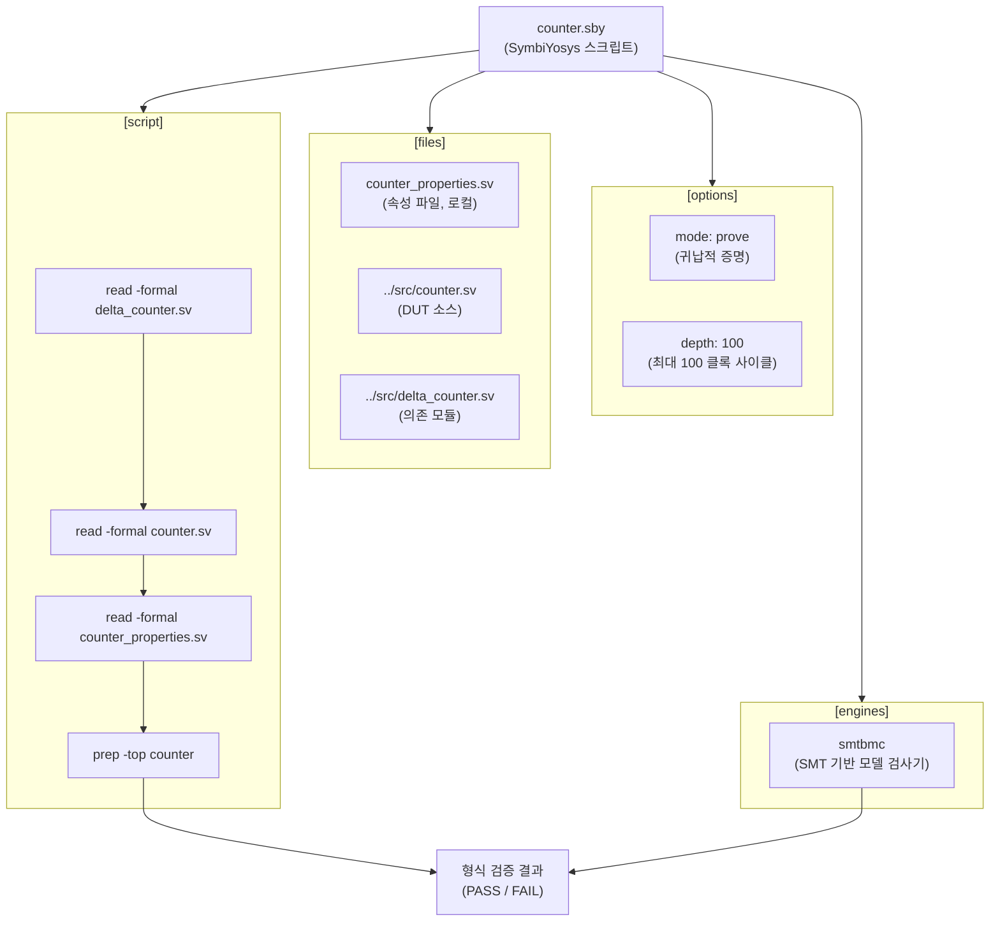

# counter.sby

## 개요

`counter.sby`는 `counter` 모듈에 대한 SymbiYosys 형식 검증 스크립트이다. SMT 기반 모델 검사기(`smtbmc`)를 사용하여 최대 100 클록 깊이까지 `prove` 모드(귀납적 증명)로 카운터의 동작 속성을 검증한다. 대상 모듈은 `counter`이며, `delta_counter`와 `counter_properties` 파일을 함께 로드하여 속성 바인딩 방식으로 검증한다.

## 블록 다이어그램

## 상세 내용

### [options] 섹션

| 항목 | 값 | 설명 |
|------|----|------|
| `mode` | `prove` | 귀납적 증명 모드. BMC(유계 모델 검사)와 k-귀납법을 조합하여 속성이 모든 시간 지평에서 성립함을 증명한다. |
| `depth` | `100` | 검증에 사용할 최대 클록 사이클 수. |

### [engines] 섹션

| 항목 | 설명 |
|------|------|
| `smtbmc` | Yosys의 SMT 기반 유계 모델 검사기. 내부적으로 Z3, Boolector 등의 SMT 솔버를 사용하여 속성을 검증한다. |

### [files] 섹션

| 파일 | 설명 |
|------|------|
| `counter_properties.sv` | 카운터 속성 정의 파일 (로컬 디렉토리) |
| `../src/counter.sv` | 검증 대상(DUT) 카운터 RTL 소스 |
| `../src/delta_counter.sv` | counter 모듈이 내부적으로 사용하는 delta_counter 모듈 |

### [script] 섹션

SymbiYosys가 Yosys에 전달하는 명령 시퀀스이다.

| 순서 | 명령 | 설명 |
|------|------|------|
| 1 | `read -formal delta_counter.sv` | delta_counter 모듈을 형식 검증 모드로 읽기 |
| 2 | `read -formal counter.sv` | counter DUT를 형식 검증 모드로 읽기 |
| 3 | `read -formal counter_properties.sv` | 속성 모듈 읽기 (bind 문 포함) |
| 4 | `prep -top counter` | counter를 최상위 모듈로 지정하여 합성 준비 |

`-formal` 플래그는 Yosys가 `assert`, `assume`, `cover` 구문을 형식 검증용으로 처리하도록 지시한다. `prep -top counter`는 `counter_properties.sv` 내의 `bind` 문을 통해 속성 모듈이 자동으로 DUT에 연결된다.

## 의존성

| 항목 | 역할 |
|------|------|
| `SymbiYosys` | 형식 검증 프레임워크 |
| `smtbmc` | SMT 기반 모델 검사 엔진 |
| `counter_properties.sv` | 검증할 속성 정의 |
| `../src/counter.sv` | 검증 대상 모듈 |
| `../src/delta_counter.sv` | counter의 내부 의존 모듈 |
