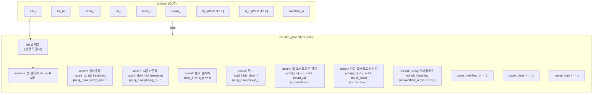

# counter_properties.sv

## 개요

`counter_properties.sv`는 `counter` 모듈에 대한 형식 검증 속성 파일이다. SVA(SystemVerilog Assertion) 언어로 작성된 `counter_properties` 모듈을 정의하며, 파일 하단의 `bind` 구문을 통해 DUT인 `counter` 모듈에 자동으로 연결된다. 업/다운 카운팅 동작, 동기식 클리어, 로드, 오버플로우 감지, Sticky 오버플로우 모드의 정확성을 `assert`, `assume`, `cover` 속성으로 검증한다.

## 블록 다이어그램



## 상세 내용

### 모듈 파라미터

| 파라미터 | 타입 | 기본값 | 설명 |
|----------|------|--------|------|
| `WIDTH` | `int unsigned` | `4` | 카운터 비트 폭 |
| `STICKY_OVERFLOW` | `bit` | `1'b0` | 1이면 오버플로우 플래그가 클리어/로드 전까지 유지됨 |

### 포트 (DUT 신호 관찰용)

| 포트 | 방향 | 설명 |
|------|------|------|
| `clk_i` | input | 클록 |
| `rst_ni` | input | 비동기 액티브-로우 리셋 |
| `clear_i` | input | 동기식 클리어 |
| `en_i` | input | 카운터 활성화 |
| `load_i` | input | 새 값 로드 |
| `down_i` | input | 다운 카운팅 선택 (기본: 업) |
| `d_i` | input `[WIDTH-1:0]` | 로드할 데이터 |
| `q_o` | input `[WIDTH-1:0]` | 카운터 출력 (관찰) |
| `overflow_o` | input | 오버플로우 플래그 (관찰) |

### 내부 보조 신호

| 신호 | 설명 |
|------|------|
| `init` | 첫 번째 클록 이후 1이 되는 초기화 인디케이터 |
| `resetting` | `clear_i \|\| load_i` - 정상 카운팅이 아닌 상태 |
| `count_up` | `en_i && !down_i` |
| `count_down` | `en_i && down_i` |

### Assumption (assume)

| # | 조건 | 설명 |
|---|------|------|
| 1 | `(!init) \|-> !rst_ni` | 시뮬레이션 시작 직후 첫 클록에서 반드시 리셋 상태(`rst_ni=0`)를 거치도록 강제 |

### Assertion (assert)

| # | 조건 | 설명 |
|---|------|------|
| 1 | `count_up && !resetting \|=> q_o == $past(q_o) + 1` | 업 카운팅 시 다음 클록에 출력이 1 증가해야 함 |
| 2 | `count_down && !resetting \|=> q_o == $past(q_o) - 1` | 다운 카운팅 시 다음 클록에 출력이 1 감소해야 함 |
| 3 | `clear_i \|=> q_o == '0` | 클리어 신호 후 다음 클록에 출력이 0이 되어야 함 |
| 4 | `(load_i && !clear_i) \|=> q_o == $past(d_i)` | 로드 시 (클리어 우선) 다음 클록에 `d_i` 값이 출력되어야 함 |
| 5 | 업 방향 래핑 감지: `$past(q_o) > q_o && count_up && !resetting && !$past(overflow_o) \|-> overflow_o` | 업 오버플로우 발생 시 `overflow_o`가 설정되어야 함 |
| 6 | 다운 방향 래핑 감지: `$past(q_o) < q_o && count_down && !resetting && !$past(overflow_o) \|-> overflow_o` | 다운 오버플로우 발생 시 `overflow_o`가 설정되어야 함 |
| 7 | `(STICKY_OVERFLOW==1) overflow_o && !resetting \|=> overflow_o` | Sticky 모드에서 오버플로우 플래그는 클리어/로드 없이는 유지되어야 함 |

> 모든 assert 속성은 `disable iff (!rst_ni)`로 리셋 중에는 검사가 비활성화된다.

### Cover (cover)

| # | 조건 | 설명 |
|---|------|------|
| 1 | `overflow_o == 1'b1` | 오버플로우가 발생하는 시나리오 도달 가능성 확인 |
| 2 | `clear_i == 1'b1` | 클리어가 활성화되는 시나리오 도달 가능성 확인 |
| 3 | `load_i == 1'b1` | 로드가 활성화되는 시나리오 도달 가능성 확인 |

### bind 구문

```systemverilog
bind counter counter_properties #(
    .WIDTH(WIDTH), .STICKY_OVERFLOW(STICKY_OVERFLOW)
) i_counter_properties(.*);
```

`bind` 구문은 DUT(`counter`)의 파라미터와 포트를 자동으로 속성 모듈에 전달한다. `.*`는 동일한 이름의 포트를 자동 연결한다.

## 의존성

| 항목 | 역할 |
|------|------|
| `../src/counter.sv` | bind 대상 DUT 모듈 |
| `../src/delta_counter.sv` | counter 내부에서 사용하는 서브모듈 |
| `counter.sby` | 이 속성 파일을 로드하는 SymbiYosys 스크립트 |
