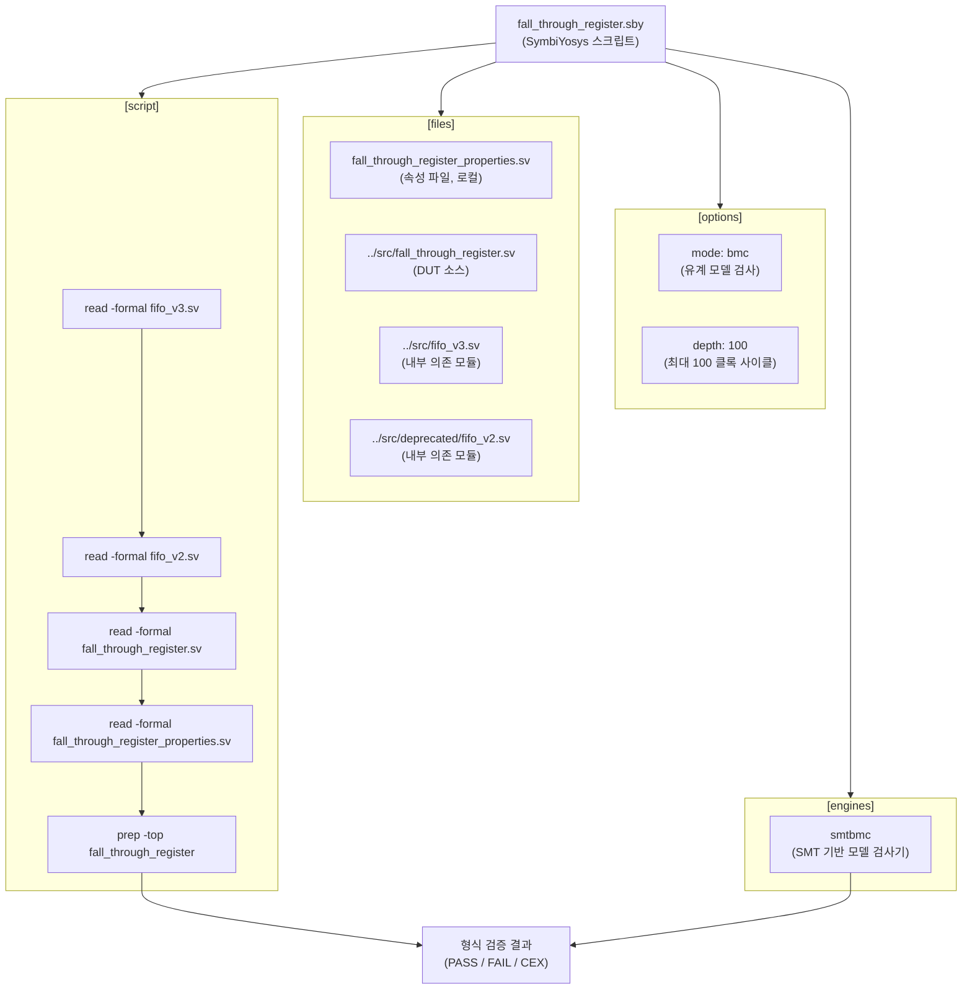

# fall_through_register.sby

## 개요

`fall_through_register.sby`는 `fall_through_register` 모듈에 대한 SymbiYosys 형식 검증 스크립트이다. SMT 기반 모델 검사기(`smtbmc`)를 사용하여 `bmc`(유계 모델 검사) 모드로 최대 100 클록 깊이까지 검증한다. `fall_through_register`는 내부적으로 `fifo_v3`와 `fifo_v2`에 의존하므로, 세 모듈 모두 함께 로드한다. `counter.sby`의 `prove` 모드와 달리 이 스크립트는 `bmc` 모드를 사용하여 유한 깊이 내의 반례 탐색에 집중한다.

## 블록 다이어그램

## 상세 내용

### [options] 섹션

| 항목 | 값 | 설명 |
|------|----|------|
| `mode` | `bmc` | 유계 모델 검사(Bounded Model Checking) 모드. 지정된 깊이까지 속성 위반 반례(counterexample)를 탐색한다. `prove`와 달리 무한 시간 지평의 완전한 증명은 보장하지 않는다. |
| `depth` | `100` | 검사할 최대 클록 사이클 수 |

### [engines] 섹션

| 항목 | 설명 |
|------|------|
| `smtbmc` | SMT 기반 유계 모델 검사기. SAT/SMT 솔버를 활용하여 속성 위반 반례를 탐색한다. |

### [files] 섹션

| 파일 | 설명 |
|------|------|
| `fall_through_register_properties.sv` | 폴스루 레지스터 속성 정의 파일 (로컬 디렉토리) |
| `../src/fall_through_register.sv` | 검증 대상(DUT) RTL 소스 |
| `../src/fifo_v3.sv` | fall_through_register 내부 의존 모듈 |
| `../src/deprecated/fifo_v2.sv` | fall_through_register 내부 의존 모듈 (구버전) |

### [script] 섹션

| 순서 | 명령 | 설명 |
|------|------|------|
| 1 | `read -formal fifo_v3.sv` | fifo_v3 의존 모듈을 형식 검증 모드로 읽기 |
| 2 | `read -formal fifo_v2.sv` | fifo_v2 의존 모듈을 형식 검증 모드로 읽기 |
| 3 | `read -formal fall_through_register.sv` | DUT를 형식 검증 모드로 읽기 |
| 4 | `read -formal fall_through_register_properties.sv` | 속성 모듈 읽기 (bind 문 포함) |
| 5 | `prep -top fall_through_register` | fall_through_register를 최상위 모듈로 지정하여 합성 준비 |

### bmc vs prove 모드 비교

| 항목 | `bmc` (이 파일) | `prove` (counter.sby, fifo_v3.sby) |
|------|----------------|-------------------------------------|
| 검증 방식 | 유계 반례 탐색 | 귀납적 완전 증명 |
| 완전성 | depth 내로 제한 | 모든 시간 지평 |
| 적합한 상황 | 버그 탐색, 빠른 검증 | 불변 속성 증명 |

## 의존성

| 항목 | 역할 |
|------|------|
| `SymbiYosys` | 형식 검증 프레임워크 |
| `smtbmc` | SMT 기반 모델 검사 엔진 |
| `fall_through_register_properties.sv` | 검증할 속성 정의 |
| `../src/fall_through_register.sv` | 검증 대상 모듈 |
| `../src/fifo_v3.sv` | DUT 내부 의존 모듈 |
| `../src/deprecated/fifo_v2.sv` | DUT 내부 의존 모듈 (구버전) |
