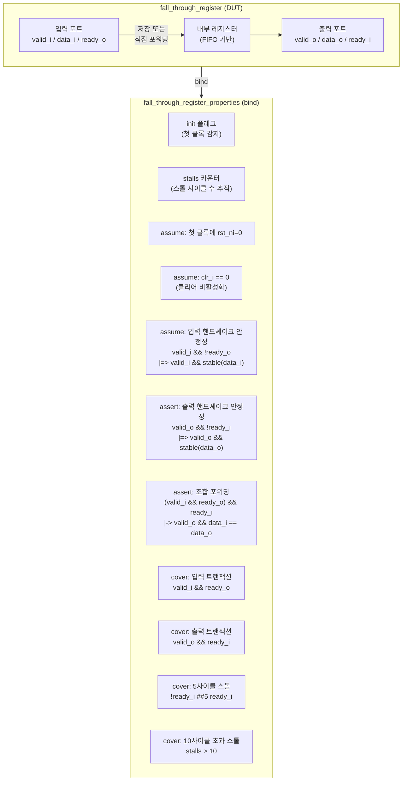

# fall_through_register_properties.sv

## 개요

`fall_through_register_properties.sv`는 `fall_through_register` 모듈에 대한 형식 검증 속성 파일이다. 폴스루 레지스터(fall-through register)는 내부에 데이터를 저장할 수 있으면서, 입력이 유효하고 하위 로직이 준비된 경우 데이터를 조합 논리로 직접 통과시키는 특수한 레지스터이다. 이 파일은 valid/ready 핸드셰이크 프로토콜의 데이터 안정성, 조합 포워딩, 스톨 동작을 `assume`, `assert`, `cover` 속성으로 검증한다.

## 블록 다이어그램



## 상세 내용

### 모듈 파라미터

| 파라미터 | 타입 | 기본값 | 설명 |
|----------|------|--------|------|
| `T` | `type` | `logic` | 전송되는 데이터의 타입 (Vivado 호환을 위해 기본값 필요) |

### 포트 (DUT 신호 관찰용)

| 포트 | 방향 | 설명 |
|------|------|------|
| `clk_i` | input | 클록 |
| `rst_ni` | input | 비동기 액티브-로우 리셋 |
| `clr_i` | input | 동기식 클리어 |
| `testmode_i` | input | 클록 게이팅 우회 테스트 모드 |
| `valid_i` | input | 입력 포트: 데이터 유효 신호 |
| `ready_o` | input | 입력 포트: 레지스터 수신 준비 신호 (관찰) |
| `data_i` | input `T` | 입력 포트: 입력 데이터 |
| `valid_o` | input | 출력 포트: 출력 데이터 유효 신호 (관찰) |
| `ready_i` | input | 출력 포트: 하위 로직 수신 준비 신호 |
| `data_o` | input `T` | 출력 포트: 출력 데이터 (관찰) |

### 내부 보조 신호

| 신호 | 설명 |
|------|------|
| `init` | 첫 번째 클록 이후 1이 되는 초기화 인디케이터 |
| `stalls` | 입력이 유효하지만 `ready_o`가 낮은 사이클 수를 누적하는 정수형 카운터 |

### Assumption (assume)

| # | 조건 | 설명 |
|---|------|------|
| 1 | `(!init) \|-> !rst_ni` | 시뮬레이션 시작 직후 리셋 상태를 반드시 거치도록 강제 |
| 2 | `clr_i == 1'b0` | 클리어 기능은 현재 검증에서 제약을 완화하지 않으므로 비활성화(TODO 주석 있음) |
| 3 | `valid_i && !ready_o \|=> valid_i && $stable(data_i)` | 입력 valid/ready 핸드셰이크 규약: ready_o가 낮을 때 valid_i와 data_i는 안정적으로 유지되어야 함 |

### Assertion (assert)

| # | 조건 | 설명 |
|---|------|------|
| 1 | `valid_o && !ready_i \|=> valid_o && $stable(data_o)` | 출력 valid/ready 핸드셰이크 규약: ready_i가 낮을 때 valid_o와 data_o가 안정적으로 유지되어야 함 |
| 2 | `(valid_i && ready_o) && ready_i \|-> valid_o && (data_i == data_o)` | 조합 포워딩: 입력 트랜잭션이 수락되고 출력도 준비된 경우, 동일 클록에 입력 데이터가 출력에 그대로 나타나야 함 (fall-through 핵심 속성) |

> 모든 assert 속성은 `disable iff (!rst_ni)`로 리셋 중에는 검사가 비활성화된다.

### stalls 카운터 동작

```
리셋, 비유효 입력, 또는 트랜잭션 수락 시: stalls = 0
valid_i && !ready_o인 사이클마다: stalls += 1
```

### Cover (cover)

| # | 조건 | 설명 |
|---|------|------|
| 1 | `valid_i && ready_o` | 입력 트랜잭션이 수락되는 시나리오 도달 가능성 확인 |
| 2 | `valid_o && ready_i` | 출력 트랜잭션이 수락되는 시나리오 도달 가능성 확인 |
| 3 | `!ready_i ##5 ready_i` | 5사이클 연속 스톨 후 트랜잭션 수락 시나리오 도달 가능성 확인 |
| 4 | `stalls > 10` | 10사이클 초과 스톨 시나리오 도달 가능성 확인 |

### bind 구문

```systemverilog
bind fall_through_register fall_through_register_properties #(
    .T(T)
) i_fall_through_register_properties(.*);
```

DUT의 타입 파라미터 `T`를 속성 모듈에 전달하고, `.*`로 동일 이름의 포트를 자동 연결한다.

## 의존성

| 항목 | 역할 |
|------|------|
| `../src/fall_through_register.sv` | bind 대상 DUT 모듈 |
| `../src/fifo_v3.sv` | fall_through_register 내부 의존 모듈 |
| `../src/deprecated/fifo_v2.sv` | fall_through_register 내부 의존 모듈 (구버전) |
| `fall_through_register.sby` | 이 속성 파일을 로드하는 SymbiYosys 스크립트 |
