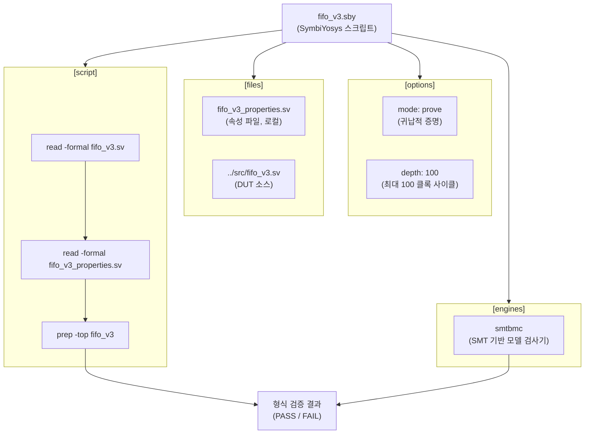

# fifo_v3.sby

## 개요

`fifo_v3.sby`는 `fifo_v3` 모듈에 대한 SymbiYosys 형식 검증 스크립트이다. SMT 기반 모델 검사기(`smtbmc`)를 사용하여 `prove` 모드(귀납적 증명)로 최대 100 클록 깊이까지 FIFO의 동작 속성을 검증한다. `fifo_v3.sv`와 `fifo_v3_properties.sv` 두 파일만 사용하는 간결한 구성이며, `counter.sby`와 동일하게 완전한 귀납적 증명을 수행한다.

## 블록 다이어그램

## 상세 내용

### [options] 섹션

| 항목 | 값 | 설명 |
|------|----|------|
| `mode` | `prove` | 귀납적 증명 모드. BMC(유계 모델 검사)와 k-귀납법을 조합하여 속성이 모든 시간 지평에서 성립함을 증명한다. |
| `depth` | `100` | 검증에 사용할 최대 클록 사이클 수 |

### [engines] 섹션

| 항목 | 설명 |
|------|------|
| `smtbmc` | Yosys의 SMT 기반 유계 모델 검사기. 내부적으로 SMT 솔버를 사용하여 속성 위반 여부를 검사한다. |

### [files] 섹션

| 파일 | 설명 |
|------|------|
| `fifo_v3_properties.sv` | FIFO v3 속성 정의 파일 (로컬 디렉토리) |
| `../src/fifo_v3.sv` | 검증 대상(DUT) FIFO v3 RTL 소스 |

### [script] 섹션

| 순서 | 명령 | 설명 |
|------|------|------|
| 1 | `read -formal fifo_v3.sv` | FIFO v3 DUT를 형식 검증 모드로 읽기 |
| 2 | `read -formal fifo_v3_properties.sv` | 속성 모듈 읽기 (bind 문 포함) |
| 3 | `prep -top fifo_v3` | fifo_v3를 최상위 모듈로 지정하여 합성 준비 |

### 다른 .sby 파일과의 비교

| 항목 | `fifo_v3.sby` | `counter.sby` | `fall_through_register.sby` |
|------|--------------|--------------|------------------------------|
| `mode` | `prove` | `prove` | `bmc` |
| `depth` | `100` | `100` | `100` |
| 로드 파일 수 | 2개 | 3개 | 4개 |
| 의존 모듈 | 없음 | `delta_counter` | `fifo_v3`, `fifo_v2` |

## 의존성

| 항목 | 역할 |
|------|------|
| `SymbiYosys` | 형식 검증 프레임워크 |
| `smtbmc` | SMT 기반 모델 검사 엔진 |
| `fifo_v3_properties.sv` | 검증할 속성 정의 |
| `../src/fifo_v3.sv` | 검증 대상 모듈 |
