# fifo_v3_properties.sv

## 개요

`fifo_v3_properties.sv`는 `fifo_v3` 모듈에 대한 형식 검증 속성 파일이다. FIFO의 내부 포인터(`read_pointer`, `write_pointer`)와 상태 카운터(`status_cnt`)를 관찰하여, 오버플로우/언더플로우 방지, 상태 표시 신호(`full_o`, `empty_o`, `usage_o`)의 정확성, 내부 변수의 일관성을 검증한다. `writes`와 `reads` 정수 변수를 통해 논리적 트랜잭션 수를 추적하는 추상화 기법을 사용한다.

## 블록 다이어그램

```mermaid
graph TD
    subgraph DUT["fifo_v3 (DUT)"]
        CLK["clk_i"]
        RST["rst_ni"]
        FLUSH["flush_i"]
        FULL["full_o"]
        EMPTY["empty_o"]
        USAGE["usage_o [ADDR_DEPTH-1:0]"]
        PUSH["push_i"]
        POP["pop_i"]
        RPN["read_pointer_n"]
        RPQ["read_pointer_q"]
        WPN["write_pointer_n"]
        WPQ["write_pointer_q"]
        SCNTQ["status_cnt_q"]
    end

    subgraph PROPS["fifo_v3_properties (bind)"]
        INIT["init 플래그\n(첫 클록 감지)"]
        WRCNT["writes 카운터\n(총 쓰기 횟수)"]
        RDCNT["reads 카운터\n(총 읽기 횟수)"]

        ASSUME1["assume: 첫 클록에 rst_ni=0"]
        ASSUME2["assume: FALL_THROUGH == 0"]
        ASSUME3["assume: reads<1024 && writes<1024\n(오버플로우 방지)"]
        ASSUME4["assume: (writes-reads) == status_cnt_q\n(귀납 초기 조건)"]

        A1["assert: writes >= reads\n(언더플로우 방지)"]
        A2["assert: writes-reads <= FIFO_SIZE\n(오버플로우 방지)"]
        A3["assert: writes==reads |-> empty_o"]
        A4["assert: writes-reads==FIFO_SIZE |-> full_o"]
        A5["assert: fill_level == usage_o"]
        A6["assert: status_cnt_q <= FIFO_SIZE"]

        C1["cover: full_o == 1"]
        C2["cover: empty_o == 1"]
    end

    DUT -- "bind" --> PROPS
    WPN & WPQ --> WRCNT
    RPN & RPQ --> RDCNT
```



## 상세 내용

### 모듈 파라미터

| 파라미터 | 타입 | 기본값 | 설명 |
|----------|------|--------|------|
| `FALL_THROUGH` | `bit` | `1'b0` | 폴스루 모드 (현재 검증 미지원, assert로 0 강제) |
| `DATA_WIDTH` | `int unsigned` | `32` | FIFO 데이터 폭 (기본 logic 타입일 때) |
| `DEPTH` | `int unsigned` | `8` | FIFO 깊이 (0 ~ 2^32) |
| `dtype` | `type` | `logic [DATA_WIDTH-1:0]` | 데이터 타입 |
| `ADDR_DEPTH` | `int unsigned` | `$clog2(DEPTH)` 또는 `1` | 주소 비트 폭 (자동 계산, 덮어쓰기 금지) |

### 포트 (DUT 신호 관찰용)

| 포트 | 타입 | 설명 |
|------|------|------|
| `clk_i` | input logic | 클록 |
| `rst_ni` | input logic | 비동기 액티브-로우 리셋 |
| `flush_i` | input logic | FIFO 플러시 신호 |
| `testmode_i` | input logic | 테스트 모드 |
| `full_o` | input logic | FIFO 가득 참 표시 (관찰) |
| `empty_o` | input logic | FIFO 비어 있음 표시 (관찰) |
| `usage_o` | input `[ADDR_DEPTH-1:0]` | 현재 채움 레벨 (관찰) |
| `push_i` | input logic | 쓰기 요청 |
| `pop_i` | input logic | 읽기 요청 |
| `read_pointer_n` | input `[ADDR_DEPTH-1:0]` | 다음 읽기 포인터 (관찰) |
| `read_pointer_q` | input `[ADDR_DEPTH-1:0]` | 현재 읽기 포인터 (관찰) |
| `write_pointer_n` | input `[ADDR_DEPTH-1:0]` | 다음 쓰기 포인터 (관찰) |
| `write_pointer_q` | input `[ADDR_DEPTH-1:0]` | 현재 쓰기 포인터 (관찰) |
| `status_cnt_n` | input `[ADDR_DEPTH:0]` | 다음 상태 카운터 (관찰) |
| `status_cnt_q` | input `[ADDR_DEPTH:0]` | 현재 상태 카운터 (관찰) |

### 내부 보조 신호 및 변수

| 이름 | 타입 | 설명 |
|------|------|------|
| `init` | logic | 첫 번째 클록 이후 1이 되는 초기화 인디케이터 |
| `writes` | int | 총 쓰기 횟수 누적 (포인터 증분 기반) |
| `reads` | int | 총 읽기 횟수 누적 (포인터 증분 기반) |
| `fill_level` | `[ADDR_DEPTH-1:0]` | `writes - reads` (논리적 채움 레벨) |
| `read_incr` | `[ADDR_DEPTH-1:0]` | `read_pointer_n - read_pointer_q` |
| `write_incr` | `[ADDR_DEPTH-1:0]` | `write_pointer_n - write_pointer_q` |

#### writes/reads 추적 로직

```
리셋: writes = 0, reads = 0
flush_i: writes = 0, reads = 0
그 외: writes += write_incr, reads += read_incr
```

포인터의 증분을 누적하여 총 트랜잭션 수를 추적하는 추상화 기법을 사용한다.

### Assumption (assume)

| # | 조건 | 설명 |
|---|------|------|
| 1 | `(!init) \|-> !rst_ni` | 시뮬레이션 시작 직후 리셋 상태를 반드시 거치도록 강제 |
| 2 | `always_comb assert (FALL_THROUGH == 1'b0)` | FALL_THROUGH 모드 검증 미지원 (콤비네이셔널 assertion으로 0 강제) |
| 3 | `reads < 1024 && writes < 1024` | 정수형 카운터 오버플로우 방지 (솔버의 교묘한 오버플로우 악용 차단) |
| 4 | `(writes - reads) == status_cnt_q` | k-귀납법의 초기 조건: 논리적 채움과 내부 카운터가 일치함을 귀납 시작점으로 가정 |

### Assertion (assert)

| # | 조건 | 설명 |
|---|------|------|
| 1 | `writes >= reads` | FIFO 언더플로우 발생 불가 |
| 2 | `(writes - reads) <= FIFO_SIZE` | FIFO 오버플로우 발생 불가 |
| 3 | `(writes == reads) \|-> empty_o` | 쓰기와 읽기 수가 같으면 `empty_o`가 반드시 1이어야 함 |
| 4 | `((writes - reads) == FIFO_SIZE) \|-> full_o` | 채움 레벨이 최대이면 `full_o`가 반드시 1이어야 함 |
| 5 | `fill_level == usage_o` | 논리적 채움 레벨과 `usage_o` 출력이 일치해야 함 |
| 6 | `status_cnt_q <= FIFO_SIZE` | 내부 상태 카운터가 FIFO 크기를 초과하지 않아야 함 |

### Cover (cover)

| # | 조건 | 설명 |
|---|------|------|
| 1 | `full_o == 1'b1` | FIFO가 가득 찬 시나리오 도달 가능성 확인 |
| 2 | `empty_o == 1'b1` | FIFO가 비어 있는 시나리오 도달 가능성 확인 |

### bind 구문

```systemverilog
bind fifo_v3 fifo_v3_properties #(
    .FALL_THROUGH(FALL_THROUGH), .DATA_WIDTH(DATA_WIDTH), .DEPTH(DEPTH)
) i_fifo_v3_properties(.*);
```

DUT의 파라미터를 속성 모듈에 전달하고, `.*`로 동일 이름의 포트를 자동 연결한다.

## 의존성

| 항목 | 역할 |
|------|------|
| `../src/fifo_v3.sv` | bind 대상 DUT 모듈 |
| `fifo_v3.sby` | 이 속성 파일을 로드하는 SymbiYosys 스크립트 |
