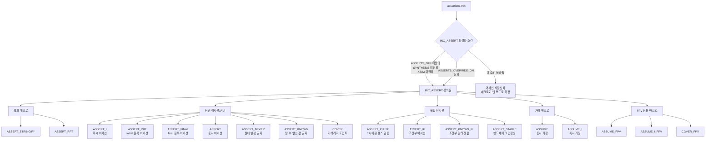

# assertions.svh

## 개요

`assertions.svh`는 SystemVerilog RTL 설계에서 어서션(assertion), 가정(assumption), 커버리지(cover) 검사를 편리하게 삽입할 수 있도록 정의된 매크로 헤더 파일입니다. lowRISC 프로젝트에서 기원하여 Apache-2.0 라이선스로 배포됩니다.

이 파일은 다음과 같은 특징을 제공합니다.

- 기본 클록(`clk_i`)과 리셋(`rst_ni`) 신호를 자동으로 사용하여 반복 코드를 최소화
- UVM(Universal Verification Methodology) 환경과의 통합 지원
- 합성(synthesis), Verilator(`XSIM`), ASSERTS_OFF 정의 시 어서션 자동 비활성화
- 형식 검증(FPV, Formal Property Verification) 전용 매크로 제공

## 블록 다이어그램



## 상세 내용

### 활성화 제어 매크로

어서션 포함 여부는 `INC_ASSERT` 매크로로 제어됩니다.

| 조건 | 결과 |
|------|------|
| `ASSERTS_OFF`, `SYNTHESIS`, `XSIM` 중 하나라도 정의 | `INC_ASSERT` 미정의 → 어서션 비활성화 |
| 위 조건 없이 일반 시뮬레이션 | `INC_ASSERT` 정의 → 어서션 활성화 |
| `ASSERTS_OVERRIDE_ON` 정의 | `INC_ASSERT` 강제 정의 → 어서션 강제 활성화 |

### 기본 클록 및 리셋

```systemverilog
`define ASSERT_DEFAULT_CLK clk_i
`define ASSERT_DEFAULT_RST !rst_ni
```

대부분의 매크로에서 `__clk`와 `__rst` 인자를 생략하면 위 기본값이 사용됩니다. `rst_ni`는 active-low 리셋이므로 `!rst_ni`로 반전하여 disable iff 조건에 사용합니다.

### UVM 통합

`UVM` 매크로가 정의된 경우, 어서션 실패 시 `$error` 대신 `uvm_error`를 사용하여 UVM 리포트 메커니즘으로 오류를 출력합니다.

```systemverilog
package assert_rpt_pkg;
  import uvm_pkg::*;
  `include "uvm_macros.svh"
  function void assert_rpt(string msg);
    `uvm_error("ASSERT FAILED", msg)
  endfunction
endpackage
```

### 헬퍼 매크로

#### `ASSERT_STRINGIFY(__x)`

임의의 코드 블록을 Verilog 문자열로 변환합니다. 주로 어서션 이름을 오류 메시지에 포함할 때 사용합니다.

#### `ASSERT_RPT(__name, __desc = "")`

어서션 실패 시 오류를 출력하는 리포트 매크로입니다. UVM 유무에 따라 출력 방식이 달라집니다. 출력 형식은 `[ASSERT FAILED] [<module>] <name>: <desc> (<file>:<line>)`입니다.

### 단순 어서션 및 커버 매크로

#### `ASSERT_I(__name, __prop, __desc = "")`

**즉시 어서션(Immediate Assertion)**입니다. 시뮬레이션 글리치에 민감하므로 주의가 필요합니다.

```systemverilog
`ASSERT_I(MyCheck, (a == b), "a와 b는 같아야 합니다")
```

#### `ASSERT_INIT(__name, __prop, __desc = "")`

`initial` 블록에서 수행하는 어서션으로, 파라미터 유효성 검사 등에 활용합니다.

```systemverilog
`ASSERT_INIT(WidthCheck, WIDTH > 0, "WIDTH는 양수여야 합니다")
```

#### `ASSERT_FINAL(__name, __prop, __desc = "")`

`final` 블록에서 수행하는 어서션으로, 시뮬레이션 종료 시 큐가 비어 있는지, 모든 크레딧이 반환되었는지, 상태 머신이 idle 상태인지 등을 검사합니다. `+disable_assert_final_checks` plusarg로 비활성화할 수 있습니다.

#### `ASSERT(__name, __prop, __clk, __rst, __desc = "")`

**동시 어서션(Concurrent Assertion)**의 핵심 매크로입니다. 클록의 posedge마다 `__prop`이 참인지 확인하며, 리셋 중에는 검사를 건너뜁니다.

```systemverilog
`ASSERT(ValidStable, valid_i |-> ##[0:$] ready_o)
```

> 리셋 조건으로 `(__rst !== '0)`을 사용합니다. 이는 시뮬레이션 시작 시 리셋이 X값일 때도 올바르게 어서션을 비활성화하기 위함입니다.

#### `ASSERT_NEVER(__name, __prop, __clk, __rst, __desc = "")`

`__prop`이 절대로 참이 되어서는 안 됨을 검사합니다. 내부적으로 `not (__prop)` 형태의 동시 어서션을 사용합니다.

```systemverilog
`ASSERT_NEVER(NoOverflow, overflow_flag)
```

#### `ASSERT_KNOWN(__name, __sig, __clk, __rst, __desc = "")`

리셋 해제 후 신호의 모든 비트가 알려진 값(`'0` 또는 `'1`)인지 검사합니다. X/Z 값 전파를 방지하는 데 유용합니다.

```systemverilog
`ASSERT_KNOWN(OutputKnown, data_out)
```

#### `COVER(__name, __prop, __clk, __rst)`

특정 프로퍼티가 시뮬레이션 중 발생했는지 커버리지 포인트로 기록합니다.

```systemverilog
`COVER(HandshakeCover, valid_i && ready_o)
```

### 복합 어서션 매크로

#### `ASSERT_PULSE(__name, __sig, __clk, __rst, __desc = "")`

신호가 정확히 1 클록 사이클 동안만 high인 펄스인지 검사합니다.

```systemverilog
// 내부 구현: $rose(__sig) |=> !(__sig)
`ASSERT_PULSE(ReqPulse, req_i)
```

#### `ASSERT_IF(__name, __prop, __enable, __clk, __rst, __desc = "")`

`__enable`이 참일 때만 `__prop`을 검사합니다.

```systemverilog
// 내부 구현: (__enable) |-> (__prop)
`ASSERT_IF(DataCheck, data == expected, valid_i)
```

#### `ASSERT_KNOWN_IF(__name, __sig, __enable, __clk, __rst, __desc = "")`

`__enable`이 참일 때 `__sig`에 X/Z가 없는지 검사합니다. 동시에 `__enable` 자체도 알려진 값인지 확인합니다.

#### `ASSERT_STABLE(__name, __valid, __ready, __data, __mask, __clk, __rst, __desc = "")`

핸드셰이크 인터페이스에서 `valid`가 high이고 `ready`가 low인 동안 `data`가 안정적으로 유지되는지 검사합니다. `__mask`로 특정 비트를 마스킹할 수 있습니다.

```systemverilog
// valid=1, ready=0 구간에서 data가 변하지 않아야 함
`ASSERT_STABLE(DataStable, valid_i, ready_o, data_i)
```

### 가정(Assumption) 매크로

형식 검증(FPV)에서 입력 제약을 설정할 때 사용합니다.

#### `ASSUME(__name, __prop, __clk, __rst, __desc = "")`

동시 가정(Concurrent Assumption)입니다. 형식 도구에 입력 신호의 제약 조건을 알려줍니다.

#### `ASSUME_I(__name, __prop, __desc = "")`

즉시 가정(Immediate Assumption)입니다.

### 형식 검증(FPV) 전용 매크로

`FPV_ON` 매크로가 정의된 경우에만 활성화됩니다. 시뮬레이션에서는 무시되어 오버헤드가 없습니다.

| 매크로 | 설명 |
|--------|------|
| `ASSUME_FPV(__name, __prop, ...)` | FPV 전용 동시 가정 |
| `ASSUME_I_FPV(__name, __prop, ...)` | FPV 전용 즉시 가정 |
| `COVER_FPV(__name, __prop, ...)` | FPV 전용 커버리지 포인트 |

> 일반 어서션 매크로(`ASSERT`, `ASSERT_KNOWN` 등)는 FPV와 DV 시뮬레이션 모두에서 동작하므로, FPV 전용 매크로는 FPV에서만 필요한 추가 가정/커버에만 사용합니다.

### 매크로 요약표

| 매크로 | 유형 | 트리거 | 주요 용도 |
|--------|------|--------|-----------|
| `ASSERT_I` | 즉시 어서션 | 즉시 | 콤비네이셔널 조건 검사 |
| `ASSERT_INIT` | initial 어서션 | 시뮬레이션 시작 | 파라미터 유효성 검사 |
| `ASSERT_FINAL` | final 어서션 | 시뮬레이션 종료 | 종료 상태 검사 |
| `ASSERT` | 동시 어서션 | 클록 엣지 | 일반 RTL 프로퍼티 |
| `ASSERT_NEVER` | 동시 어서션 | 클록 엣지 | 금지 조건 |
| `ASSERT_KNOWN` | 동시 어서션 | 클록 엣지 | X/Z 전파 방지 |
| `COVER` | 커버 | 클록 엣지 | 기능 커버리지 |
| `ASSERT_PULSE` | 동시 어서션 | 클록 엣지 | 1사이클 펄스 검증 |
| `ASSERT_IF` | 동시 어서션 | 클록 엣지 | 조건부 프로퍼티 |
| `ASSERT_KNOWN_IF` | 동시 어서션 | 클록 엣지 | 조건부 X/Z 검사 |
| `ASSERT_STABLE` | 동시 어서션 | 클록 엣지 | 핸드셰이크 데이터 안정성 |
| `ASSUME` | 동시 가정 | 클록 엣지 | FPV 입력 제약 |
| `ASSUME_I` | 즉시 가정 | 즉시 | FPV 즉시 제약 |
| `ASSUME_FPV` | 동시 가정 (FPV) | 클록 엣지 | FPV 전용 제약 |
| `ASSUME_I_FPV` | 즉시 가정 (FPV) | 즉시 | FPV 전용 즉시 제약 |
| `COVER_FPV` | 커버 (FPV) | 클록 엣지 | FPV 전용 커버리지 |

## 의존성 및 관계

- **`common_cells.core`**: `rtl` fileset에 include 파일로 등록되어 있으며, `include_path: include`로 설정되어 있습니다. RTL 소스들은 `` `include "common_cells/assertions.svh" ``로 이 파일을 포함합니다.
- **`registers.svh`**: 동일 디렉토리에 위치하며, 함께 RTL 설계에서 include됩니다.
- **UVM 환경**: `UVM` 매크로가 정의된 UVM 테스트벤치에서 컴파일 시 `assert_rpt_pkg`가 활성화되어 UVM 오류 리포팅과 통합됩니다.
- **형식 검증 도구**: `FPV_ON` 매크로를 통해 JasperGold, SymbiYosys 등의 형식 검증 도구와 연동됩니다.
- **`COMMON_CELLS_ASSERTS_OFF` (common_cells.core 파라미터)**: FuseSoC 파라미터로 정의되면 `ASSERTS_OFF`와 함께 전달되어 모든 어서션이 비활성화됩니다.
