# registers.svh

## 개요

`registers.svh`는 RTL 설계에서 플립플롭(Flip-Flop, FF)을 간결하게 표현하기 위한 SystemVerilog 매크로 헤더 파일입니다. ETH Zurich 및 University of Bologna가 개발하였으며 Solderpad Hardware License v0.51 하에 배포됩니다.

이 파일의 목적은 다음과 같습니다.

- `always_ff` 블록을 반복 작성하는 수고를 줄이고 코드 가독성 향상
- 리셋 극성(active-high/low), 리셋 시점(동기/비동기), 로드 인에이블, 클리어 등 다양한 FF 변형을 일관된 인터페이스로 제공
- 기본 클록(`clk_i`) 및 리셋(`rst_ni`) 신호를 생략 가능한 기본값으로 설정하여 코드 간소화
- Verilator 환경에서 Synopsys 어노테이션 자동 비활성화 (`NO_SYNOPSYS_FF`)

## 블록 다이어그램

```mermaid
graph TD
    A[registers.svh] --> B[기본 설정]
    A --> C[리셋 없음 FF]
    A --> D[비동기 리셋 FF]
    A --> E[동기 리셋 FF]
    A --> F[로드 인에이블 FF]

    B --> B1["REG_DFLT_CLK = clk_i"]
    B --> B2["REG_DFLT_RST = rst_ni"]

    C --> C1["FFNR<br/>(리셋 없음)"]
    C --> C2["FFLNR<br/>(로드 인에이블, 리셋 없음)"]

    D --> D1["FF<br/>(active-low, 기본값 사용 가능)"]
    D --> D2["FFAR<br/>(active-high)"]
    D --> D3["FFARN<br/>[deprecated] active-low"]
    D --> D4["FFARNC<br/>(active-low + 동기 클리어)"]

    E --> E1["FFSR<br/>(active-high)"]
    E --> E2["FFSRN<br/>(active-low)"]

    F --> F1["FFL<br/>(async active-low, 기본값 사용 가능)"]
    F --> F2["FFLAR<br/>(async active-high)"]
    F --> F3["FFLARN<br/>[deprecated] async active-low"]
    F --> F4["FFLARNC<br/>(async active-low + 동기 클리어)"]
    F --> F5["FFLSR<br/>(sync active-high)"]
    F --> F6["FFLSRN<br/>(sync active-low)"]
```



## 상세 내용

### 기본 클록 및 리셋 신호

```systemverilog
`define REG_DFLT_CLK clk_i
`define REG_DFLT_RST rst_ni
```

`FF`와 `FFL` 매크로는 `__clk`와 `__arst_n` 인자에 기본값을 지원합니다. 모듈의 클록과 리셋 신호 이름이 `clk_i`, `rst_ni`로 표준화되어 있다면 이 인자를 생략할 수 있습니다.

### Verilator 환경 처리

```systemverilog
`ifdef VERILATOR
`define NO_SYNOPSYS_FF 1
`endif
```

Verilator로 컴파일할 경우 `NO_SYNOPSYS_FF`를 정의하여, 동기 리셋 FF에 삽입되는 Synopsys DC 어노테이션 주석(`/* synopsys sync_set_reset ... */`)이 포함되지 않도록 합니다.

### 매크로 상세 설명

#### `FF` — 비동기 active-low 리셋 플립플롭 (권장)

```systemverilog
`FF(__q, __d, __reset_value, __clk = clk_i, __arst_n = rst_ni)
```

| 인자 | 설명 |
|------|------|
| `__q` | FF의 Q 출력 (레지스터 신호) |
| `__d` | FF의 D 입력 (다음 상태) |
| `__reset_value` | 리셋 시 할당 값 |
| `__clk` | 클록 입력 (기본값: `clk_i`) |
| `__arst_n` | 비동기 리셋, active-low (기본값: `rst_ni`) |

`__arst_n`이 low가 되면 즉시(비동기) `__q`에 `__reset_value`를 할당합니다.

**사용 예:**
```systemverilog
logic [7:0] counter_q, counter_d;
`FF(counter_q, counter_d, '0)  // clk_i, rst_ni 기본값 사용
```

---

#### `FFAR` — 비동기 active-high 리셋 플립플롭

```systemverilog
`FFAR(__q, __d, __reset_value, __clk, __arst)
```

`__arst`가 high가 되면 즉시(비동기) `__q`에 `__reset_value`를 할당합니다. 기본값 인자 없이 모든 인자를 명시해야 합니다.

---

#### `FFARN` — [deprecated] 비동기 active-low 리셋 플립플롭

```systemverilog
`FFARN(__q, __d, __reset_value, __clk, __arst_n)
```

내부적으로 `` `FF ``를 호출합니다. **신규 코드에서는 `` `FF ``를 사용하세요.**

---

#### `FFSR` — 동기 active-high 리셋 플립플롭

```systemverilog
`FFSR(__q, __d, __reset_value, __clk, __reset_clk)
```

클록의 posedge에서만 리셋이 적용됩니다. Synopsys DC를 위한 `sync_set_reset` 어노테이션이 자동으로 삽입됩니다 (`NO_SYNOPSYS_FF` 미정의 시).

---

#### `FFSRN` — 동기 active-low 리셋 플립플롭

```systemverilog
`FFSRN(__q, __d, __reset_value, __clk, __reset_n_clk)
```

`__reset_n_clk`가 low일 때 클록의 posedge에서 리셋이 적용됩니다.

---

#### `FFNR` — 리셋 없는 플립플롭

```systemverilog
`FFNR(__q, __d, __clk)
```

리셋 신호 없이 클록 posedge마다 `__q <= __d`를 수행합니다. 초기화가 필요 없는 데이터 패스에 사용합니다.

**사용 예:**
```systemverilog
`FFNR(data_q, data_d, clk_i)
```

---

#### `FFL` — 로드 인에이블 + 비동기 active-low 리셋 플립플롭 (권장)

```systemverilog
`FFL(__q, __d, __load, __reset_value, __clk = clk_i, __arst_n = rst_ni)
```

| 인자 | 설명 |
|------|------|
| `__load` | `'1`일 때 `__d`를 `__q`에 로드 |

`__load`가 `'0`이면 현재 값을 유지합니다. 리셋은 비동기 active-low입니다.

**사용 예:**
```systemverilog
`FFL(reg_q, reg_d, write_en, '0)  // 쓰기 인에이블이 있는 레지스터
```

---

#### `FFLAR` — 로드 인에이블 + 비동기 active-high 리셋 플립플롭

```systemverilog
`FFLAR(__q, __d, __load, __reset_value, __clk, __arst)
```

---

#### `FFLARN` — [deprecated] 로드 인에이블 + 비동기 active-low 리셋

```systemverilog
`FFLARN(__q, __d, __load, __reset_value, __clk, __arst_n)
```

내부적으로 `` `FFL ``을 호출합니다. **신규 코드에서는 `` `FFL ``을 사용하세요.**

---

#### `FFLSR` — 로드 인에이블 + 동기 active-high 리셋 플립플롭

```systemverilog
`FFLSR(__q, __d, __load, __reset_value, __clk, __reset_clk)
```

리셋이 로드 인에이블보다 우선순위가 높습니다 (`if (reset) ... else if (load) ...`).

---

#### `FFLSRN` — 로드 인에이블 + 동기 active-low 리셋 플립플롭

```systemverilog
`FFLSRN(__q, __d, __load, __reset_value, __clk, __reset_n_clk)
```

---

#### `FFLARNC` — 로드 인에이블 + 비동기 active-low 리셋 + 동기 클리어

```systemverilog
`FFLARNC(__q, __d, __load, __clear, __reset_value, __clk, __arst_n)
```

| 인자 | 설명 |
|------|------|
| `__clear` | 동기 클리어. high이면 클록 엣지에서 `__reset_value` 할당 |

우선순위: 비동기 리셋 > 동기 클리어 > 로드 인에이블 > 유지

---

#### `FFARNC` — 비동기 active-low 리셋 + 동기 클리어

```systemverilog
`FFARNC(__q, __d, __clear, __reset_value, __clk, __arst_n)
```

로드 인에이블 없이 비동기 리셋과 동기 클리어를 모두 지원합니다.

---

#### `FFLNR` — 로드 인에이블 + 리셋 없는 플립플롭

```systemverilog
`FFLNR(__q, __d, __load, __clk)
```

리셋 없이 `__load`가 high일 때만 값을 로드합니다.

### 전체 매크로 요약표

| 매크로 | 리셋 | 리셋 극성 | 리셋 시점 | 로드 인에이블 | 클리어 | 기본값 지원 |
|--------|------|-----------|-----------|---------------|--------|------------|
| `FF` | O | active-low | 비동기 | X | X | O |
| `FFAR` | O | active-high | 비동기 | X | X | X |
| `FFARN` | O | active-low | 비동기 | X | X | X (deprecated) |
| `FFSR` | O | active-high | 동기 | X | X | X |
| `FFSRN` | O | active-low | 동기 | X | X | X |
| `FFNR` | X | — | — | X | X | X |
| `FFL` | O | active-low | 비동기 | O | X | O |
| `FFLAR` | O | active-high | 비동기 | O | X | X |
| `FFLARN` | O | active-low | 비동기 | O | X | X (deprecated) |
| `FFLSR` | O | active-high | 동기 | O | X | X |
| `FFLSRN` | O | active-low | 동기 | O | X | X |
| `FFLARNC` | O | active-low | 비동기+동기 | O | O | X |
| `FFARNC` | O | active-low | 비동기+동기 | X | O | X |
| `FFLNR` | X | — | — | O | X | X |

## 의존성 및 관계

- **`common_cells.core`**: `rtl` fileset에 include 파일로 등록되어 있으며, `include_path: include`로 설정되어 있습니다. RTL 소스들은 `` `include "common_cells/registers.svh" ``로 이 파일을 포함합니다.
- **`assertions.svh`**: 동일 디렉토리에 위치하며, 함께 RTL 설계에서 include됩니다. 두 파일 모두 `common_cells` 라이브러리의 표준 헤더입니다.
- **RTL 소스 파일들**: `src/` 디렉토리의 모든 모듈이 이 파일의 매크로를 활용하여 레지스터를 표현합니다.
- **Verilator**: `VERILATOR` 매크로 정의 시 `NO_SYNOPSYS_FF`를 자동으로 설정하여 Synopsys 어노테이션 없이 컴파일됩니다.
- **Synopsys Design Compiler**: 동기 리셋 FF(`FFSR`, `FFSRN`, `FFLSR`, `FFLSRN`, `FFLARNC`, `FFARNC`)에는 `/* synopsys sync_set_reset ... */` 어노테이션이 포함되어 DC의 합성 최적화를 지원합니다.
