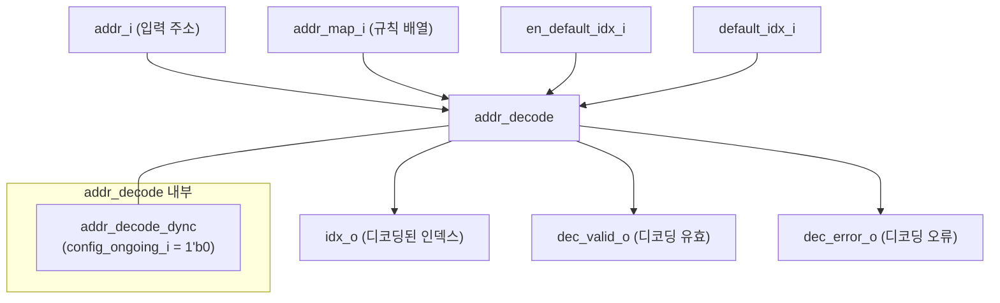

# addr_decode.sv

## 개요

`addr_decode`는 입력 주소를 조합 논리로 인덱스에 매핑하는 주소 디코더 모듈이다. 주소 맵 `addr_map_i`는 `rule_t` 구조체의 패킹된 배열로 구성되며, 두 규칙의 범위가 겹칠 경우 배열에서 더 높은 위치(상위 인덱스)의 규칙이 우선된다.

이 모듈은 내부적으로 `addr_decode_dync`를 래핑하며, `config_ongoing_i`를 항상 `1'b0`으로 고정하여 정적(static) 구성 전용으로 동작한다. NAPOT(Naturally-Aligned Power Of Two) 방식과 일반 범위 방식 모두 지원한다.

## 블록 다이어그램

## 포트/파라미터

### 파라미터

| 파라미터 | 타입 | 기본값 | 설명 |
|---------|------|--------|------|
| `NoIndices` | `int unsigned` | `32'd0` | 규칙에서 사용 가능한 최대 인덱스 수 |
| `NoRules` | `int unsigned` | `32'd0` | 전체 주소 규칙 수 |
| `addr_t` | `type` | `logic` | 규칙 및 디코딩에 사용되는 주소 타입 |
| `rule_t` | `type` | `logic` | 규칙 구조체 타입 (`idx`, `start_addr`, `end_addr` 필드 포함) |
| `Napot` | `bit` | `0` | NAPOT 모드 활성화 여부 (1: base+mask 방식, 0: 범위 방식) |
| `IdxWidth` | `int unsigned` | `cf_math_pkg::idx_width(NoIndices)` | 출력 인덱스 비트폭 (자동 계산) |
| `idx_t` | `type` | `logic [IdxWidth-1:0]` | 출력 인덱스 타입 |

### `rule_t` 구조체 (일반 범위 모드)

| 필드 | 설명 |
|------|------|
| `idx` | 규칙 일치 시 반환할 인덱스 |
| `start_addr` | 범위의 시작 주소 (포함) |
| `end_addr` | 범위의 끝 주소 (미포함); `'0`이면 주소 공간의 끝까지 |

### 포트

| 포트 | 방향 | 타입 | 설명 |
|------|------|------|------|
| `addr_i` | input | `addr_t` | 디코딩할 입력 주소 |
| `addr_map_i` | input | `rule_t [NoRules-1:0]` | 주소 규칙 배열 (상위 인덱스 규칙이 우선) |
| `idx_o` | output | `idx_t` | 디코딩된 출력 인덱스 |
| `dec_valid_o` | output | `logic` | 디코딩 결과가 유효함을 나타내는 신호 |
| `dec_error_o` | output | `logic` | 일치하는 규칙이 없음을 나타내는 오류 신호 |
| `en_default_idx_i` | input | `logic` | 기본 인덱스 매핑 활성화 (`1'b1`이면 미매핑 주소를 기본 인덱스로 연결) |
| `default_idx_i` | input | `idx_t` | 기본 인덱스 값 (`en_default_idx_i`가 `1`일 때 사용) |

## 동작 설명

1. **규칙 매핑**: `addr_map_i` 배열을 순회하며 `addr_i`가 각 규칙의 범위에 속하는지 검사한다.
   - 일반 모드: `start_addr <= addr_i < end_addr` 조건을 검사
   - NAPOT 모드: `(start_addr & mask) == (addr_i & mask)` 조건을 검사

2. **우선순위**: 배열에서 인덱스가 높을수록 우선순위가 높다. 겹치는 규칙이 있을 경우 가장 마지막에 매칭된 (높은 인덱스) 규칙이 적용된다.

3. **기본 인덱스**: `en_default_idx_i`가 `1'b1`이면, 일치하는 규칙이 없는 경우 `default_idx_i`를 출력하고 `dec_error_o`는 `1'b0`이 된다.

4. **오류 출력**: 일치하는 규칙이 없고 기본 인덱스가 비활성화된 경우 `dec_error_o`가 `1'b1`이 된다.

5. **정적 동작**: `config_ongoing_i = 1'b0`으로 고정하여 `addr_decode_dync` 모듈을 정적 모드로 래핑한다.

## 의존성 및 관계

| 모듈/패키지 | 관계 | 설명 |
|------------|------|------|
| `addr_decode_dync` | 내부 인스턴스화 | 실제 디코딩 로직을 수행하는 동적 설정 버전 |
| `cf_math_pkg` | 패키지 사용 | `idx_width()` 함수로 `IdxWidth` 기본값 계산 |
| `addr_decode_napot` | 상위 래퍼 | NAPOT 전용 인터페이스를 제공하는 래퍼 모듈 |
