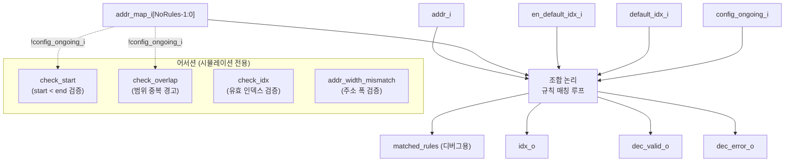

# addr_decode_dync.sv

## 개요

`addr_decode_dync`는 동적 구성(Dynamic Configuration, DYNC)을 지원하는 주소 디코더 모듈이다. 입력 주소를 조합 논리로 인덱스에 매핑하며, 런타임 중 주소 맵이 변경될 때 `config_ongoing_i` 신호로 출력을 비활성화하고 내부 검증 어서션을 억제할 수 있다.

`addr_decode` 모듈의 실제 디코딩 로직을 담당하는 핵심 모듈로, 일반 범위(range) 방식과 NAPOT(Naturally-Aligned Power Of Two) 방식을 모두 지원한다.

## 블록 다이어그램

## 포트/파라미터

### 파라미터

| 파라미터 | 타입 | 기본값 | 설명 |
|---------|------|--------|------|
| `NoIndices` | `int unsigned` | `32'd0` | 규칙에서 허용되는 최대 인덱스 수 |
| `NoRules` | `int unsigned` | `32'd0` | 전체 주소 규칙 수 (최소 1 이상 필요) |
| `addr_t` | `type` | `logic` | 규칙 및 디코딩에 사용되는 주소 타입 |
| `rule_t` | `type` | `logic` | 규칙 구조체 타입 (`idx`, `start_addr`, `end_addr` 필드 포함) |
| `Napot` | `bit` | `0` | NAPOT 모드 활성화 여부 (1: base+mask 방식, 0: 범위 방식) |
| `IdxWidth` | `int unsigned` | `cf_math_pkg::idx_width(NoIndices)` | 출력 인덱스 비트폭 (자동 계산) |
| `idx_t` | `type` | `logic [IdxWidth-1:0]` | 출력 인덱스 타입 |

### `rule_t` 구조체

| 필드 | 일반 모드 | NAPOT 모드 | 설명 |
|------|---------|-----------|------|
| `idx` | 반환 인덱스 | 반환 인덱스 | 일치 시 반환할 인덱스 값 |
| `start_addr` | 범위 시작 (포함) | base 주소 | 일반: 포함 범위 시작; NAPOT: 비교 기준 주소 |
| `end_addr` | 범위 끝 (미포함) | mask | 일반: 미포함 범위 끝 (`'0`=끝까지); NAPOT: 비교할 비트 마스크 |

### 포트

| 포트 | 방향 | 타입 | 설명 |
|------|------|------|------|
| `addr_i` | input | `addr_t` | 디코딩할 입력 주소 |
| `addr_map_i` | input | `rule_t [NoRules-1:0]` | 주소 규칙 배열 (상위 인덱스 규칙이 우선) |
| `idx_o` | output | `idx_t` | 디코딩된 출력 인덱스 |
| `dec_valid_o` | output | `logic` | 디코딩 결과가 유효함을 나타내는 신호 |
| `dec_error_o` | output | `logic` | 일치하는 규칙이 없음을 나타내는 오류 신호 |
| `en_default_idx_i` | input | `logic` | 기본 인덱스 매핑 활성화 신호 |
| `default_idx_i` | input | `idx_t` | 기본 인덱스 값 |
| `config_ongoing_i` | input | `logic` | 동적 설정 진행 중 신호; `1`이면 출력 비활성화 및 어서션 억제 |

## 동작 설명

### 조합 논리 (always_comb)

1. **기본값 설정**:
   - `matched_rules = '0`
   - `dec_valid_o = 1'b0`
   - `dec_error_o = en_default_idx_i ? 1'b0 : 1'b1`
   - `idx_o = en_default_idx_i ? default_idx_i : '0`

2. **규칙 매칭 루프** (`for i = 0 to NoRules-1`):
   - **일반 모드** (`Napot == 0`): `addr_i >= start_addr` AND (`addr_i < end_addr` OR `end_addr == '0`)
   - **NAPOT 모드** (`Napot == 1`): `(start_addr & mask) == (addr_i & mask)`
   - 매칭 시: `matched_rules[i]`, `dec_valid_o`를 `~config_ongoing_i`로 설정, `dec_error_o = 1'b0`
   - `config_ongoing_i`가 `1`이면 출력을 `default_idx_i`로 유지

3. **우선순위**: 루프를 순방향으로 진행하므로, 높은 인덱스(i가 큰)의 규칙이 나중에 덮어쓰여 최종적으로 우선된다.

### 어서션 및 검증

| 어서션 | 조건 | 설명 |
|--------|------|------|
| `addr_width_mismatch` | `$bits(addr_i) == $bits(addr_map_i[0].start_addr)` | 주소 폭 일치 검사 |
| `norules_0` | `NoRules > 0` | 최소 1개의 규칙 필요 |
| `more_than_1_bit_set` | `$onehot0(matched_rules)` | 동시에 2개 이상 규칙 매칭 금지 |
| `check_start` | `start_addr < end_addr` 또는 `end_addr == '0` | 유효한 범위 검사 (비 NAPOT) |
| `check_overlap` | 두 규칙의 범위가 겹치지 않아야 함 | 범위 중복 경고 (비 NAPOT) |

## 의존성 및 관계

| 모듈/패키지 | 관계 | 설명 |
|------------|------|------|
| `cf_math_pkg` | 패키지 사용 | `idx_width()` 함수로 `IdxWidth` 기본값 계산 |
| `common_cells/assertions.svh` | 헤더 포함 | `ASSUME_I`, `ASSERT_FINAL` 등 어서션 매크로 |
| `addr_decode` | 상위 래퍼 | `config_ongoing_i = 1'b0`으로 고정하는 정적 버전 |
| `addr_decode_napot` | 상위 래퍼 | NAPOT 전용 필드명으로 래핑하는 버전 |
