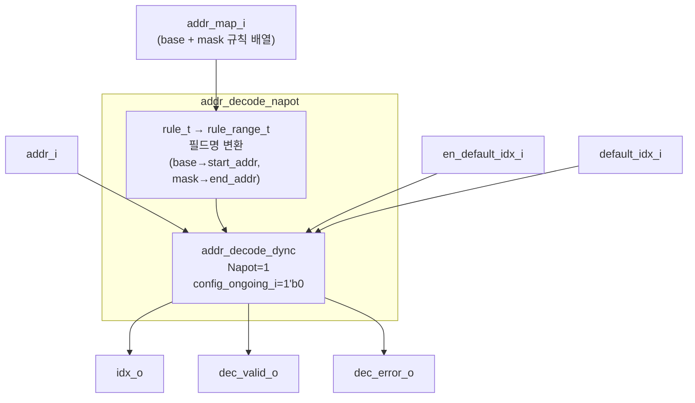
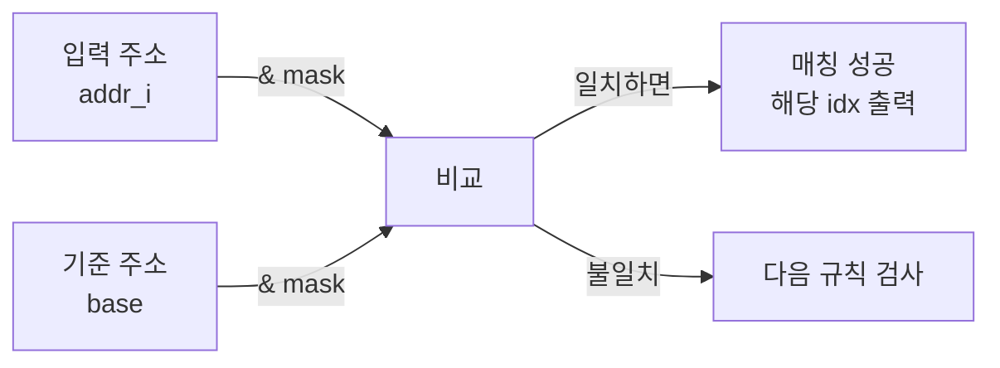

# addr_decode_napot.sv

## 개요

`addr_decode_napot`는 NAPOT(Naturally-Aligned Power Of Two, 자연 정렬 2의 거듭제곱) 방식 전용 주소 디코더 래퍼 모듈이다. `addr_decode_dync`를 `Napot = 1`로 감싸며, 범용 모듈에서 사용하는 `start_addr`/`end_addr` 대신 더 직관적인 `base`/`mask` 필드명을 사용할 수 있도록 한다.

NAPOT 방식은 `(base & mask) == (addr_i & mask)` 조건으로 주소 일치를 판단하므로, 2의 거듭제곱 크기의 자연 정렬된 메모리 영역을 간결하게 표현할 수 있다.

## 블록 다이어그램



### NAPOT 주소 매칭 원리



## 포트/파라미터

### 파라미터

| 파라미터 | 타입 | 기본값 | 설명 |
|---------|------|--------|------|
| `NoIndices` | `int unsigned` | `32'd0` | 규칙에서 허용되는 최대 인덱스 수 |
| `NoRules` | `int unsigned` | `32'd0` | 전체 주소 규칙 수 |
| `addr_t` | `type` | `logic` | 규칙 및 디코딩에 사용되는 주소 타입 |
| `rule_t` | `type` | `logic` | NAPOT 규칙 구조체 타입 (`idx`, `base`, `mask` 필드 포함) |
| `IdxWidth` | `int unsigned` | `cf_math_pkg::idx_width(NoIndices)` | 출력 인덱스 비트폭 (파생 파라미터, 덮어쓰기 금지) |
| `idx_t` | `type` | `logic [IdxWidth-1:0]` | 출력 인덱스 타입 (파생 파라미터, 덮어쓰기 금지) |

### `rule_t` 구조체 (NAPOT 전용)

| 필드 | 타입 | 설명 |
|------|------|------|
| `idx` | `int unsigned` | 규칙 인덱스. `NoIndices`보다 작아야 함 |
| `base` | `addr_t` | 비교 기준이 되는 베이스 주소 |
| `mask` | `addr_t` | 비교할 비트를 지정하는 마스크 (세트된 비트만 검사) |

### 포트

| 포트 | 방향 | 타입 | 설명 |
|------|------|------|------|
| `addr_i` | input | `addr_t` | 디코딩할 입력 주소 |
| `addr_map_i` | input | `rule_t [NoRules-1:0]` | NAPOT 규칙 배열 (상위 인덱스 규칙이 우선) |
| `idx_o` | output | `idx_t` | 디코딩된 출력 인덱스 |
| `dec_valid_o` | output | `logic` | 디코딩 결과 유효 신호 |
| `dec_error_o` | output | `logic` | 일치하는 규칙 없음 오류 신호 |
| `en_default_idx_i` | input | `logic` | 기본 인덱스 매핑 활성화 신호 |
| `default_idx_i` | input | `idx_t` | 기본 인덱스 값 |

## 동작 설명

1. **내부 타입 변환**: `rule_t`의 `base`/`mask` 필드를 `addr_decode_dync`가 기대하는 `start_addr`/`end_addr` 필드명의 `rule_range_t`로 재정의한다.

   ```systemverilog
   typedef struct packed {
     int unsigned  idx;
     addr_t        start_addr;  // base에 해당
     addr_t        end_addr;    // mask에 해당
   } rule_range_t;
   ```

2. **디코딩 조건**: `addr_decode_dync` 내부에서 NAPOT 조건으로 평가된다.
   - `(start_addr & end_addr) == (addr_i & end_addr)`
   - 즉, `(base & mask) == (addr_i & mask)`

3. **정적 동작**: `config_ongoing_i = 1'b0`으로 고정되어 동적 설정 중 억제 기능은 비활성화된다.

4. **우선순위**: `addr_map_i` 배열에서 인덱스가 높은 규칙이 충돌 시 우선된다.

### NAPOT 마스크 예시

| 영역 | base | mask | 커버 범위 |
|------|------|------|---------|
| 4KB @ 0x0000 | `0x0000` | `0xF000` | 0x0000 ~ 0x0FFF |
| 64KB @ 0x1_0000 | `0x1_0000` | `0xFFFF_0000` | 0x1_0000 ~ 0x1_FFFF |

## 의존성 및 관계

| 모듈/패키지 | 관계 | 설명 |
|------------|------|------|
| `addr_decode_dync` | 내부 인스턴스화 | `Napot=1`, `config_ongoing_i=1'b0`으로 호출 |
| `cf_math_pkg` | 패키지 사용 | `idx_width()` 함수로 `IdxWidth` 기본값 계산 |
| `addr_decode` | 형제 모듈 | 일반 범위 방식의 정적 주소 디코더 |
