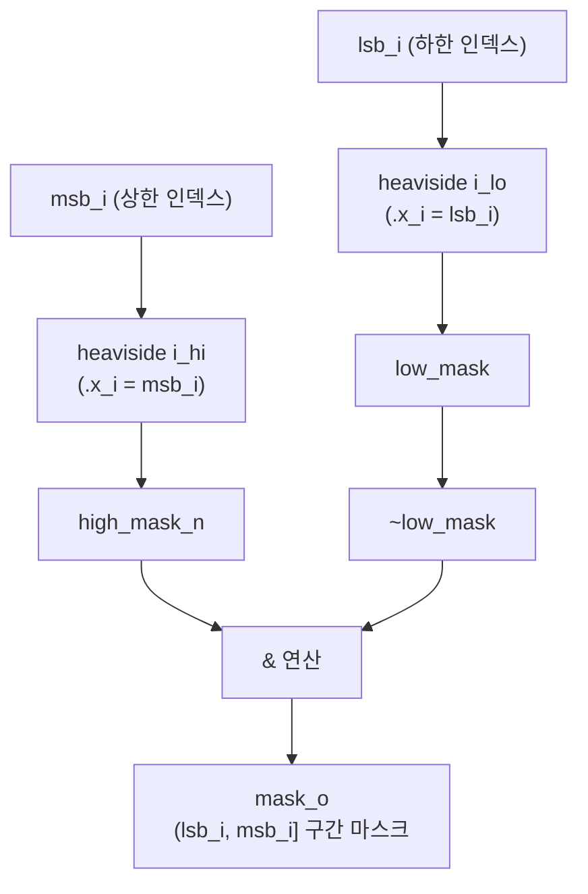
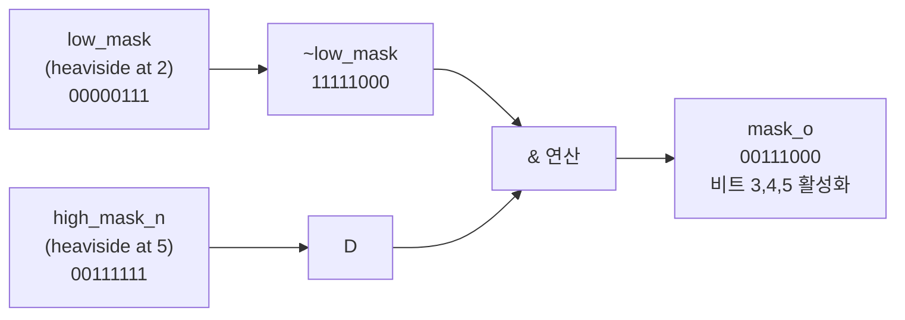

# boxcar.sv

## 개요

`boxcar`는 박스카 함수(Boxcar Function)를 기반으로 비트 마스크를 생성하는 조합 논리 모듈이다. 입력으로 하한 인덱스 `lsb_i`와 상한 인덱스 `msb_i`를 받아, `(lsb_i, msb_i]` 구간의 비트만 1로 설정된 마스크를 출력한다.

두 개의 `heaviside` 모듈(단위 계단 함수)을 조합하여 구간 마스크를 생성한다. `low_mask`는 `lsb_i` 기준 하위 마스크이며, `high_mask_n`은 `msb_i` 기준 상위 마스크이다. 최종 출력은 `~low_mask & high_mask_n`으로 두 마스크의 차집합에 해당하는 비트만 활성화된다.

## 블록 다이어그램

### 마스크 생성 예시 (Width=8, lsb_i=2, msb_i=5)

## 포트/파라미터

### 파라미터

| 파라미터 | 타입 | 기본값 | 설명 |
|---------|------|--------|------|
| `Width` | `int unsigned` | `32` | 출력 마스크의 비트 폭 |
| `IdxWidth` | `int unsigned` | `cf_math_pkg::idx_width(Width)` | 인덱스 입력 비트폭 (파생 localparam, 덮어쓰기 금지) |
| `idx_t` | `type` | `logic [IdxWidth-1:0]` | 인덱스 입력 타입 (파생 localparam) |
| `mask_t` | `type` | `logic [Width-1:0]` | 마스크 출력 타입 (파생 localparam) |

### 포트

| 포트 | 방향 | 타입 | 설명 |
|------|------|------|------|
| `lsb_i` | input | `idx_t` | 마스크 하한 인덱스 (해당 비트는 마스크에 미포함) |
| `msb_i` | input | `idx_t` | 마스크 상한 인덱스 (해당 비트는 마스크에 포함) |
| `mask_o` | output | `mask_t` | `(lsb_i, msb_i]` 구간의 비트가 1인 출력 마스크 |

## 동작 설명

1. **Heaviside 하위 마스크**: `heaviside i_lo`는 `lsb_i`를 기준으로 `[0, lsb_i)` 범위의 비트를 1로 설정한 `low_mask`를 생성한다.

2. **Heaviside 상위 마스크**: `heaviside i_hi`는 `msb_i`를 기준으로 `[0, msb_i)` 범위의 비트를 1로 설정한 `high_mask_n`을 생성한다.

3. **최종 마스크 계산**: `mask_o = ~low_mask & high_mask_n`
   - `~low_mask`: `[lsb_i, Width-1]` 범위의 비트가 1
   - `& high_mask_n`: 그 중 `[0, msb_i)` 범위만 유지
   - 결과: `[lsb_i, msb_i)` 즉 `(lsb_i-1, msb_i]`에 해당하는 비트가 1

4. **구간 정의**: 출력 마스크에서 비트 `b`는 `lsb_i < b <= msb_i`일 때 1이다 (lsb_i 미포함, msb_i 포함).

### 진리표 예시 (Width=8)

| `lsb_i` | `msb_i` | `mask_o` (이진) | 활성 비트 |
|---------|---------|----------------|---------|
| 0 | 3 | `00001110` | 1, 2, 3 |
| 2 | 6 | `01111100` | 3, 4, 5, 6 |
| 0 | 8 | `11111110` | 1~7 |
| 3 | 3 | `00000000` | 없음 |

## 의존성 및 관계

| 모듈/패키지 | 관계 | 설명 |
|------------|------|------|
| `heaviside` | 내부 인스턴스화 (2개) | 단위 계단 함수 마스크 생성 서브모듈 |
| `cf_math_pkg` | 패키지 사용 | `idx_width()` 함수로 `IdxWidth` 계산 |
