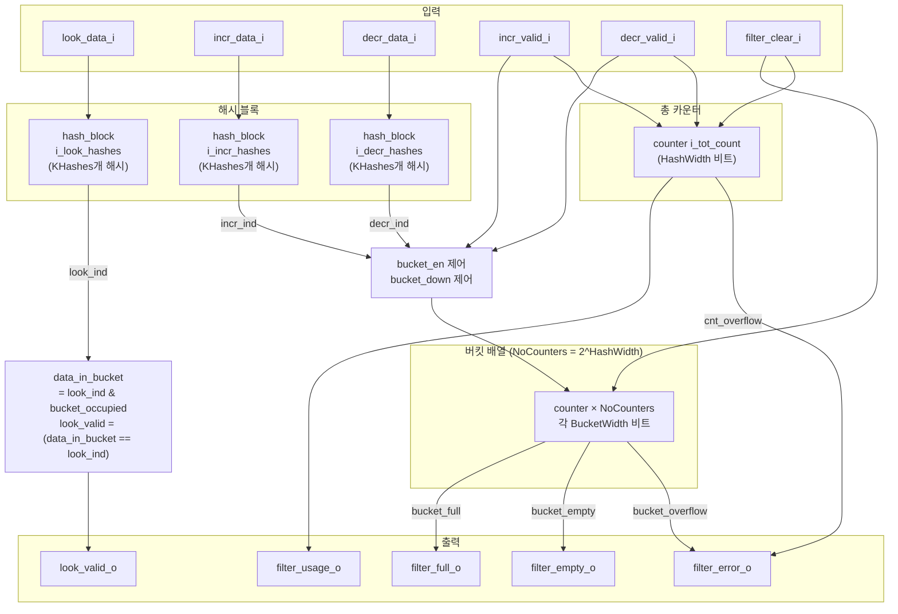

# cb_filter.sv

## 개요

`cb_filter`는 파라미터화 가능한 해시 함수를 사용하는 계수형 블룸 필터(Counting Bloom Filter) 모듈이다. 블룸 필터는 집합 멤버십을 효율적으로 구현하는 확률적 자료구조로, 거짓 양성(false positive)은 가능하지만 거짓 음성(false negative)은 발생하지 않는다.

주요 기능:
- **룩업(Lookup)**: 데이터가 필터에 존재하는지 조합적으로 검사
- **증가(Increment)**: 데이터를 필터에 추가
- **감소(Decrement)**: 필터에서 데이터 제거 (이전에 추가된 데이터만 제거 가능)
- **상태 신호**: 필터의 사용량, 포화 여부, 비어 있음, 오류 상태 출력

## 블록 다이어그램

## 포트/파라미터

### 파라미터

| 파라미터 | 타입 | 기본값 | 설명 |
|---------|------|--------|------|
| `KHashes` | `int unsigned` | `3` | 해시 함수 수 |
| `HashWidth` | `int unsigned` | `4` | 버킷 주소 폭 (버킷 수 = 2^HashWidth) |
| `HashRounds` | `int unsigned` | `1` | 해시 내부 치환-대체 라운드 수 |
| `InpWidth` | `int unsigned` | `32` | 입력 데이터 폭 (비트) |
| `BucketWidth` | `int unsigned` | `4` | 각 버킷 카운터의 비트폭 |
| `Seeds` | `cb_filter_pkg::cb_seed_t [KHashes-1:0]` | `cb_filter_pkg::EgSeeds` | 각 해시 함수의 PRG 시드 배열 |

### 포트

| 포트 | 방향 | 타입 | 설명 |
|------|------|------|------|
| `clk_i` | input | `logic` | 클록 신호 |
| `rst_ni` | input | `logic` | 액티브 로우 리셋 |
| `look_data_i` | input | `logic [InpWidth-1:0]` | 룩업할 데이터 |
| `look_valid_o` | output | `logic` | 룩업 데이터가 필터에 존재하면 High |
| `incr_data_i` | input | `logic [InpWidth-1:0]` | 필터에 추가할 데이터 |
| `incr_valid_i` | input | `logic` | 증가 동작 활성화 신호 |
| `decr_data_i` | input | `logic [InpWidth-1:0]` | 필터에서 제거할 데이터 |
| `decr_valid_i` | input | `logic` | 감소 동작 활성화 신호 |
| `filter_clear_i` | input | `logic` | 필터 초기화 (모든 카운터를 0으로 리셋) |
| `filter_usage_o` | output | `logic [HashWidth-1:0]` | 현재 필터에 저장된 항목 수 |
| `filter_full_o` | output | `logic` | 필터가 꽉 찬 상태 (더 이상 추가 불가) |
| `filter_empty_o` | output | `logic` | 필터가 비어 있는 상태 |
| `filter_error_o` | output | `logic` | 내부 카운터 또는 버킷 오버플로 발생 |

## 동작 설명

### 해시 함수 블록 (`hash_block`)

각 해시 블록은 `KHashes`개의 `sub_per_hash` 서브모듈을 포함하며, 각각 PRG 시드(`PermuteSeed`, `XorSeed`)로 초기화된다. 각 해시 함수가 생성한 원핫(one-hot) 벡터들을 OR 연산하여 `NoCounters` 크기의 `indicator` 비트맵을 출력한다.

### 버킷 제어 로직

| `incr_valid_i` | `decr_valid_i` | `bucket_en` |
|---------------|---------------|------------|
| 0 | 0 | `'0` (비활성) |
| 1 | 0 | `incr_ind` (증가 대상 버킷만 활성) |
| 0 | 1 | `decr_ind` (감소 대상 버킷만 활성) |
| 1 | 1 | `incr_ind ^ decr_ind` (동시 수행 시 XOR) |

### 버킷 상태 신호

| 신호 | 계산식 | 의미 |
|------|--------|------|
| `bucket_occupied[i]` | `\|bucket_content` | 버킷에 1개 이상 카운트 존재 |
| `bucket_empty[i]` | `~bucket_occupied[i]` | 버킷이 비어 있음 |
| `bucket_full[i]` | `bucket_overflow[i] \| (&bucket_content)` | 버킷이 최대 카운트에 도달 |

### 필터 출력 플래그

| 출력 | 계산식 | 설명 |
|------|--------|------|
| `look_valid_o` | `(look_ind & bucket_occupied) == look_ind` | 모든 해시 포인터 버킷이 점유되어 있으면 멤버로 판단 |
| `filter_full_o` | `\|bucket_full` | 하나라도 꽉 찬 버킷이 있으면 Full |
| `filter_empty_o` | `&bucket_empty` | 모든 버킷이 비어 있으면 Empty |
| `filter_error_o` | `\|bucket_overflow \| cnt_overflow` | 어느 카운터라도 오버플로 시 Error |

## 의존성 및 관계

| 모듈/패키지 | 관계 | 설명 |
|------------|------|------|
| `hash_block` | 내부 인스턴스화 (3개) | 룩업/증가/감소 각각 별도 해시 블록 |
| `sub_per_hash` | `hash_block` 내부 인스턴스화 | 개별 치환-대체 해시 함수 |
| `counter` | 내부 인스턴스화 (NoCounters+1개) | 버킷 카운터 및 총 카운터 |
| `cb_filter_pkg` | 패키지 사용 | `cb_seed_t` 타입 및 `EgSeeds` 기본값 제공 |
| `common_cells/assertions.svh` | 헤더 포함 | `ASSUME_I` 어서션 매크로 |
