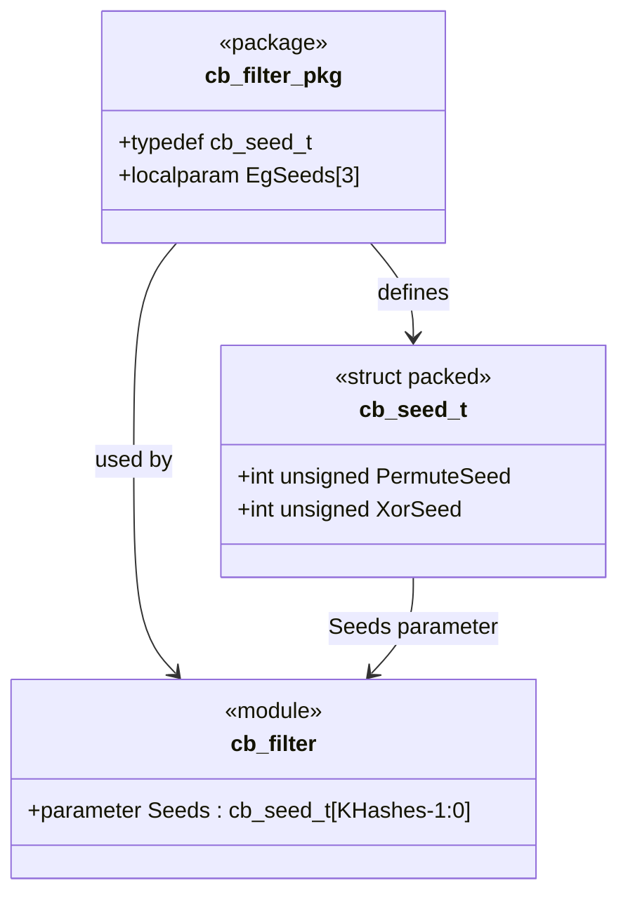

# cb_filter_pkg.sv

## 개요

`cb_filter_pkg`는 계수형 블룸 필터(`cb_filter`) 모듈에서 사용하는 해시 함수의 시드(seed) 구조체 타입과 예시 시드 값을 정의하는 SystemVerilog 패키지다.

각 해시 함수는 내부 의사난수 생성기(PRG, Pseudo-Random Generator)를 초기화하기 위한 두 개의 시드 값(`PermuteSeed`, `XorSeed`)을 필요로 하며, 이 패키지는 해당 구조체와 기본 예시 시드를 제공한다.

## 블록 다이어그램

## 포트/파라미터

이 파일은 모듈이 아닌 패키지이므로 포트가 없다. 정의된 타입과 상수는 다음과 같다.

### 타입 정의

| 타입 | 종류 | 설명 |
|------|------|------|
| `cb_seed_t` | `struct packed` | 해시 함수의 PRG 시드 구조체 |

#### `cb_seed_t` 구조체 필드

| 필드 | 타입 | 설명 |
|------|------|------|
| `PermuteSeed` | `int unsigned` | 치환(permutation) 연산에 사용되는 시드 값 |
| `XorSeed` | `int unsigned` | XOR 연산에 사용되는 시드 값 |

### 상수 (localparam)

| 상수 | 타입 | 값 | 설명 |
|------|------|-----|------|
| `EgSeeds` | `cb_seed_t [2:0]` | 아래 표 참조 | `cb_filter`의 `Seeds` 파라미터 기본값으로 사용되는 예시 시드 3개 |

#### `EgSeeds` 값

| 인덱스 | `PermuteSeed` | `XorSeed` |
|--------|--------------|----------|
| `[2]` | `299034753` | `4094834` |
| `[1]` | `19921030` | `995713` |
| `[0]` | `294388` | `65146511` |

## 동작 설명

이 패키지 자체는 동작 로직 없이 타입과 상수만 정의한다.

- **`cb_seed_t`**: `cb_filter` 모듈의 `Seeds` 파라미터 타입으로 사용된다. 해시 함수 수(`KHashes`)만큼의 시드 배열을 제공하며, 각 원소가 하나의 해시 함수 PRG를 초기화한다.

- **시드 선택 가이드라인**: 시드 값은 컴파일/정교화 시점(elaboration time)에 결정된다. 서로 다른 해시 함수가 서로 다른 패턴을 생성하도록 시드를 선택해야 충돌률(collision rate)을 낮출 수 있다. 원칙적으로 어떤 시드 조합도 사용 가능하지만, 충분히 다양한 해시 출력 패턴을 보장하는 시드를 선택하는 것이 권장된다.

## 의존성 및 관계

| 모듈/패키지 | 관계 | 설명 |
|------------|------|------|
| `cb_filter` | 사용처 | `cb_seed_t` 타입과 `EgSeeds` 기본값을 파라미터로 사용 |
| `hash_block` | 간접 사용처 | `cb_filter` 내부에서 `Seeds`를 `hash_block`에 전달 |
| `sub_per_hash` | 간접 사용처 | `hash_block` 내부에서 각 시드로 PRG 초기화 |
