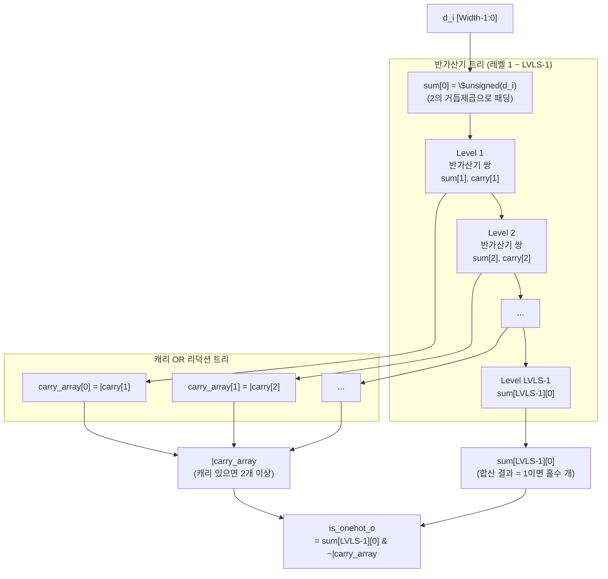
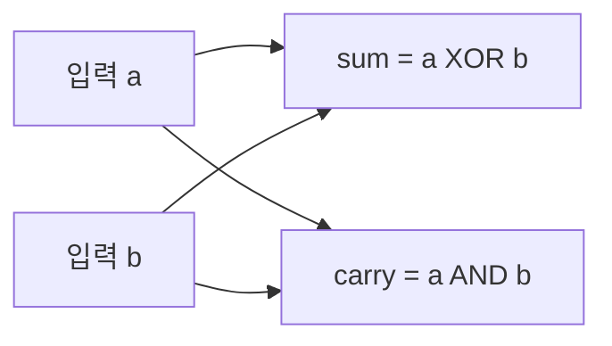

# cc_onehot.sv

## 개요

`cc_onehot`는 SystemVerilog의 `$onehot()` 시스템 함수를 하드웨어로 구현한 조합 논리 모듈이다. 입력 벡터에서 정확히 1개의 비트만 설정되어 있는지를 검사하며, 반가산기(Half Adder) 트리와 캐리 OR 리덕션 트리를 조합하여 효율적으로 구현된다.

원핫 인코딩 검증이 필요한 디코더, 중재기(arbiter), FSM 등에서 활용할 수 있다.

## 블록 다이어그램

### 반가산기 동작

## 포트/파라미터

### 파라미터

| 파라미터 | 타입 | 기본값 | 설명 |
|---------|------|--------|------|
| `Width` | `int unsigned` | `4` | 입력 벡터의 비트폭 |

### 내부 파생 상수

| 상수 | 계산식 | 설명 |
|------|--------|------|
| `LVLS` | `$clog2(Width) + 1` | 반가산기 트리 레벨 수 |

### 포트

| 포트 | 방향 | 타입 | 설명 |
|------|------|------|------|
| `d_i` | input | `logic [Width-1:0]` | 원핫 여부를 검사할 입력 벡터 |
| `is_onehot_o` | output | `logic` | 입력이 원핫이면 `1`, 아니면 `0` |

## 동작 설명

### 특수 케이스: Width == 1

`Width`가 1인 경우 단순히 `is_onehot_o = d_i`로 직결된다.

### 일반 케이스: Width > 1

1. **입력 패딩**: `d_i`를 `2^(LVLS-1)` 크기의 `sum[0]`으로 부호 없는 변환하여 확장 (패딩 비트는 0).

2. **반가산기 트리 구성** (레벨 1 ~ LVLS-1):
   - 각 레벨에서 인접한 두 비트 쌍에 반가산기 적용
   - `sum[i][j/2] = sum[i-1][j] ^ sum[i-1][j+1]` (XOR = 합)
   - `carry[i][j/2] = sum[i-1][j] & sum[i-1][j+1]` (AND = 캐리)

3. **캐리 OR 리덕션**: 각 레벨의 캐리를 OR 리덕션하여 `carry_array[i-1]`에 저장. 캐리가 하나라도 발생하면 입력에 1이 2개 이상 존재한다는 의미.

4. **최종 출력**:
   - `sum[LVLS-1][0]`: 모든 비트의 XOR 합산. 홀수 개의 1이 있으면 1.
   - `~|carry_array`: 어떤 레벨에서도 캐리가 없어야 함 (즉, 2개 이상의 1이 없어야 함).
   - `is_onehot_o = sum[LVLS-1][0] & ~|carry_array`: 합이 1이고 캐리가 없는 경우에만 원핫.

### 진리표 예시 (Width=4)

| `d_i` | `is_onehot_o` | 설명 |
|-------|--------------|------|
| `0000` | 0 | 비트 없음 |
| `0001` | 1 | 정확히 1개 |
| `0010` | 1 | 정확히 1개 |
| `0100` | 1 | 정확히 1개 |
| `1000` | 1 | 정확히 1개 |
| `0011` | 0 | 2개 이상 |
| `1111` | 0 | 4개 |

## 의존성 및 관계

이 모듈은 외부 모듈이나 패키지에 의존하지 않는 독립적인 조합 논리 모듈이다.

| 모듈/패키지 | 관계 | 설명 |
|------------|------|------|
| (없음) | - | 독립적 구현, 외부 의존성 없음 |

이 모듈을 활용하는 대표적인 사용처:
- 디코더/멀티플렉서의 선택 신호 유효성 검증
- 중재기(arbiter)의 그랜트 신호 원핫 확인
- FSM의 상태 레지스터 유효성 검사 (원핫 FSM 인코딩)
- 어서션/검증 로직에서 `$onehot()` 대체 하드웨어 구현
