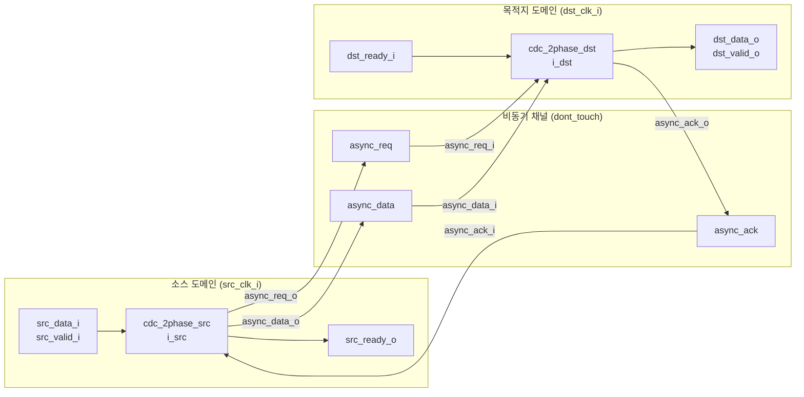

# cdc_2phase (`cdc_2phase.sv`)

## 개요

2-페이즈 핸드셰이크 방식의 클록 도메인 크로싱(CDC) 모듈입니다. 소스 도메인과 목적지 도메인 사이에서 데이터를 안전하게 전송합니다. 2-페이즈 방식은 req와 ack가 각각 토글(toggle)되는 방식으로 동작하여 레벨이 아닌 에지 변화로 트랜잭션을 인식합니다. 단방향 데이터 흐름(소스 → 목적지)을 지원합니다.

**중요 제약:** 웜 리셋(warm reset) 시나리오에서는 사용하지 마십시오. 웜 리셋이 필요한 경우 `cdc_2phase_clearable`을 사용하세요. POR(Power-On Reset)의 경우 두 리셋(`src_rst_ni`, `dst_rst_ni`)이 동시에 어서트되어야 합니다.

## 블록 다이어그램



## 포트 목록

| 포트명 | 방향 | 비트폭 | 설명 |
|--------|------|--------|------|
| `src_rst_ni` | input | 1 | 소스 도메인 리셋 (active-low) |
| `src_clk_i` | input | 1 | 소스 도메인 클록 |
| `src_data_i` | input | T | 소스 입력 데이터 |
| `src_valid_i` | input | 1 | 소스 데이터 유효 신호 |
| `src_ready_o` | output | 1 | 소스 준비 신호 (데이터 수신 가능) |
| `dst_rst_ni` | input | 1 | 목적지 도메인 리셋 (active-low) |
| `dst_clk_i` | input | 1 | 목적지 도메인 클록 |
| `dst_data_o` | output | T | 목적지 출력 데이터 |
| `dst_valid_o` | output | 1 | 목적지 데이터 유효 신호 |
| `dst_ready_i` | input | 1 | 목적지 준비 신호 |

## 파라미터

| 파라미터명 | 기본값 | 설명 |
|-----------|--------|------|
| `T` | `logic` | 전송할 데이터 타입 |

## 동작 설명

### 2-페이즈 핸드셰이크 원리

```
소스: valid_i=1, ready_o=1(req==ack) → req 토글 → 데이터 전송
목적지: req 변화 감지(sync 후) → valid_o=1(ack!=req) → ready_i=1 → ack 토글
소스: ack 동기화 후 ready_o=1 복귀 (req==ack)
```

**타이밍 다이어그램:**
```
src_clk:    _|‾|_|‾|_|‾|_|‾|_|‾|_|‾|_|‾|_|‾|_
async_req:  ________|‾‾‾‾‾‾‾‾‾‾‾‾‾‾‾‾‾‾‾‾‾‾‾‾‾‾‾‾
async_ack:  ________________________|‾‾‾‾‾‾‾‾‾‾‾‾‾
src_ready:  ‾‾‾‾‾‾‾‾‾|_________________________|‾‾

dst_clk:    _|‾|_|‾|_|‾|_|‾|_|‾|_|‾|_|‾|_|‾|_
dst_valid:  ________________|‾‾‾‾‾‾‾‾‾‾‾|_______
```

### 소스 측 (`cdc_2phase_src`)
- `req_src_q`: 유효한 전송 시 토글되는 요청 플립플롭
- `ack_src_q`, `ack_q`: 비동기 ack의 2단 동기화기 (메타스테빌리티 해소)
- `src_ready_o = (req_src_q == ack_q)`: req와 동기화된 ack가 같으면 준비 완료

### 목적지 측 (`cdc_2phase_dst`)
- `req_dst_q`, `req_q0`, `req_q1`: 비동기 req의 3단 동기화기
- `ack_dst_q`: 전송 완료 시 토글되는 응답 플립플롭
- `dst_valid_o = (ack_dst_q != req_q1)`: ack와 동기화된 req가 다르면 데이터 유효
- 데이터는 req 변화 감지 시 `data_dst_q`에 래치

## 내부 구조

| 서브모듈 | 클록 도메인 | 설명 |
|---|---|---|
| `cdc_2phase_src` | `src_clk_i` | 소스 측 핸드셰이크 로직 |
| `cdc_2phase_dst` | `dst_clk_i` | 목적지 측 핸드셰이크 로직 |
| `async_req` | 비동기 | req 신호 (dont_touch 속성) |
| `async_ack` | 비동기 | ack 신호 (dont_touch 속성) |
| `async_data` | 비동기 | 데이터 버스 (dont_touch 속성) |

## 의존성

없음 (독립 모듈, 서브모듈 내장)

## 사용 예시

```systemverilog
cdc_2phase #(
    .T ( logic [31:0] )
) i_cdc (
    .src_rst_ni  ( src_rst_n   ),
    .src_clk_i   ( src_clk     ),
    .src_data_i  ( src_data    ),
    .src_valid_i ( src_valid   ),
    .src_ready_o ( src_ready   ),
    .dst_rst_ni  ( dst_rst_n   ),
    .dst_clk_i   ( dst_clk     ),
    .dst_data_o  ( dst_data    ),
    .dst_valid_o ( dst_valid   ),
    .dst_ready_i ( dst_ready   )
);
```

> **STA 제약:** `async_req`, `async_ack`, `async_data` 경로에 `min_period(src_clk, dst_clk)`의 max_delay 설정 필요
