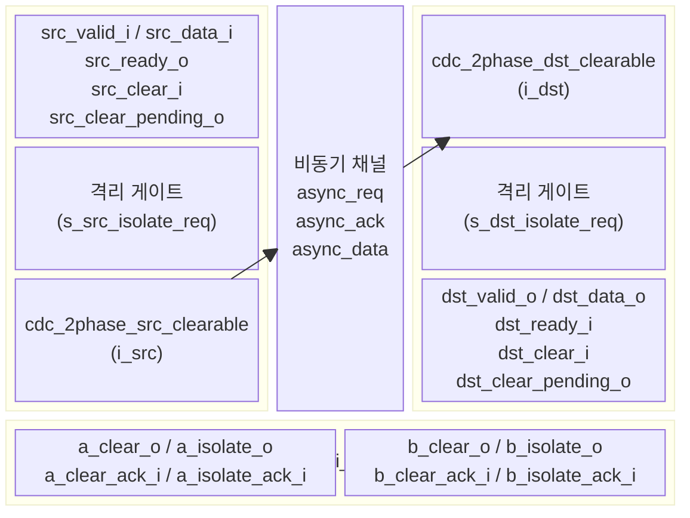
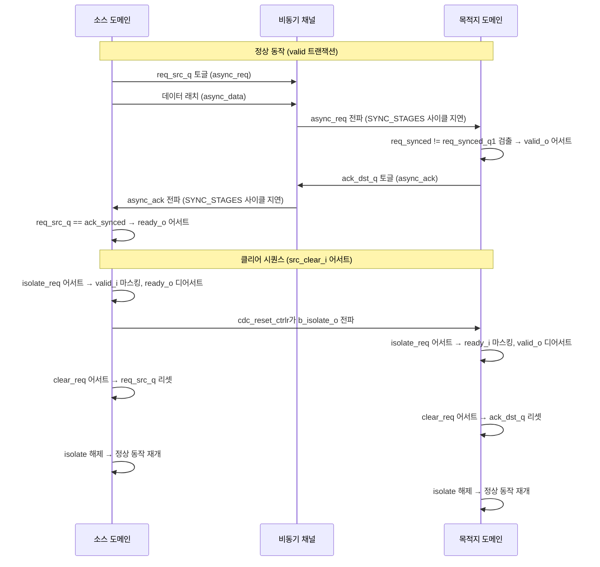
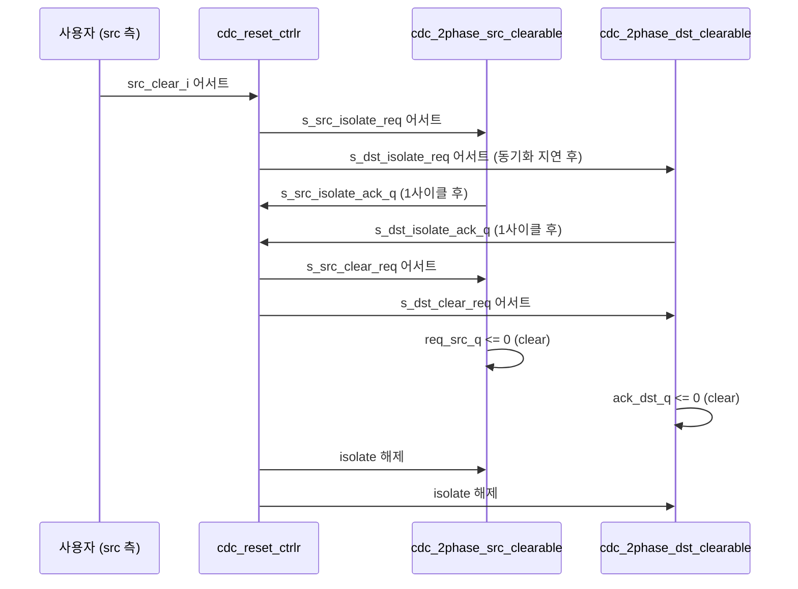

# cdc_2phase_clearable.sv

## 개요

`cdc_2phase_clearable`은 클리어(clear) 기능이 추가된 2-phase 핸드셰이크 방식의 클락 도메인 크로싱(CDC) 모듈이다. 기본 `cdc_2phase`와 달리 단방향 웜 리셋(one-sided warm reset)을 지원하며, `src_clear_i` 또는 `dst_clear_i` 신호로 어느 쪽에서든 클리어 요청을 시작할 수 있다. 내부적으로 `cdc_reset_ctrlr`를 사용하여 양쪽 도메인을 lock-step으로 리셋 시퀀스를 수행하며, 가짜 트랜잭션(spurious transactions)이 발생하지 않도록 보장한다.

이 파일에는 다음 세 모듈이 포함된다:
- `cdc_2phase_clearable` - 최상위 래퍼 모듈
- `cdc_2phase_src_clearable` - 소스 도메인 송신부
- `cdc_2phase_dst_clearable` - 목적지 도메인 수신부

---

## 블록 다이어그램

### CDC 핸드셰이크 프로토콜 (2-phase)

### 클리어 시퀀스 타이밍

---

## 포트/파라미터

### 파라미터

| 파라미터 | 타입 | 기본값 | 설명 |
|---|---|---|---|
| `T` | type | `logic` | CDC를 통해 전송되는 데이터 타입 |
| `SYNC_STAGES` | int unsigned | `3` | 동기화 FF 스테이지 수. CLEAR_ON_ASYNC_RESET=1이면 최소 3, 아니면 최소 2 |
| `CLEAR_ON_ASYNC_RESET` | int | `1` | 비동기 리셋 발생 시에도 클리어 시퀀스를 시작할지 여부 |

### 포트 (cdc_2phase_clearable)

| 포트 | 방향 | 폭 | 설명 |
|---|---|---|---|
| `src_rst_ni` | input | 1 | 소스 도메인 비동기 리셋 (active-low) |
| `src_clk_i` | input | 1 | 소스 도메인 클락 |
| `src_clear_i` | input | 1 | 소스 도메인 동기 클리어 요청 |
| `src_clear_pending_o` | output | 1 | 클리어 시퀀스 진행 중 표시 (isolate 신호와 동일) |
| `src_data_i` | input | T | 소스 도메인 데이터 입력 |
| `src_valid_i` | input | 1 | 소스 도메인 valid 신호 |
| `src_ready_o` | output | 1 | 소스 도메인 ready 신호 (격리 중에는 0) |
| `dst_rst_ni` | input | 1 | 목적지 도메인 비동기 리셋 (active-low) |
| `dst_clk_i` | input | 1 | 목적지 도메인 클락 |
| `dst_clear_i` | input | 1 | 목적지 도메인 동기 클리어 요청 |
| `dst_clear_pending_o` | output | 1 | 클리어 시퀀스 진행 중 표시 |
| `dst_data_o` | output | T | 목적지 도메인 데이터 출력 |
| `dst_valid_o` | output | 1 | 목적지 도메인 valid 신호 (격리 중에는 0) |
| `dst_ready_i` | input | 1 | 목적지 도메인 ready 신호 |

### 포트 (cdc_2phase_src_clearable)

| 포트 | 방향 | 폭 | 설명 |
|---|---|---|---|
| `rst_ni` | input | 1 | 비동기 리셋 (active-low) |
| `clk_i` | input | 1 | 클락 |
| `clear_i` | input | 1 | 동기 클리어 (req_src_q를 0으로 리셋) |
| `data_i` | input | T | 데이터 입력 |
| `valid_i` | input | 1 | valid 입력 |
| `ready_o` | output | 1 | ready 출력 (`req_src_q == ack_synced`일 때 1) |
| `async_req_o` | output | 1 | 비동기 request 출력 |
| `async_ack_i` | input | 1 | 비동기 acknowledge 입력 |
| `async_data_o` | output | T | 비동기 데이터 출력 |

### 포트 (cdc_2phase_dst_clearable)

| 포트 | 방향 | 폭 | 설명 |
|---|---|---|---|
| `rst_ni` | input | 1 | 비동기 리셋 (active-low) |
| `clk_i` | input | 1 | 클락 |
| `clear_i` | input | 1 | 동기 클리어 (ack_dst_q를 0으로 리셋) |
| `data_o` | output | T | 데이터 출력 |
| `valid_o` | output | 1 | valid 출력 (`ack_dst_q != req_synced_q1`일 때 1) |
| `ready_i` | input | 1 | ready 입력 |
| `async_req_i` | input | 1 | 비동기 request 입력 |
| `async_ack_o` | output | 1 | 비동기 acknowledge 출력 |
| `async_data_i` | input | T | 비동기 데이터 입력 |

---

## 동작 설명

### 2-phase 핸드셰이크 원리

2-phase CDC는 req/ack 신호의 레벨 변화(토글)로 트랜잭션을 표현한다. 4-phase와 달리 신호의 High/Low 각각이 독립적인 이벤트이므로 처리량이 2배 높다.

- **소스**: `valid_i && ready_o` 조건에서 `req_src_q`를 토글하고 데이터를 래치한다.
- **목적지**: `req_synced`가 `req_synced_q1`과 다른 엣지 변화를 감지하면 `valid_o`를 어서트하고, `dst_ready_i`와 함께 `ack_dst_q`를 토글한다.
- **소스 ready**: `req_src_q == ack_synced`일 때, 즉 마지막으로 보낸 req가 ack로 확인되었을 때 ready 상태이다.

### 클리어 시퀀스 동작

1. `src_clear_i`(또는 `dst_clear_i`) 어서트 → `cdc_reset_ctrlr`가 시퀀스 시작
2. 양쪽에 `isolate_req` 어서트 → `valid_i`와 `ready_i`를 마스킹하여 새 트랜잭션 차단
3. 1사이클 후 `isolate_ack_q` 어서트 (자동)
4. 양쪽에 `clear_req` 어서트 → `req_src_q`와 `ack_dst_q`를 0으로 리셋
5. `isolate` 해제 → 정상 동작 재개

### 리셋 보장 사항

- 어느 쪽에서든 클리어를 요청해도 가짜 트랜잭션이 없음
- 동기 클리어 시: 요청 다음 사이클부터 `src_ready_o = 0`
- `CLEAR_ON_ASYNC_RESET = 1` 시 비동기 리셋도 동일하게 처리 (SYNC_STAGES ≥ 3 필요)
- `src_clear_i` 어서트 중에는 `src_valid_i`를 어서트하지 않아야 함 (assertion으로 검증)

---

## 의존성 및 관계

| 의존 모듈 | 역할 |
|---|---|
| `cdc_2phase_src_clearable` | 소스 도메인 2-phase CDC 송신 서브모듈 |
| `cdc_2phase_dst_clearable` | 목적지 도메인 2-phase CDC 수신 서브모듈 |
| `cdc_reset_ctrlr` | 양방향 클리어/리셋 시퀀스 조율 컨트롤러 |
| `sync` | 비동기 신호 동기화 플립플롭 체인 (SYNC_STAGES 스테이지) |
| `common_cells/registers.svh` | `FFNR` 매크로 등 레지스터 헬퍼 |
| `common_cells/assertions.svh` | `ASSERT`, `ASSUME` 매크로 |

**관련 모듈**: 클리어 기능 없는 버전은 `cdc_2phase`이며, FIFO 형태는 `cdc_fifo_gray_clearable`이다.

**타이밍 제약**: `async_req`, `async_ack`, `async_data` 경로에 대해 `max_delay = min_period(src_clk, dst_clk)` 제약이 필요하다.
