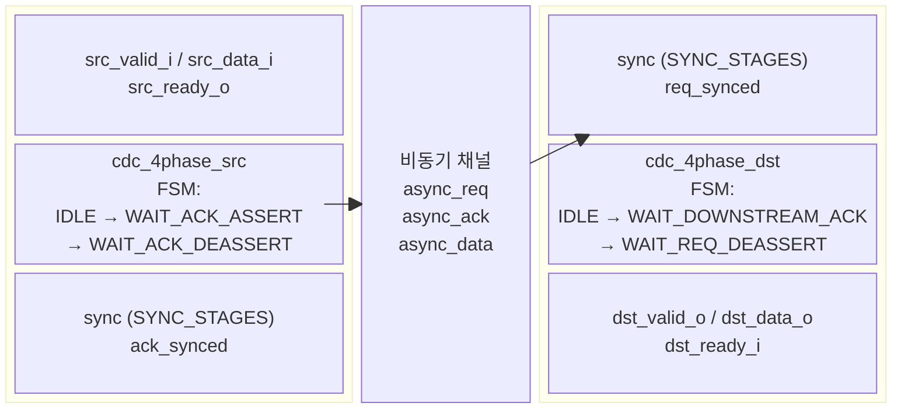
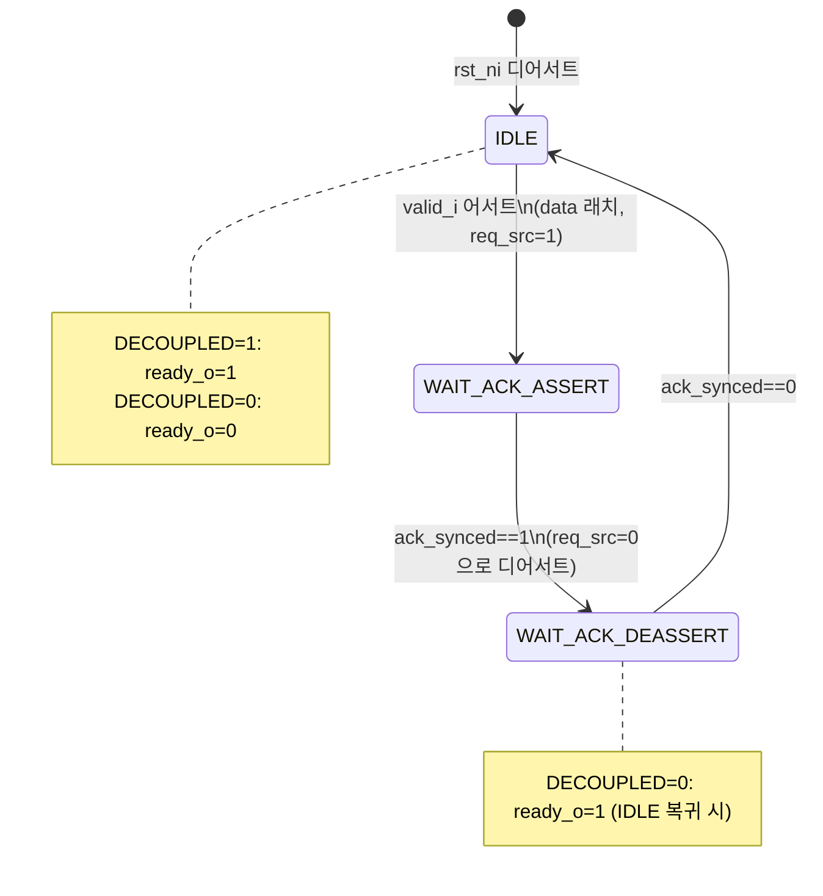
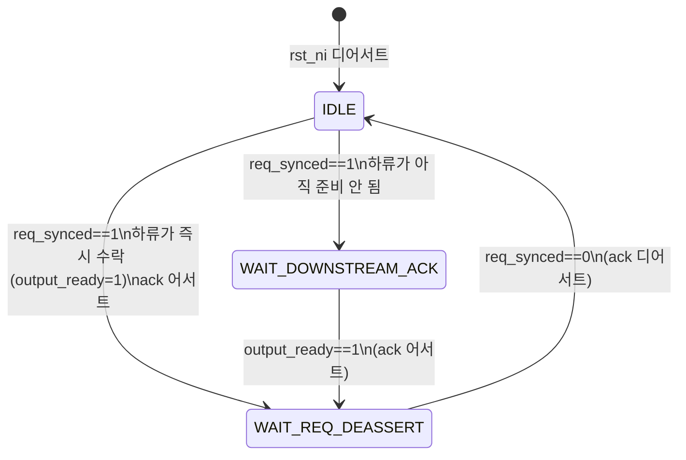
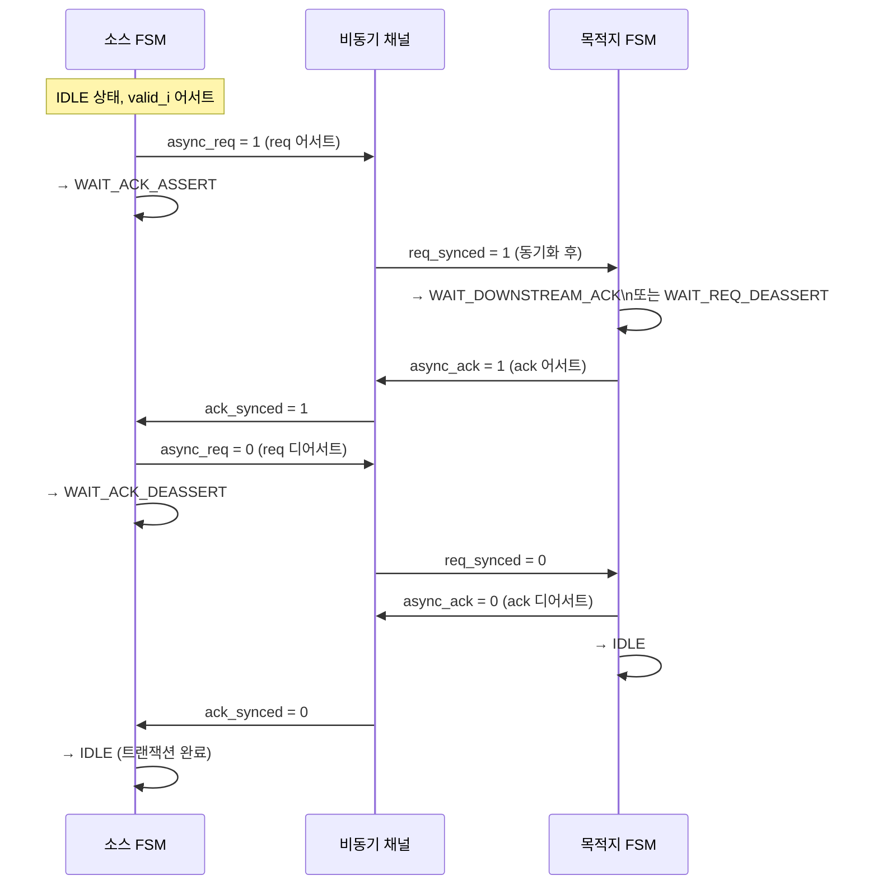

# cdc_4phase.sv

## 개요

`cdc_4phase`는 4-phase 핸드셰이크 방식의 클락 도메인 크로싱(CDC) 모듈이다. 2-phase CDC에 비해 처리량은 낮지만, IDLE 상태가 트랜잭션마다 변하지 않으므로 단방향 리셋(one-sided reset) 시 가짜 트랜잭션이 발생하지 않는다는 장점이 있다. `cdc_reset_ctrlr` 내부에서 리셋 시퀀스 메시지를 전달하는 용도로도 사용된다.

이 파일에는 다음 세 모듈이 포함된다:
- `cdc_4phase` - 최상위 래퍼 모듈
- `cdc_4phase_src` - 소스 도메인 FSM 송신부
- `cdc_4phase_dst` - 목적지 도메인 FSM 수신부

---

## 블록 다이어그램

### 소스 FSM 상태 전이

### 목적지 FSM 상태 전이

### 4-phase 핸드셰이크 타이밍

---

## 포트/파라미터

### 파라미터

| 파라미터 | 타입 | 기본값 | 설명 |
|---|---|---|---|
| `T` | type | `logic` | 전송 데이터 타입 |
| `DECOUPLED` | bit | `1` | 1이면 소스가 즉시 ready를 반환(spill_register 삽입). 0이면 dst 핸드셰이크 완료 후 ready |
| `SEND_RESET_MSG` | bit | `0` | 비동기 리셋 시 `RESET_MSG`를 즉시 dst로 전송할지 여부 |
| `RESET_MSG` | T | `T'('0)` | 비동기 리셋 시 전송할 메시지 (`SEND_RESET_MSG=1`일 때 사용) |
| `SYNC_STAGES` | int unsigned | `2` | 동기화 FF 스테이지 수 (cdc_4phase_src/dst 전용 파라미터) |

### 포트 (cdc_4phase)

| 포트 | 방향 | 폭 | 설명 |
|---|---|---|---|
| `src_rst_ni` | input | 1 | 소스 도메인 비동기 리셋 (active-low) |
| `src_clk_i` | input | 1 | 소스 도메인 클락 |
| `src_data_i` | input | T | 소스 도메인 데이터 입력 |
| `src_valid_i` | input | 1 | 소스 도메인 valid 신호 |
| `src_ready_o` | output | 1 | 소스 도메인 ready 신호 |
| `dst_rst_ni` | input | 1 | 목적지 도메인 비동기 리셋 (active-low) |
| `dst_clk_i` | input | 1 | 목적지 도메인 클락 |
| `dst_data_o` | output | T | 목적지 도메인 데이터 출력 |
| `dst_valid_o` | output | 1 | 목적지 도메인 valid 신호 |
| `dst_ready_i` | input | 1 | 목적지 도메인 ready 신호 |

---

## 동작 설명

### 4-phase 핸드셰이크 원리

4-phase CDC는 req/ack 신호의 어서트(0→1)와 디어서트(1→0)를 각각 별개의 이벤트로 처리한다. 한 트랜잭션당 총 4번의 신호 변화가 발생한다.

1. **Phase 1**: 소스가 `async_req = 1`로 어서트 (데이터 제시)
2. **Phase 2**: 목적지가 데이터 수락 후 `async_ack = 1`로 어서트
3. **Phase 3**: 소스가 `async_req = 0`으로 디어서트
4. **Phase 4**: 목적지가 `async_ack = 0`으로 디어서트 → IDLE 복귀

### DECOUPLED 모드

- **DECOUPLED = 1 (기본)**: 소스가 IDLE에서 `ready_o = 1`을 즉시 반환. 다음 데이터를 바로 받을 수 있어 처리량이 높아짐. 목적지 측에 `spill_register`를 삽입하여 `async_data_i`를 분리.
- **DECOUPLED = 0**: 소스가 IDLE → WAIT_ACK_DEASSERT 완료 후에만 `ready_o = 1`. CDC 내부에 in-flight 트랜잭션이 없음을 보장. `cdc_reset_ctrlr`에서 이 모드를 사용한다.

### SEND_RESET_MSG 모드

`SEND_RESET_MSG = 1`이면 비동기 리셋 시 `req_src_q = 1`, `data_src_q = RESET_MSG`로 초기화된다. 이를 통해 클락이 없어도 비동기 리셋 즉시 목적지에 특정 메시지를 전송할 수 있다. `cdc_reset_ctrlr`에서 리셋 시 ISOLATE 페이즈를 즉시 알리는 용도로 활용된다.

### 단방향 리셋 안전성

2-phase CDC와 달리, 4-phase는 IDLE 상태 값이 항상 0으로 고정되어 있어 한쪽만 리셋되어도 상대방이 IDLE을 올바르게 인식한다.

---

## 의존성 및 관계

| 의존 모듈 | 역할 |
|---|---|
| `cdc_4phase_src` | 소스 도메인 4-phase FSM 송신 서브모듈 |
| `cdc_4phase_dst` | 목적지 도메인 4-phase FSM 수신 서브모듈 |
| `sync` | 비동기 req/ack 동기화 체인 |
| `spill_register` | DECOUPLED=1 시 출력 경로 파이프라인 레지스터 |

**사용처**: `cdc_reset_ctrlr` 내부에서 클리어 시퀀스 페이즈를 도메인 간 전달하는 데 사용된다 (DECOUPLED=0, SEND_RESET_MSG=1 모드).

**타이밍 제약**: `async_req`, `async_ack`, `async_data` 경로에 대해 `max_delay = min_period(src_clk, dst_clk)` 제약이 필요하다.
