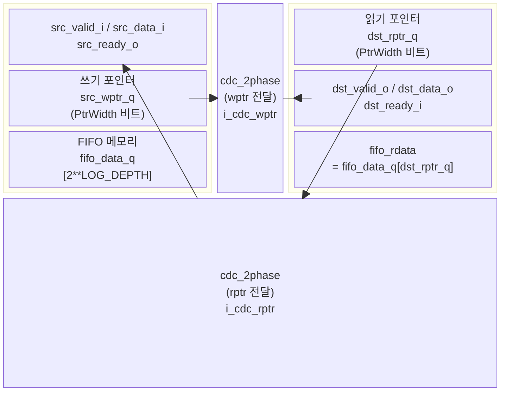
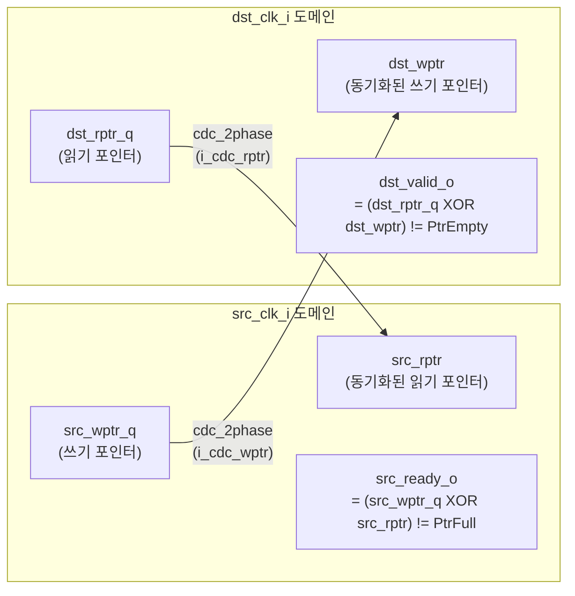
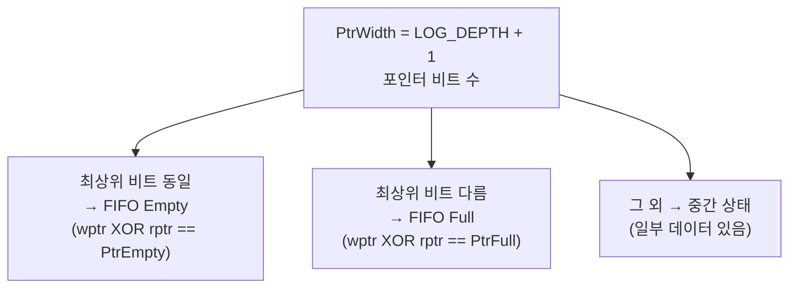

# cdc_fifo_2phase.sv

## 개요

`cdc_fifo_2phase`는 2-phase 핸드셰이크를 이용한 클락 도메인 크로싱 FIFO 모듈이다. 깊이는 `2**LOG_DEPTH`이며 LOG_DEPTH는 최소 1 이상이어야 한다. 쓰기 포인터와 읽기 포인터를 각각 `cdc_2phase` CDC를 통해 반대 도메인으로 전달함으로써 FIFO의 full/empty 상태를 판단한다. FIFO 데이터 자체는 소스 도메인 클락으로 쓰이며 목적지 도메인에서 읽힌다.

> **주의**: 이 모듈은 웜 리셋(warm reset) 기능을 지원하지 않는다. 웜 리셋이 필요하면 `cdc_fifo_gray_clearable`을 사용해야 한다. 파워-온 리셋(POR) 시에는 `src_rst_ni`와 `dst_rst_ni`를 동시에(비동기적으로) 어서트해야 한다.

---

## 블록 다이어그램



### 포인터 전달 구조 (CDC 경로)



### FIFO 포인터 상태 해석



---

## 포트/파라미터

### 파라미터

| 파라미터 | 타입 | 기본값 | 설명 |
|---|---|---|---|
| `T` | type | `logic` | FIFO 페이로드 데이터 타입 |
| `LOG_DEPTH` | int | `3` | FIFO 깊이의 로그 값. 실제 깊이 = 2**LOG_DEPTH. 최소 1 이상 |

### 포트

| 포트 | 방향 | 폭 | 설명 |
|---|---|---|---|
| `src_rst_ni` | input | 1 | 소스 도메인 비동기 리셋 (active-low) |
| `src_clk_i` | input | 1 | 소스 도메인 클락 |
| `src_data_i` | input | T | 소스 도메인 데이터 입력 |
| `src_valid_i` | input | 1 | 소스 도메인 valid (push 요청) |
| `src_ready_o` | output | 1 | 소스 도메인 ready (FIFO가 full이 아님) |
| `dst_rst_ni` | input | 1 | 목적지 도메인 비동기 리셋 (active-low) |
| `dst_clk_i` | input | 1 | 목적지 도메인 클락 |
| `dst_data_o` | output | T | 목적지 도메인 데이터 출력 |
| `dst_valid_o` | output | 1 | 목적지 도메인 valid (FIFO에 데이터 있음) |
| `dst_ready_i` | input | 1 | 목적지 도메인 ready (pop 요청) |

---

## 동작 설명

### FIFO 구조

- 메모리 배열 `fifo_data_q[2**LOG_DEPTH]`는 소스 도메인 클락으로 쓰임
- 쓰기 인덱스: `fifo_widx = src_wptr_q[LOG_DEPTH-1:0]` (포인터 하위 비트)
- 읽기 인덱스: `fifo_ridx = dst_rptr_q[LOG_DEPTH-1:0]`

### 포인터 관리

포인터는 실제 FIFO 인덱스보다 1비트 넓다(PtrWidth = LOG_DEPTH+1). 이 추가 비트 덕분에 full과 empty를 XOR 연산으로 구분한다.

- **쓰기 포인터** (`src_wptr_q`): `src_valid_i && src_ready_o` 시 소스 도메인에서 증가
- **읽기 포인터** (`dst_rptr_q`): `dst_valid_o && dst_ready_i` 시 목적지 도메인에서 증가

### CDC 포인터 전달

```
src_wptr_q → [cdc_2phase i_cdc_wptr] → dst_wptr (dst 도메인)
dst_rptr_q → [cdc_2phase i_cdc_rptr] → src_rptr (src 도메인)
```

두 `cdc_2phase` 인스턴스 모두 `src_valid_i = 1`, `dst_ready_i = 1`로 설정되어 포인터를 연속적으로 최대한 빠르게 전달한다. 포인터 전달에는 최소 2사이클(SYNC_STAGES)의 지연이 발생하므로, 소스/목적지는 각각 보수적(pessimistic) 포인터 값을 참조한다. 이로 인해 FIFO overflow나 underflow는 발생하지 않는다.

### Full/Empty 판단

```
src_ready_o = ((src_wptr_q XOR src_rptr) != PtrFull)   // not-full
dst_valid_o = ((dst_rptr_q XOR dst_wptr) != PtrEmpty)  // not-empty
```

### 리셋 요구사항

- `src_rst_ni`와 `dst_rst_ni`는 반드시 동시에(비동기) 어서트되어야 한다.
- 디어서트는 각자의 클락 도메인에 동기화되어야 한다 (예: `rstgen` 셀 사용).
- 웜 리셋 시나리오는 지원하지 않는다. 필요 시 `cdc_fifo_gray_clearable`을 사용한다.

---

## 의존성 및 관계

| 의존 모듈 | 역할 |
|---|---|
| `cdc_2phase` | 쓰기/읽기 포인터를 반대 도메인으로 전달하는 2-phase CDC |
| `common_cells/assertions.svh` | `ASSERT_INIT` 매크로 (LOG_DEPTH > 0 검증) |

**관련 모듈**:
- `cdc_fifo_gray` - 그레이 코드 포인터를 사용하는 더 효율적인 CDC FIFO (warm reset 불가)
- `cdc_fifo_gray_clearable` - 그레이 코드 + 클리어 기능 지원 CDC FIFO

**타이밍 제약**: `cdc_2phase`의 `async_req`, `async_ack`, `async_data` 경로와 함께 `fifo_data_q`에서 `dst_data_o`까지의 추가 max_delay 경로 설정이 필요하다.
