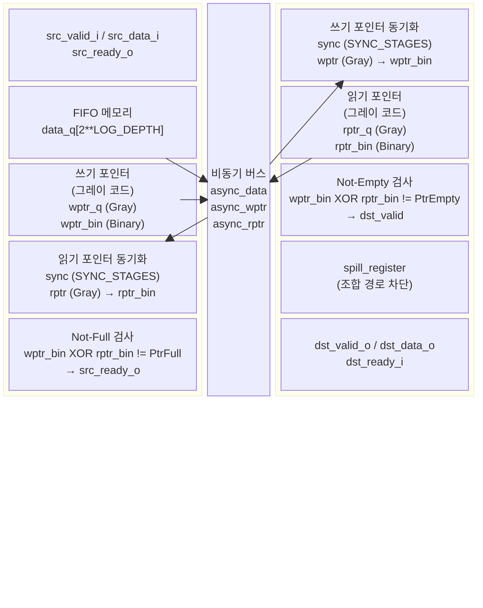
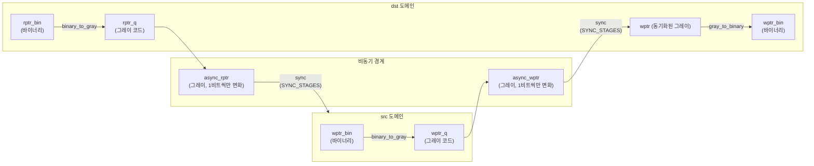

# cdc_fifo_gray.sv

## 개요

`cdc_fifo_gray`는 그레이 코드(Gray code) 포인터를 사용한 클락 도메인 크로싱 FIFO 모듈이다. 그레이 코드를 사용함으로써 포인터가 증가할 때 오직 1비트만 변화하여 다단계 FF 동기화기(multi-stage FF synchronizer)가 불일치 상태를 래치할 위험을 제거한다. FIFO 깊이는 `2**LOG_DEPTH`이다.

이 파일에는 다음 세 모듈이 포함된다:
- `cdc_fifo_gray` - 최상위 래퍼 모듈
- `cdc_fifo_gray_src` - 소스 도메인 쓰기 측 서브모듈
- `cdc_fifo_gray_dst` - 목적지 도메인 읽기 측 서브모듈

> **주의**: 이 모듈은 웜 리셋(warm reset) 기능을 지원하지 않는다. 웜 리셋/클리어/플러시가 필요하면 `cdc_fifo_gray_clearable`을 사용해야 한다.

---

## 블록 다이어그램



### 그레이 코드 포인터 전달 흐름



---

## 포트/파라미터

### 파라미터

| 파라미터 | 타입 | 기본값 | 설명 |
|---|---|---|---|
| `WIDTH` | int unsigned | `1` | 기본 logic 타입의 비트 폭 |
| `T` | type | `logic [WIDTH-1:0]` | FIFO 페이로드 데이터 타입 |
| `LOG_DEPTH` | int | `3` | FIFO 깊이의 로그 값. 실제 깊이 = 2**LOG_DEPTH. 최소 1 이상 |
| `SYNC_STAGES` | int | `2` | 비동기 포인터에 삽입할 동기화 FF 스테이지 수. 최소 2 이상 |

### 포트 (cdc_fifo_gray)

| 포트 | 방향 | 폭 | 설명 |
|---|---|---|---|
| `src_rst_ni` | input | 1 | 소스 도메인 비동기 리셋 (active-low) |
| `src_clk_i` | input | 1 | 소스 도메인 클락 |
| `src_data_i` | input | T | 소스 도메인 데이터 입력 |
| `src_valid_i` | input | 1 | 소스 도메인 valid (push) |
| `src_ready_o` | output | 1 | 소스 도메인 ready (not-full) |
| `dst_rst_ni` | input | 1 | 목적지 도메인 비동기 리셋 (active-low) |
| `dst_clk_i` | input | 1 | 목적지 도메인 클락 |
| `dst_data_o` | output | T | 목적지 도메인 데이터 출력 |
| `dst_valid_o` | output | 1 | 목적지 도메인 valid (not-empty) |
| `dst_ready_i` | input | 1 | 목적지 도메인 ready (pop) |

### 내부 비동기 포트 (cdc_fifo_gray_src / dst 간)

| 신호 | 방향 | 폭 | 설명 |
|---|---|---|---|
| `async_data` | src→dst | T×2^LOG_DEPTH | FIFO 전체 내용 (비동기 노출) |
| `async_wptr` | src→dst | LOG_DEPTH+1 | 그레이 코드 쓰기 포인터 |
| `async_rptr` | dst→src | LOG_DEPTH+1 | 그레이 코드 읽기 포인터 |

---

## 동작 설명

### 그레이 코드 사용 이유

포인터는 증가할 때 항상 1비트만 변화하는 그레이 코드로 인코딩된다. 동기화기 체인이 비동기 경계를 통과하는 다비트 신호를 래치할 때, 1비트만 변화하면 불일치 상태(inconsistent state)를 포착할 위험이 없다.

### 소스 도메인 (cdc_fifo_gray_src)

1. `src_valid_i && src_ready_o` 조건 시 현재 `wptr_bin` 인덱스에 데이터를 씀
2. `wptr_q`(그레이)를 다음 값으로 업데이트: `binary_to_gray(wptr_bin + 1)`
3. 목적지에서 동기화된 `async_rptr`를 `gray_to_binary`로 변환하여 `rptr_bin` 획득
4. `src_ready_o = (wptr_bin XOR rptr_bin) != PtrFull`로 full 상태 판단

### 목적지 도메인 (cdc_fifo_gray_dst)

1. 소스에서 동기화된 `async_wptr`를 `gray_to_binary`로 변환하여 `wptr_bin` 획득
2. `dst_valid = (wptr_bin XOR rptr_bin) != PtrEmpty`로 empty 상태 판단
3. `dst_valid && dst_ready` 시 `rptr_q`를 다음 그레이 코드로 업데이트
4. `spill_register`로 조합 경로 차단 후 `dst_valid_o`, `dst_data_o` 출력

### 보수적(Pessimistic) 포인터 참조

동기화 지연(최소 SYNC_STAGES 사이클)으로 인해 각 도메인이 보는 상대방 포인터는 실제보다 오래된 값이다.
- 소스는 `rptr`이 실제보다 낮다고 가정 → FIFO full 판단이 보수적 → overflow 방지
- 목적지는 `wptr`이 실제보다 낮다고 가정 → FIFO empty 판단이 보수적 → underflow 방지

### FIFO 데이터 접근

- `async_data`는 FIFO 배열 전체를 비동기로 노출한다 (`async_data_o = data_q`)
- 목적지는 `rptr_bin`으로 인덱싱하여 데이터를 직접 읽는다
- 읽히는 데이터는 최소 SYNC_STAGES 사이클 전에 쓰인 것이 보장된다

### 리셋 요구사항

- `src_rst_ni`와 `dst_rst_ni`는 동시에(비동기) 어서트해야 한다
- 디어서트는 각자의 클락에 동기화되어야 한다
- 웜 리셋은 지원하지 않는다

---

## 의존성 및 관계

| 의존 모듈 | 역할 |
|---|---|
| `cdc_fifo_gray_src` | 소스 도메인 쓰기 로직 서브모듈 |
| `cdc_fifo_gray_dst` | 목적지 도메인 읽기 로직 서브모듈 |
| `sync` | 그레이 코드 포인터의 비트별 동기화 FF 체인 |
| `gray_to_binary` | 그레이 코드 → 바이너리 변환 |
| `binary_to_gray` | 바이너리 → 그레이 코드 변환 |
| `spill_register` | 목적지 측 조합 경로 파이프라인 레지스터 |
| `common_cells/registers.svh` | `FFLARN` 매크로 (load-enable 레지스터) |
| `common_cells/assertions.svh` | `ASSERT_INIT` 매크로 |

**관련 모듈**:
- `cdc_fifo_2phase` - 2-phase 포인터 전달 방식 CDC FIFO
- `cdc_fifo_gray_clearable` - 클리어/플러시 기능 추가 버전

**합성 속성**: `no_ungroup`, `no_boundary_optimization` 속성이 적용되어 있어 합성 도구가 모듈 경계를 최적화하지 않도록 강제한다.

**타이밍 제약**:
```
set_max_delay min(T_src, T_dst) \
    -through [get_pins -hierarchical -filter async] \
    -through [get_pins -hierarchical -filter async]
set_false_path -hold \
    -through [get_pins -hierarchical -filter async] \
    -through [get_pins -hierarchical -filter async]
```
