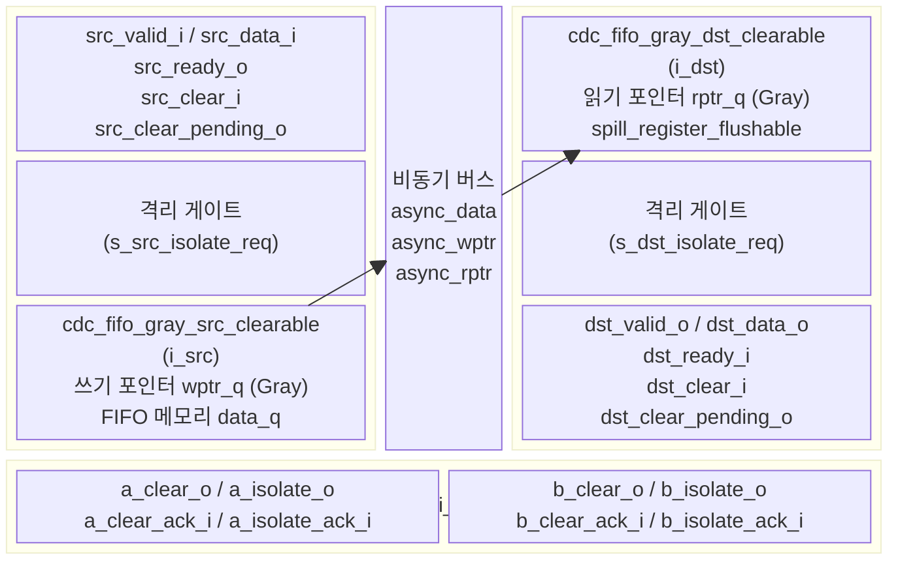
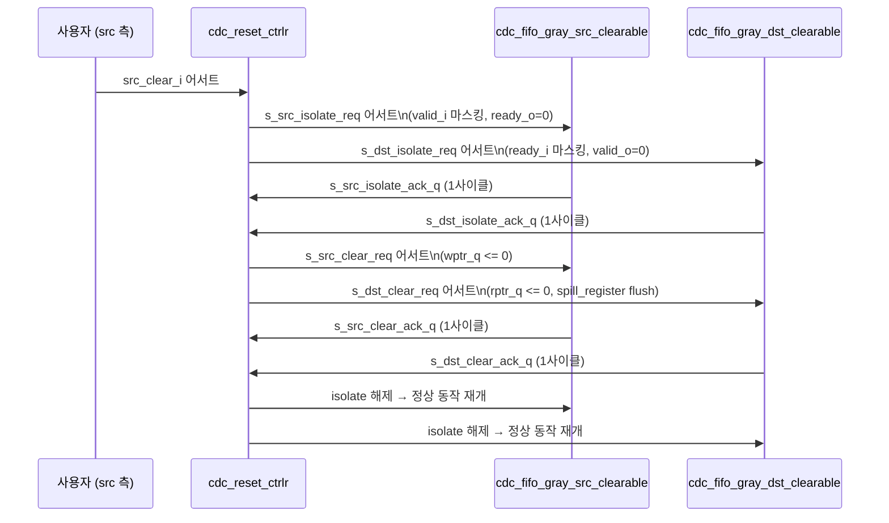
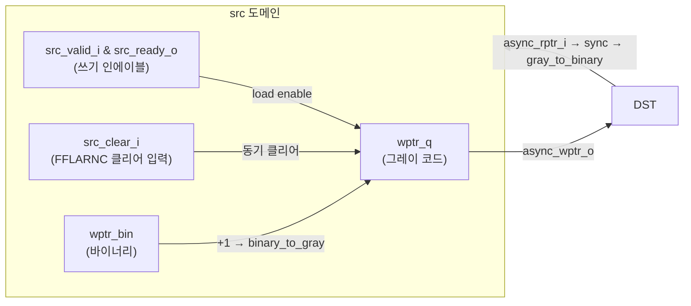

# cdc_fifo_gray_clearable.sv

## 개요

`cdc_fifo_gray_clearable`은 클리어(clear) 기능이 추가된 그레이 코드 포인터 방식의 클락 도메인 크로싱 FIFO 모듈이다. `cdc_fifo_gray`의 기능에 더해, `src_clear_i` 또는 `dst_clear_i` 신호로 어느 한쪽에서든 웜 리셋(warm reset)을 시작할 수 있다. 내부적으로 `cdc_reset_ctrlr`를 사용하여 양쪽 도메인을 lock-step으로 격리(isolate)하고 클리어한다.

이 파일에는 다음 세 모듈이 포함된다:
- `cdc_fifo_gray_clearable` - 최상위 래퍼 모듈
- `cdc_fifo_gray_src_clearable` - 클리어 기능이 있는 소스 도메인 서브모듈
- `cdc_fifo_gray_dst_clearable` - 클리어 기능이 있는 목적지 도메인 서브모듈

---

## 블록 다이어그램



### 클리어 시퀀스 타이밍



### `cdc_fifo_gray_src_clearable` 포인터 로직



---

## 포트/파라미터

### 파라미터

| 파라미터 | 타입 | 기본값 | 설명 |
|---|---|---|---|
| `WIDTH` | int unsigned | `1` | 기본 logic 타입의 비트 폭 |
| `T` | type | `logic [WIDTH-1:0]` | FIFO 페이로드 데이터 타입 |
| `LOG_DEPTH` | int | `3` | FIFO 깊이의 로그 값. 실제 깊이 = 2**LOG_DEPTH |
| `SYNC_STAGES` | int | `3` | 비동기 포인터 동기화 FF 스테이지 수. CLEAR_ON_ASYNC_RESET=1이면 최소 3, 아니면 최소 2 |
| `CLEAR_ON_ASYNC_RESET` | int | `1` | 비동기 리셋 발생 시 클리어 시퀀스 시작 여부 |

> **경고**: `2 * SYNC_STAGES > 2**LOG_DEPTH`이면 합성 시 경고가 발생한다. 동기화 지연이 FIFO 깊이를 초과하면 같은 속도 클락에서 스톨이 발생할 수 있다.

### 포트 (cdc_fifo_gray_clearable)

| 포트 | 방향 | 폭 | 설명 |
|---|---|---|---|
| `src_rst_ni` | input | 1 | 소스 도메인 비동기 리셋 (active-low) |
| `src_clk_i` | input | 1 | 소스 도메인 클락 |
| `src_clear_i` | input | 1 | 소스 도메인 동기 클리어 요청 |
| `src_clear_pending_o` | output | 1 | 클리어 시퀀스 진행 중 표시 |
| `src_data_i` | input | T | 소스 도메인 데이터 입력 |
| `src_valid_i` | input | 1 | 소스 도메인 valid (push) |
| `src_ready_o` | output | 1 | 소스 도메인 ready (not-full, 격리 중에는 0) |
| `dst_rst_ni` | input | 1 | 목적지 도메인 비동기 리셋 (active-low) |
| `dst_clk_i` | input | 1 | 목적지 도메인 클락 |
| `dst_clear_i` | input | 1 | 목적지 도메인 동기 클리어 요청 |
| `dst_clear_pending_o` | output | 1 | 클리어 시퀀스 진행 중 표시 |
| `dst_data_o` | output | T | 목적지 도메인 데이터 출력 |
| `dst_valid_o` | output | 1 | 목적지 도메인 valid (격리 중에는 0) |
| `dst_ready_i` | input | 1 | 목적지 도메인 ready (pop) |

---

## 동작 설명

### cdc_fifo_gray와의 차이점

| 항목 | cdc_fifo_gray | cdc_fifo_gray_clearable |
|---|---|---|
| 웜 리셋 지원 | 불가 | 가능 (단방향 포함) |
| 클리어 포트 | 없음 | `src/dst_clear_i`, `src/dst_clear_pending_o` |
| 리셋 컨트롤러 | 없음 | `cdc_reset_ctrlr` 내장 |
| 포인터 클리어 | 리셋 시에만 | 동기 클리어 (`FFLARNC` 매크로) |
| 목적지 spill | `spill_register` | `spill_register_flushable` (flush 지원) |
| SYNC_STAGES 최소 | 2 | 2 (CLEAR_ON_ASYNC_RESET=0), 3 (=1) |

### 클리어 격리 메커니즘

```
src_ready_o = s_src_ready & !s_src_isolate_req
src_valid_i (to src FIFO) = src_valid_i & !s_src_isolate_req
dst_valid_o = s_dst_valid & !s_dst_isolate_req
dst_ready_i (to dst FIFO) = dst_ready_i & !s_dst_isolate_req
```

격리 요청(`isolate_req`) 어서트 후 1사이클이면 양쪽 포트가 완전히 차단된다.

### 목적지 측 `spill_register_flushable`

클리어 중 `dst_clear_i`가 어서트되면 `spill_register_flushable`의 `flush_i`를 통해 spill 레지스터 내 미출력 데이터가 플러시된다. 동시에 `valid_i = dst_valid & !dst_clear_i`로 클리어 중 새 데이터 입력을 차단한다.

### 리셋 보장 사항

1. 가짜 트랜잭션 없음 (어느 방향 클리어든)
2. 동기 클리어 요청 다음 사이클부터 `src_ready_o = 0`
3. 클리어 중 `dst_valid_o`가 잠시 내려갈 수 있음 (상위 프로토콜 주의)
4. `CLEAR_ON_ASYNC_RESET = 1`이면 비동기 리셋도 동일 보장 (SYNC_STAGES ≥ 3 필요)

---

## 의존성 및 관계

| 의존 모듈 | 역할 |
|---|---|
| `cdc_fifo_gray_src_clearable` | 클리어 기능 포함 소스 도메인 서브모듈 |
| `cdc_fifo_gray_dst_clearable` | 클리어 기능 포함 목적지 도메인 서브모듈 |
| `cdc_reset_ctrlr` | 양방향 클리어/리셋 시퀀스 조율 컨트롤러 |
| `sync` | 그레이 코드 포인터의 비트별 동기화 FF 체인 |
| `gray_to_binary` | 그레이 코드 → 바이너리 변환 |
| `binary_to_gray` | 바이너리 → 그레이 코드 변환 |
| `spill_register_flushable` | 플러시 기능이 있는 목적지 출력 레지스터 |
| `common_cells/registers.svh` | `FFLARN`, `FFLARNC` 매크로 |
| `common_cells/assertions.svh` | `ASSERT_INIT` 매크로 |

**관련 모듈**:
- `cdc_fifo_gray` - 클리어 기능 없는 버전
- `cdc_2phase_clearable` - 단일 항목 전달용 클리어 가능 CDC
- `cdc_reset_ctrlr` - 이 모듈이 내부적으로 사용하는 리셋 시퀀서

**합성 속성**: `no_ungroup`, `no_boundary_optimization` 속성으로 합성 도구의 경계 최적화를 방지한다.
