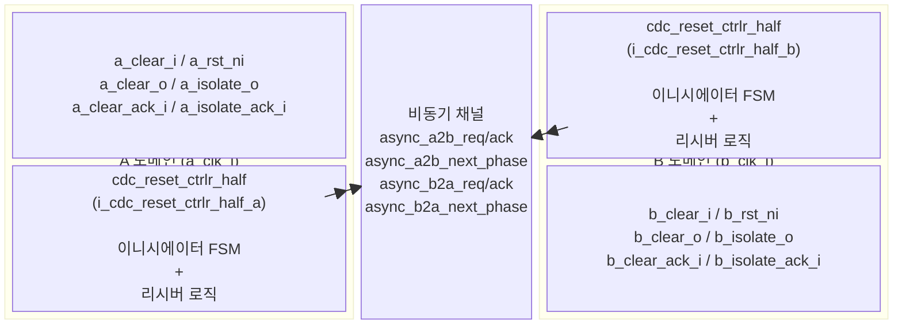
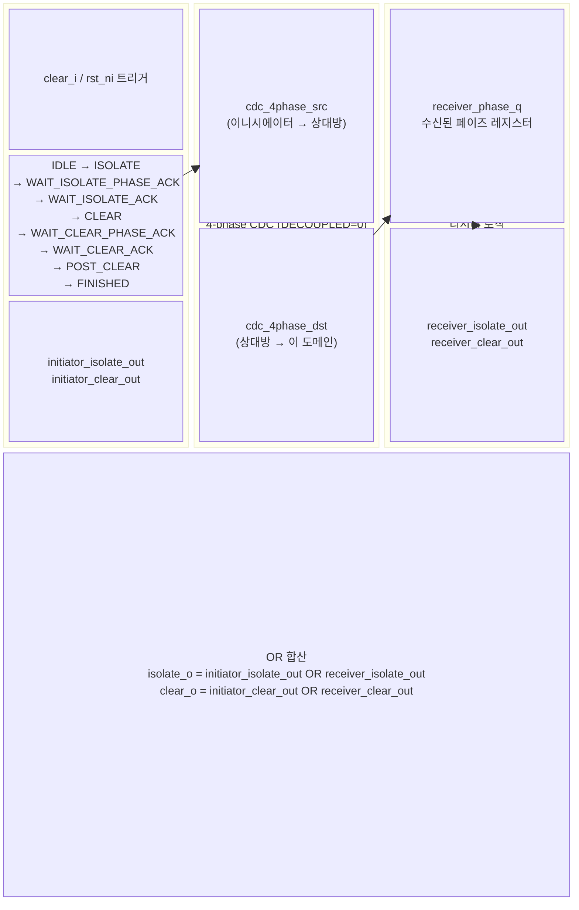
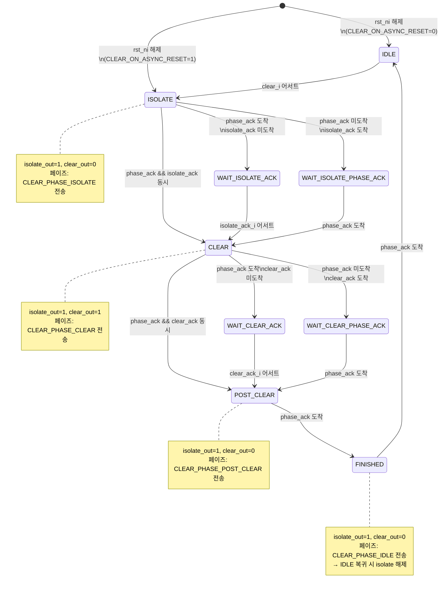
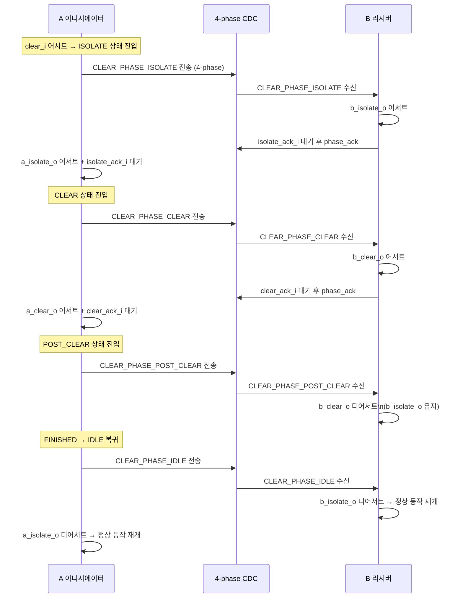

# cdc_reset_ctrlr.sv

## 개요

`cdc_reset_ctrlr`는 CDC(클락 도메인 크로싱) 모듈의 양방향 클리어/리셋 시퀀스를 조율하는 컨트롤러이다. CDC의 한쪽에서 `clear_i` 또는 비동기 리셋(`rst_ni`)이 발생했을 때, 반대쪽 도메인도 lock-step으로 클리어되도록 4-phase 핸드셰이크 CDC를 사용하여 클리어 시퀀스 페이즈를 전달한다.

이 파일에는 다음 두 모듈이 포함된다:
- `cdc_reset_ctrlr` - 최상위 래퍼 (A/B 양측 `cdc_reset_ctrlr_half` 연결)
- `cdc_reset_ctrlr_half` - 단방향 반쪽 컨트롤러 (이니시에이터 FSM + 리시버 로직)

---

## 블록 다이어그램



### `cdc_reset_ctrlr_half` 내부 구조



---

## FSM 상태 전이

### 이니시에이터 FSM (cdc_reset_ctrlr_half)



### 클리어 시퀀스 전체 타이밍



---

## 포트/파라미터

### 파라미터

| 파라미터 | 타입 | 기본값 | 설명 |
|---|---|---|---|
| `SYNC_STAGES` | int unsigned | `2` | 클리어 신호 req/ack 동기화 스테이지 수. CDC의 SYNC_STAGES보다 작아야 함 |
| `CLEAR_ON_ASYNC_RESET` | logic | `1` | 비동기 리셋 시에도 클리어 시퀀스를 시작할지 여부 |

### 포트 (cdc_reset_ctrlr)

| 포트 | 방향 | 폭 | 설명 |
|---|---|---|---|
| `a_clk_i` | input | 1 | A 도메인 클락 |
| `a_rst_ni` | input | 1 | A 도메인 비동기 리셋 (active-low) |
| `a_clear_i` | input | 1 | A 도메인 동기 클리어 요청 |
| `a_clear_o` | output | 1 | A 도메인 클리어 출력 (CDC 내부 상태 클리어용) |
| `a_clear_ack_i` | input | 1 | A 도메인 클리어 완료 확인 |
| `a_isolate_o` | output | 1 | A 도메인 격리 요청 (트랜잭션 차단) |
| `a_isolate_ack_i` | input | 1 | A 도메인 격리 완료 확인 |
| `b_clk_i` | input | 1 | B 도메인 클락 |
| `b_rst_ni` | input | 1 | B 도메인 비동기 리셋 (active-low) |
| `b_clear_i` | input | 1 | B 도메인 동기 클리어 요청 |
| `b_clear_o` | output | 1 | B 도메인 클리어 출력 |
| `b_clear_ack_i` | input | 1 | B 도메인 클리어 완료 확인 |
| `b_isolate_o` | output | 1 | B 도메인 격리 요청 |
| `b_isolate_ack_i` | input | 1 | B 도메인 격리 완료 확인 |

### 포트 (cdc_reset_ctrlr_half)

| 포트 | 방향 | 폭 | 설명 |
|---|---|---|---|
| `clk_i` | input | 1 | 이 도메인 클락 |
| `rst_ni` | input | 1 | 비동기 리셋 |
| `clear_i` | input | 1 | 동기 클리어 요청 |
| `isolate_o` | output | 1 | 격리 출력 |
| `isolate_ack_i` | input | 1 | 격리 확인 |
| `clear_o` | output | 1 | 클리어 출력 |
| `clear_ack_i` | input | 1 | 클리어 확인 |
| `async_next_phase_o` | output | clear_seq_phase_e | 상대방에게 보내는 다음 페이즈 |
| `async_req_o` | output | 1 | 4-phase req (상대방으로) |
| `async_ack_i` | input | 1 | 4-phase ack (상대방으로부터) |
| `async_next_phase_i` | input | clear_seq_phase_e | 상대방에서 받는 다음 페이즈 |
| `async_req_i` | input | 1 | 4-phase req (상대방으로부터) |
| `async_ack_o` | output | 1 | 4-phase ack (상대방으로) |

---

## 동작 설명

### 클리어 페이즈 종류 (`clear_seq_phase_e`)

`cdc_reset_ctrlr_pkg`에서 정의된 4가지 페이즈:

| 페이즈 | 값 | 의미 |
|---|---|---|
| `CLEAR_PHASE_IDLE` | 2'b00 | 유휴 상태. isolate=0, clear=0 |
| `CLEAR_PHASE_ISOLATE` | 2'b01 | 격리 단계. isolate=1, clear=0 |
| `CLEAR_PHASE_CLEAR` | 2'b10 | 클리어 단계. isolate=1, clear=1 |
| `CLEAR_PHASE_POST_CLEAR` | 2'b11 | 클리어 후 단계. isolate=1, clear=0 |

### 이니시에이터 + 리시버 OR 출력

각 `cdc_reset_ctrlr_half` 내에서 이니시에이터와 리시버의 출력을 OR로 합산한다:

```
isolate_o = initiator_isolate_out OR receiver_isolate_out
clear_o   = initiator_clear_out   OR receiver_clear_out
```

이를 통해 A/B 양쪽이 동시에 클리어를 요청해도 올바른 시퀀스가 보장된다.

### 비동기 리셋 처리 (`CLEAR_ON_ASYNC_RESET = 1`)

`CLEAR_ON_ASYNC_RESET = 1`이면:
- 이니시에이터 FSM이 리셋 시 `ISOLATE` 상태로 초기화 (IDLE 아님)
- 내부 4-phase CDC src가 `SEND_RESET_MSG = 1`, `RESET_MSG = CLEAR_PHASE_ISOLATE`로 설정되어 비동기 리셋 즉시 상대방에게 ISOLATE 페이즈를 전송

### 클리어 완료 시간 상한

```
t_clear <= 20*T + 16*SYNC_STAGES*T
(T = max(T_a, T_b): 두 클락 중 느린 쪽의 주기)
```

### 사용 방법

1. `cdc_reset_ctrlr`를 CDC 모듈 내부에 인스턴스화한다
2. CDC의 src/dst 클락과 리셋을 a/b 포트에 연결한다
3. `a/b_isolate_o` 어서트 시 CDC 외부와의 트랜잭션을 차단한다
4. `a/b_isolate_ack_i`를 1사이클 지연으로 피드백하거나 완전한 핸드셰이크로 연결한다
5. `a/b_clear_o` 어서트 시 CDC 내부 FF 상태를 동기적으로 클리어한다
6. `a/b_clear_ack_i`를 1사이클 지연으로 피드백한다

---

## 의존성 및 관계

| 의존 모듈 | 역할 |
|---|---|
| `cdc_reset_ctrlr_pkg` | `clear_seq_phase_e` 타입 정의 |
| `cdc_4phase_src` | 이니시에이터 → 리시버 페이즈 전달 (DECOUPLED=0, SEND_RESET_MSG=CLEAR_ON_ASYNC_RESET) |
| `cdc_4phase_dst` | 리시버 측 페이즈 수신 (DECOUPLED=0) |

**사용처**: 다음 모듈들이 `cdc_reset_ctrlr`를 내부적으로 사용한다:
- `cdc_2phase_clearable`
- `cdc_fifo_gray_clearable`
