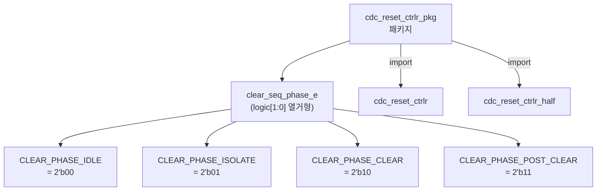
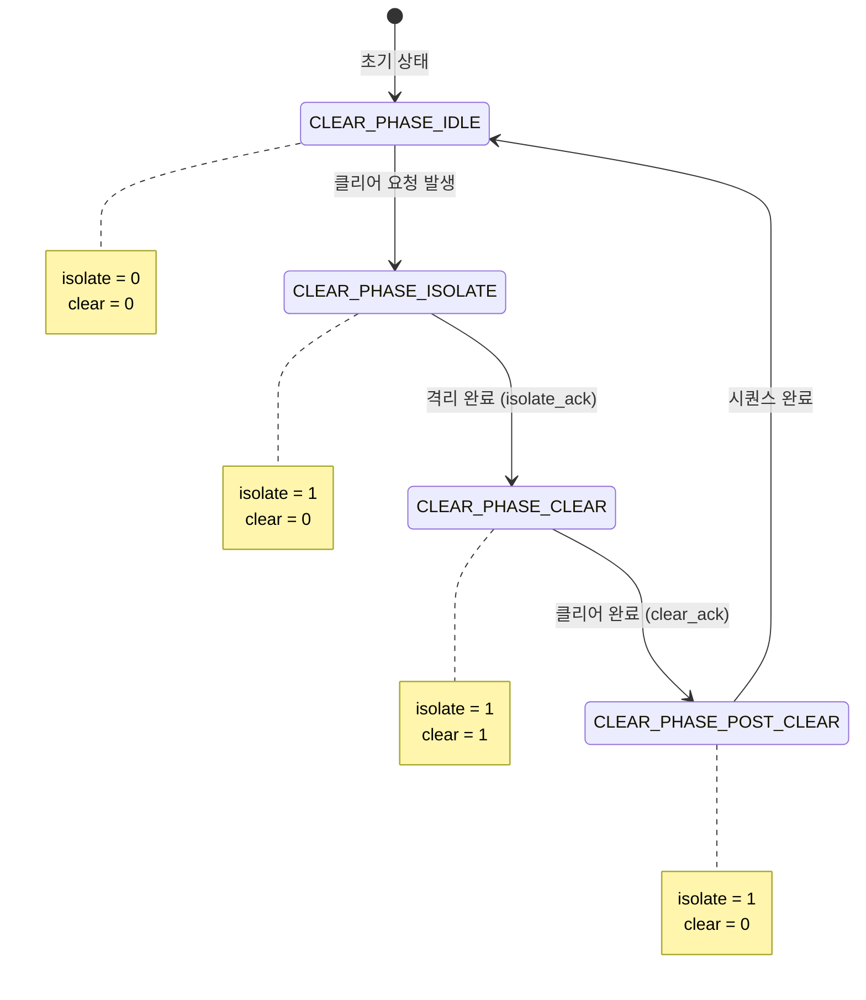

# cdc_reset_ctrlr_pkg.sv

## 개요

`cdc_reset_ctrlr_pkg`는 CDC 클리어 동기화 회로(`cdc_reset_ctrlr`, `cdc_reset_ctrlr_half`)에서 공통으로 사용하는 타입 정의를 담은 SystemVerilog 패키지이다. 클리어 시퀀스의 페이즈를 나타내는 열거형 `clear_seq_phase_e`를 정의한다.

---

## 블록 다이어그램



### 클리어 시퀀스 페이즈 전이



---

## 포트/파라미터

이 파일은 패키지이므로 포트나 파라미터가 없다. 정의된 타입은 다음과 같다.

### 열거형 타입: `clear_seq_phase_e`

| 상수명 | 값 | 의미 | isolate 신호 | clear 신호 |
|---|---|---|---|---|
| `CLEAR_PHASE_IDLE` | `2'b00` | 유휴 상태. 정상 동작 중 | 0 | 0 |
| `CLEAR_PHASE_ISOLATE` | `2'b01` | 격리 단계. CDC를 외부로부터 차단 | 1 | 0 |
| `CLEAR_PHASE_CLEAR` | `2'b10` | 클리어 단계. CDC 내부 상태 초기화 | 1 | 1 |
| `CLEAR_PHASE_POST_CLEAR` | `2'b11` | 클리어 후 단계. 격리 유지, 클리어 완료 대기 | 1 | 0 |

---

## 동작 설명

### 패키지 사용 목적

클리어 시퀀스 페이즈는 `cdc_reset_ctrlr_half` 내부 이니시에이터 FSM이 생성하여 4-phase CDC를 통해 반대 도메인의 리시버에게 전달된다. 이 페이즈 값이 `clear_seq_phase_e` 타입으로 `async_next_phase_o/i` 비동기 포트를 통해 전달된다.

### 인코딩 의미

- `2'b00` (IDLE): 시퀀스 완료 또는 시작 전 상태
- `2'b01` (ISOLATE): CDC 외부 연결 차단 요청. 상대방은 이 페이즈 수신 시 `isolate_o`를 어서트하고 `isolate_ack_i`를 기다린 후 phase_ack를 반환한다
- `2'b10` (CLEAR): 내부 FF 클리어 요청. 상대방은 `clear_o`를 어서트하고 `clear_ack_i`를 기다린 후 phase_ack를 반환한다
- `2'b11` (POST_CLEAR): 클리어 완료 후 격리 유지 단계. `isolate`는 유지하되 `clear`는 해제

### 4-phase CDC 전송과의 연계

이 타입의 값이 4-phase CDC의 데이터 페이로드로 사용된다:
```systemverilog
cdc_4phase_src #(.T(clear_seq_phase_e), ...) i_state_transition_cdc_src (
    .data_i(initiator_clear_seq_phase),  // clear_seq_phase_e 타입
    ...
);
```

---

## 의존성 및 관계

| 사용 모듈 | 사용 방식 |
|---|---|
| `cdc_reset_ctrlr` | `import cdc_reset_ctrlr_pkg::*` |
| `cdc_reset_ctrlr_half` | `import cdc_reset_ctrlr_pkg::*` |

**참고**: 이 패키지는 `cdc_reset_ctrlr.sv` 파일 내의 두 모듈(`cdc_reset_ctrlr`, `cdc_reset_ctrlr_half`)에서만 사용된다.
