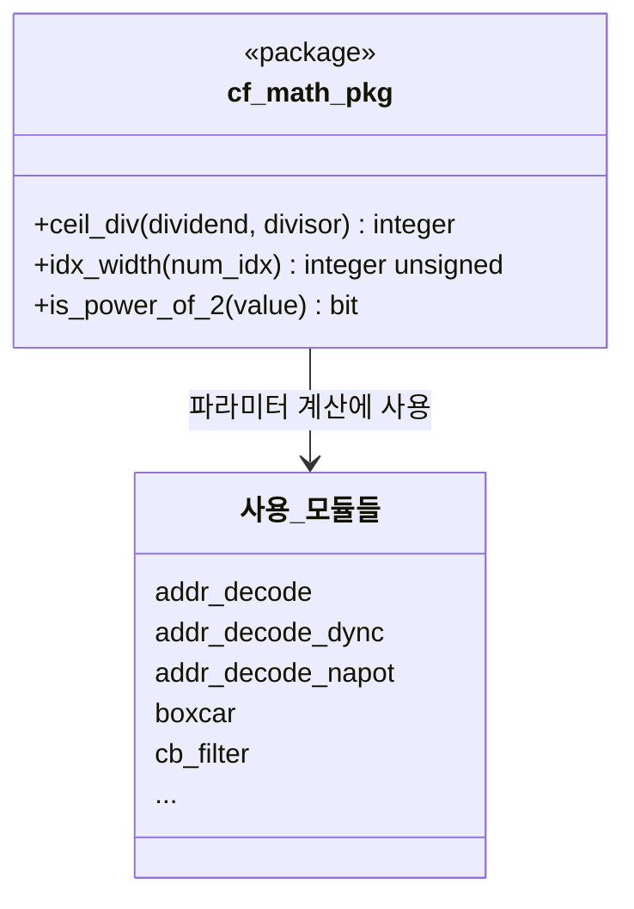

# cf_math_pkg.sv

## 개요

`cf_math_pkg`는 HDL 정교화(elaboration) 시점에 상수 값을 계산하기 위한 수학 함수들을 모아 놓은 SystemVerilog 패키지다. "cf"는 Constant Function(상수 함수)을 의미하며, IEEE Std 1364-2001에서 도입된 Verilog 상수 함수(§ 10.3.5) 기능을 활용한다.

상수 함수는 상수 인수로 호출될 때 컴파일 타임 또는 정교화 시점에 값을 평가할 수 있어, 파라미터 및 로컬파라미터 계산에 널리 사용된다.

## 블록 다이어그램



## 포트/파라미터

이 파일은 모듈이 아닌 패키지이므로 포트가 없다. 정의된 함수는 다음과 같다.

### 함수 목록

| 함수명 | 반환 타입 | 설명 |
|--------|---------|------|
| `ceil_div` | `integer` | 두 자연수의 나눗셈 결과를 양의 무한대 방향으로 올림 |
| `idx_width` | `integer unsigned` | 인덱스 신호의 최소 비트폭 계산 |
| `is_power_of_2` | `bit` | 값이 2의 거듭제곱인지 검사 |

### 함수 상세

#### `ceil_div(dividend, divisor)`

| 항목 | 내용 |
|------|------|
| 인수 | `dividend` (`longint`): 피제수, `divisor` (`longint`): 제수 |
| 반환값 | `integer`: 올림 나눗셈 결과 |
| 수식 | `⌈dividend / divisor⌉` |
| 유효성 검사 | 음수 인수 및 0으로 나누기 금지 (시뮬레이션에서 `$fatal` 발생) |

#### `idx_width(num_idx)`

| 항목 | 내용 |
|------|------|
| 인수 | `num_idx` (`integer unsigned`): 표현해야 할 최대 인덱스 수 |
| 반환값 | `integer unsigned`: 필요한 최소 비트폭 |
| 수식 | `num_idx > 1 ? $clog2(num_idx) : 1` |
| 특성 | 최소 1비트를 보장 (파라미터화와 무관하게 0비트 신호가 생기지 않도록) |

#### `is_power_of_2(value)`

| 항목 | 내용 |
|------|------|
| 인수 | `value` (`integer unsigned`): 검사할 값 |
| 반환값 | `bit`: 2의 거듭제곱이면 `1`, 아니면 `0` |
| 수식 | `(value != 0) && (value & (value - 1)) == 0` |
| 특성 | `value == 0`은 2의 거듭제곱이 아님으로 판단 |

## 동작 설명

### `ceil_div` 동작

반복 감산(iterative subtraction) 방식으로 올림 나눗셈을 구현한다.

```
remainder = dividend
ceil_div = 0
while remainder > 0:
    ceil_div++
    remainder -= divisor
```

예시:

| `dividend` | `divisor` | 결과 |
|-----------|---------|------|
| 10 | 3 | 4 (`⌈10/3⌉ = ⌈3.33⌉ = 4`) |
| 9 | 3 | 3 (`⌈9/3⌉ = 3`) |
| 1 | 4 | 1 (`⌈1/4⌉ = 1`) |

### `idx_width` 동작

인덱스 신호의 비트폭 계산에 사용한다. 예를 들어 `NoIndices = 8`이면 인덱스 0~7을 표현하는 데 3비트가 필요하므로 `idx_width(8) = 3`을 반환한다.

| `num_idx` | `$clog2(num_idx)` | `idx_width` 반환값 |
|----------|-----------------|----------------|
| 0 | - | 1 (최솟값 보장) |
| 1 | 0 | 1 (최솟값 보장) |
| 2 | 1 | 1 |
| 4 | 2 | 2 |
| 8 | 3 | 3 |
| 32 | 5 | 5 |

### `is_power_of_2` 동작

비트 트릭 `value & (value - 1) == 0`을 이용한다. 2의 거듭제곱은 이진수로 표현 시 정확히 1개의 비트만 1이므로, 1을 빼면 하위 비트가 모두 뒤집혀 AND 결과가 0이 된다.

| `value` | `value - 1` | `value & (value-1)` | 반환값 |
|--------|------------|---------------------|--------|
| 0 | - | - | 0 (0 제외 처리) |
| 1 | 0 | 0 | 1 |
| 4 | 3 | 0 | 1 |
| 6 | 5 | 4 | 0 |
| 8 | 7 | 0 | 1 |

## 의존성 및 관계

이 패키지는 외부 의존성이 없는 독립적인 기반 패키지다.

| 모듈/패키지 | 관계 | 사용 함수 |
|------------|------|---------|
| `addr_decode` | 사용처 | `idx_width()` — `IdxWidth` 파라미터 기본값 |
| `addr_decode_dync` | 사용처 | `idx_width()` — `IdxWidth` 파라미터 기본값 |
| `addr_decode_napot` | 사용처 | `idx_width()` — `IdxWidth` 파라미터 기본값 |
| `boxcar` | 사용처 | `idx_width()` — `IdxWidth` localparam 계산 |
| `cb_filter` (간접) | 간접 사용처 | `idx_width()` — 관련 모듈의 파라미터 계산 |
