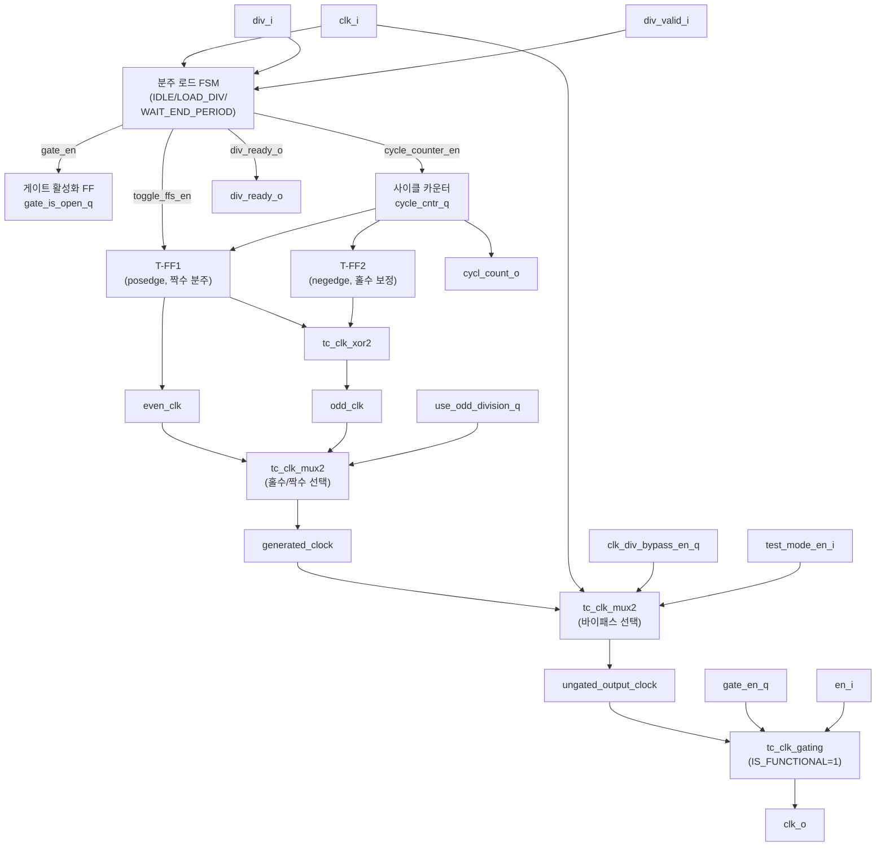
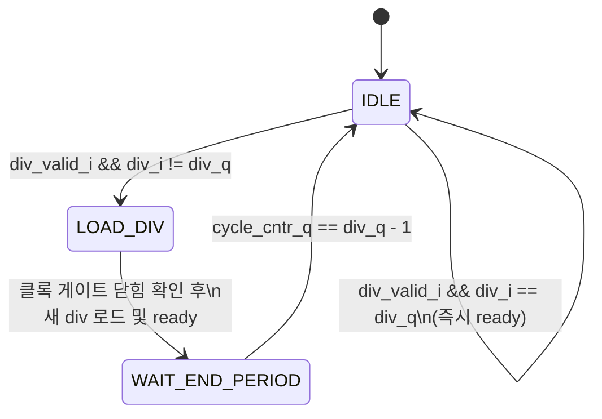

# clk_int_div (`clk_int_div.sv`)

## 개요

런타임에 분주비를 동적으로 변경할 수 있는 정수 클록 분주기입니다. 항상 정확한 50% 듀티 사이클의 출력 클록을 생성합니다. 분주비 변경은 핸드셰이크로 처리되며, 전환 중에는 글리치 방지를 위해 출력 클록이 게이팅됩니다. div_i=0 또는 1인 경우 입력 클록이 직접 바이패스됩니다. 짝수/홀수 분주 모두 지원합니다.

## 블록 다이어그램



## 포트 목록

| 포트명 | 방향 | 비트폭 | 설명 |
|--------|------|--------|------|
| `clk_i` | input | 1 | 입력 클록 |
| `rst_ni` | input | 1 | 비동기 리셋 (active-low) |
| `en_i` | input | 1 | 출력 클록 활성화 (active-high) |
| `test_mode_en_i` | input | 1 | DFT 테스트 모드 (클록 게이트 우회) |
| `div_i` | input | `[DIV_VALUE_WIDTH-1:0]` | 분주비 설정 값 |
| `div_valid_i` | input | 1 | 분주비 유효 신호 (핸드셰이크) |
| `div_ready_o` | output | 1 | 분주비 수신 완료 신호 (핸드셰이크) |
| `clk_o` | output | 1 | 분주된 출력 클록 (50% 듀티 사이클) |
| `cycl_count_o` | output | `[DIV_VALUE_WIDTH-1:0]` | 현재 사이클 카운터 값 |

## 파라미터

| 파라미터명 | 기본값 | 설명 |
|-----------|--------|------|
| `DIV_VALUE_WIDTH` | `4` | 분주비 카운터 비트폭 (최대 분주비 결정) |
| `DEFAULT_DIV_VALUE` | `0` | 리셋 후 초기 분주비 (0은 바이패스와 동일) |
| `ENABLE_CLOCK_IN_RESET` | `1'b0` | 리셋 중 출력 클록 게이트 개방 여부 |

## 동작 설명

### FSM 상태도



### 분주 동작

- **짝수 분주 (예: div=4)**: T-FF1만 사용. 사이클 카운터가 0과 div/2에 도달할 때 토글
- **홀수 분주 (예: div=3)**: T-FF1(posedge)과 T-FF2(negedge)를 XOR하여 50% 듀티 사이클 생성
- **div=0 또는 1**: 클록 바이패스 모드 (분주비=1과 동일)

### 타이밍 (div=4, 50% 듀티):
```
clk_i:   _|‾|_|‾|_|‾|_|‾|_|‾|_|‾|_
count:    0   1   2   3   0   1   2
clk_o:   __|‾‾‾‾‾‾‾‾‾|___________|‾
```

### 분주비 변경 절차:
1. IDLE 상태에서 `div_valid_i` 어서트
2. 현재 div와 다를 경우 LOAD_DIV 진입, 클록 게이트 닫힘
3. 출력 클록이 Low가 되면 새 div 값 로드, `div_ready_o` 펄스
4. WAIT_END_PERIOD에서 한 주기 대기 후 IDLE 복귀, 클록 게이트 재개방

## 내부 구조

| 신호/인스턴스 | 설명 |
|---|---|
| `clk_gate_state_q` | FSM 상태 레지스터 (IDLE/LOAD_DIV/WAIT_END_PERIOD) |
| `cycle_cntr_q` | 분주 사이클 카운터 |
| `t_ff1_q` | posedge 트리거 T-플립플롭 (짝수/홀수 분주 공통) |
| `t_ff2_q` | negedge 트리거 T-플립플롭 (홀수 분주 보정용) |
| `gate_is_open_q` | 클록 게이트 상태 레지스터 |
| `i_odd_clk_xor` | `tc_clk_xor2`: 홀수 분주 클록 생성용 XOR |
| `i_clk_mux` | `tc_clk_mux2`: 홀수/짝수 클록 선택 |
| `i_clk_bypass_mux` | `tc_clk_mux2`: div=1 바이패스 또는 테스트 모드 |
| `i_clk_gate` | `tc_clk_gating`: 전환 중 글리치 방지 게이트 |

## 의존성

- `tc_clk_xor2` (tech_cells_generic)
- `tc_clk_mux2` (tech_cells_generic)
- `tc_clk_gating` (tech_cells_generic)

## 사용 예시

```systemverilog
clk_int_div #(
    .DIV_VALUE_WIDTH       ( 8   ),
    .DEFAULT_DIV_VALUE     ( 4   ),
    .ENABLE_CLOCK_IN_RESET ( 1'b0 )
) i_clk_div (
    .clk_i         ( sys_clk      ),
    .rst_ni        ( rst_n        ),
    .en_i          ( clk_enable   ),
    .test_mode_en_i( test_mode    ),
    .div_i         ( div_value    ),
    .div_valid_i   ( div_valid    ),
    .div_ready_o   ( div_ready    ),
    .clk_o         ( divided_clk  ),
    .cycl_count_o  ( cycle_cnt    )
);
```
