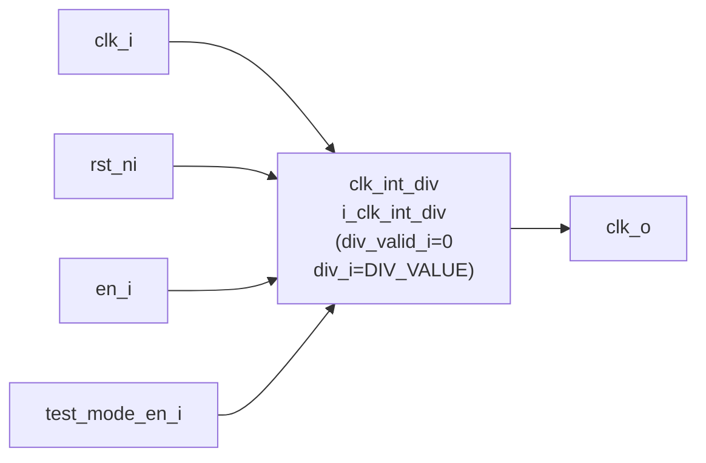

# clk_int_div_static (`clk_int_div_static.sv`)

## 개요

정수 분주비가 Elaboration 시점에 파라미터로 고정되는 정적 클록 분주기입니다. `clk_int_div` 모듈의 간편 래퍼로, 런타임 분주비 변경이 필요 없는 경우에 적합합니다. 짝수 및 홀수 정수 분주 모두 지원하며 항상 50% 듀티 사이클을 보장합니다.

## 블록 다이어그램



## 포트 목록

| 포트명 | 방향 | 비트폭 | 설명 |
|--------|------|--------|------|
| `clk_i` | input | 1 | 입력 클록 |
| `rst_ni` | input | 1 | 비동기 리셋 (active-low) |
| `en_i` | input | 1 | 출력 클록 활성화 |
| `test_mode_en_i` | input | 1 | DFT 테스트 모드 (클록 게이트 우회) |
| `clk_o` | output | 1 | 분주된 출력 클록 (50% 듀티 사이클) |

## 파라미터

| 파라미터명 | 기본값 | 설명 |
|-----------|--------|------|
| `DIV_VALUE` | `1` | 고정 분주비 값 (0이면 elaboration 오류, 최대 2^32-1) |
| `ENABLE_CLOCK_IN_RESET` | `1'b1` | 리셋 중 출력 클록 게이트 개방 여부 |

## 동작 설명

- `DIV_VALUE` 파라미터로 분주비를 정적으로 설정합니다.
- `div_valid_i`를 0으로 고정하여 런타임 분주비 변경을 비활성화합니다.
- 내부 `clk_int_div`의 `DEFAULT_DIV_VALUE`를 `DIV_VALUE`로, `DIV_VALUE_WIDTH`를 `$clog2(DIV_VALUE+1)`로 자동 계산합니다.
- `DIV_VALUE = 0`이면 elaboration 오류가 발생합니다.

**듀티 사이클:**
- 짝수 분주: T-FF1 단독 사용으로 정확한 50%
- 홀수 분주: T-FF1(posedge) + T-FF2(negedge) XOR 합성으로 50% 보장

## 내부 구조

`clk_int_div` 인스턴스 1개로만 구성됩니다. 내부 비트폭은 `$clog2(DIV_VALUE+1)`로 자동 최소화됩니다.

## 의존성

- `clk_int_div`

## 사용 예시

```systemverilog
// 클록을 3분주 (f_out = f_in / 3, 50% 듀티 사이클)
clk_int_div_static #(
    .DIV_VALUE             ( 3    ),
    .ENABLE_CLOCK_IN_RESET ( 1'b0 )
) i_clk_div3 (
    .clk_i         ( sys_clk     ),
    .rst_ni        ( rst_n       ),
    .en_i          ( 1'b1        ),
    .test_mode_en_i( test_mode   ),
    .clk_o         ( clk_div3    )
);
```
