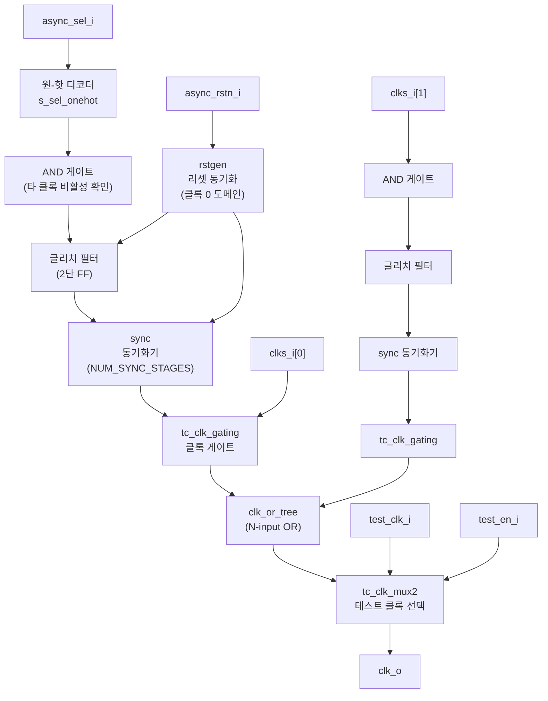

# clk_mux_glitch_free (`clk_mux_glitch_free.sv`)

## 개요

N개의 임의 입력 클록(위상 관계 무관) 사이에서 글리치 없이 전환하는 클록 멀티플렉서입니다. 클록 전환 신호를 각 클록 도메인으로 동기화하고, 클록 게이트를 적절한 시점에 제어하여 출력 클록에 글리치가 발생하지 않도록 보장합니다. 클록 경로는 전용 clock tech cell만 통과합니다.

## 블록 다이어그램



## 포트 목록

| 포트명 | 방향 | 비트폭 | 설명 |
|--------|------|--------|------|
| `clks_i` | input | `[NUM_INPUTS-1:0]` | 입력 클록 배열 |
| `test_clk_i` | input | 1 | DFT 테스트 클록 |
| `test_en_i` | input | 1 | 테스트 모드 활성화 |
| `async_rstn_i` | input | 1 | 비동기 리셋 (active-low) |
| `async_sel_i` | input | `[SelWidth-1:0]` | 클록 선택 신호 (바이너리 인코딩) |
| `clk_o` | output | 1 | 글리치 없는 출력 클록 |

## 파라미터

| 파라미터명 | 기본값 | 설명 |
|-----------|--------|------|
| `NUM_INPUTS` | `2` | 입력 클록 수 (최소 2) |
| `NUM_SYNC_STAGES` | `2` | 동기화 플립플롭 단수 |
| `CLOCK_DURING_RESET` | `1'b1` | 리셋 중 클록 전파 허용 여부 |

`SelWidth = $clog2(NUM_INPUTS)` (로컬 파라미터)

## 동작 설명

### 글리치 없는 클록 전환 절차 (클록 A → 클록 B)

1. `async_sel_i`가 변경됨 → 원-핫 디코딩으로 각 클록의 활성화 신호 결정
2. 클록 B의 게이트 활성화 신호가 계산될 때, 클록 A의 게이트가 완전히 닫혔는지 확인 (`clock_has_been_disabled_q`)
3. 글리치 필터(2사이클 안정 요구)와 동기화기를 통과한 후 클록 A 게이트 비활성화 (다음 Falling Edge에서 실제 차단)
4. 클록 A가 완전히 꺼진 것을 확인 후 클록 B 게이트 활성화 시작
5. NUM_SYNC_STAGES 사이클 동기화 후 클록 B 게이트 활성화 → 다음 Rising Edge부터 출력

**최악의 경우 전환 지연:** `2 × NUM_SYNC_STAGES × max(클록 주기)`

### 리셋 동작
- `CLOCK_DURING_RESET = 1`: 리셋 중 동기화기 우회 경로로 클록 전파 (글리치 필터 없이)
- `CLOCK_DURING_RESET = 0`: 리셋 해제 후에만 클록 출력

### 사용 조건
1. `async_sel_i`는 최소 `min(입력 클록 주기)` 동안 안정 유지 필요
2. 전환 중 두 클록 모두 안정 주기 보유 필요
3. `async_sel_i`의 글리치 지속 시간 < `min(클록 주기) - t_setup`

## 내부 구조

**입력 스테이지 (각 클록별 생성):**

| 서브모듈 | 설명 |
|---|---|
| `rstgen` | 각 클록 도메인으로 비동기 리셋 동기화 |
| 글리치 필터 (2단 FF) | 짧은 High 펄스 필터링 |
| `sync` | `NUM_SYNC_STAGES` 단 동기화기 |
| `tc_clk_gating` | 글리치 없는 클록 게이트 |
| `clock_has_been_disabled_q` | 클록이 완전히 꺼졌음을 확인하는 지연 FF |

**출력 스테이지:**

| 서브모듈 | 설명 |
|---|---|
| `clk_or_tree` | N-입력 클록 OR 게이트 트리 (재귀적 `tc_clk_or2` 구성) |
| `tc_clk_mux2` | 테스트 클록 선택 멀티플렉서 |

## 의존성

- `rstgen`
- `sync`
- `tc_clk_gating` (tech_cells_generic)
- `tc_clk_mux2` (tech_cells_generic)
- `tc_clk_or2` (tech_cells_generic, `clk_or_tree` 내부)

## 사용 예시

```systemverilog
clk_mux_glitch_free #(
    .NUM_INPUTS        ( 3    ),
    .NUM_SYNC_STAGES   ( 2    ),
    .CLOCK_DURING_RESET( 1'b1 )
) i_clk_mux (
    .clks_i       ( {clk_c, clk_b, clk_a} ),
    .test_clk_i   ( test_clk              ),
    .test_en_i    ( test_mode             ),
    .async_rstn_i ( rst_n                 ),
    .async_sel_i  ( clk_sel[1:0]          ),
    .clk_o        ( selected_clk          )
);
```
