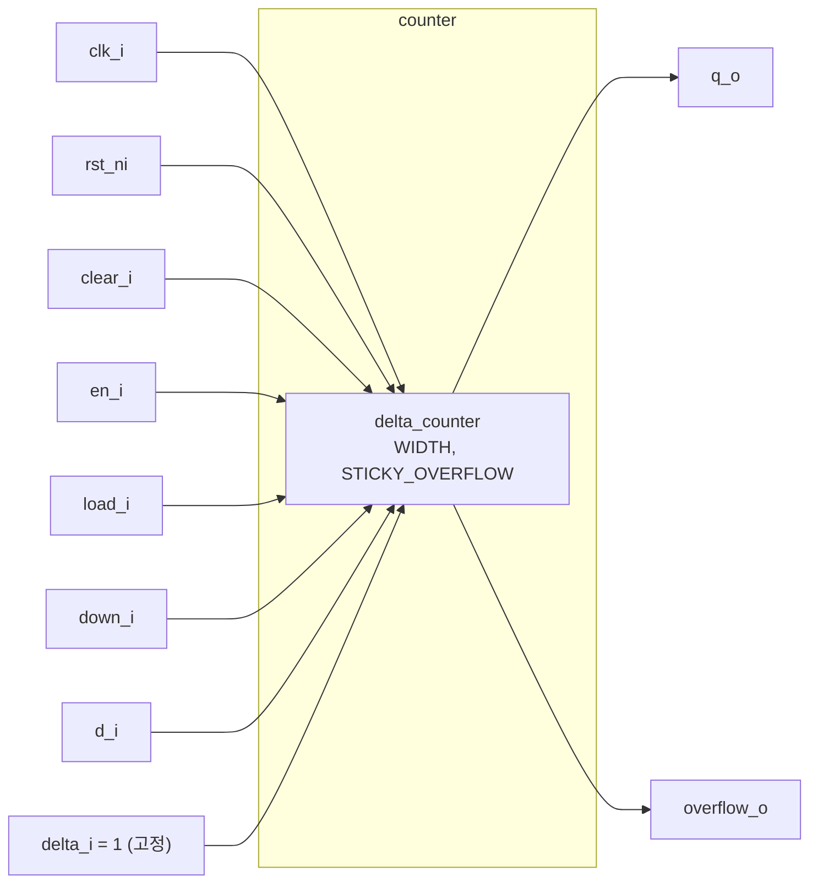

# counter (`counter.sv`)

## 개요

범용 업/다운 카운터 모듈입니다. `delta_counter`를 내부적으로 사용하며, 델타(증감값)를 항상 1로 고정한 래퍼(wrapper)입니다. 동기식 클리어, 로드, 방향 전환(업/다운), 오버플로 감지 기능을 제공합니다. 카운터 너비와 스티키(sticky) 오버플로 동작을 파라미터로 설정할 수 있어 다양한 설계에 활용됩니다.

## 블록 다이어그램



## 포트 목록

| 포트명 | 방향 | 비트폭 | 설명 |
|--------|------|--------|------|
| `clk_i` | input | 1 | 클록 신호 |
| `rst_ni` | input | 1 | 비동기 액티브-로우 리셋 |
| `clear_i` | input | 1 | 동기식 클리어 (0으로 초기화) |
| `en_i` | input | 1 | 카운터 인에이블 |
| `load_i` | input | 1 | 외부 값 로드 인에이블 |
| `down_i` | input | 1 | 다운카운트 선택 (0=업, 1=다운) |
| `d_i` | input | WIDTH | 로드할 입력 데이터 |
| `q_o` | output | WIDTH | 카운터 현재 값 |
| `overflow_o` | output | 1 | 오버플로/언더플로 플래그 |

## 파라미터

| 파라미터명 | 기본값 | 설명 |
|-----------|--------|------|
| `WIDTH` | 4 | 카운터 비트 폭 |
| `STICKY_OVERFLOW` | 1'b0 | 1이면 오버플로 플래그가 클리어/로드 전까지 유지됨 |

## 동작 설명

`counter`는 `delta_counter`의 래퍼로, `delta_i`를 `1`로 고정하여 호출합니다.

- **업카운트 (`down_i=0`)**: 매 클록 상승 엣지에서 `q_o = q_o + 1`
- **다운카운트 (`down_i=1`)**: 매 클록 상승 엣지에서 `q_o = q_o - 1`
- **클리어 (`clear_i=1`)**: 다음 클록에서 `q_o = 0`으로 초기화 (en_i에 무관)
- **로드 (`load_i=1`)**: 다음 클록에서 `q_o = d_i`로 설정 (clear_i보다 낮은 우선순위)
- **오버플로 감지**: WIDTH 비트를 초과하거나 0 아래로 내려갈 때 `overflow_o` 어서트

### 우선순위 (높음 → 낮음)

1. `clear_i` (동기식 클리어)
2. `load_i` (값 로드)
3. `en_i` (카운트 동작)

### STICKY_OVERFLOW 동작

| `STICKY_OVERFLOW` | 설명 |
|---|---|
| `0` | 오버플로는 해당 사이클에만 유효한 순간 신호 (MSB 활용) |
| `1` | 오버플로 발생 후 클리어/로드 전까지 `overflow_o` 유지 |

## 내부 구조

내부적으로 `delta_counter`를 인스턴스화하며, `delta_i` 포트에 `{{WIDTH-1{1'b0}}, 1'b1}` (즉, 1)을 연결합니다. 실제 카운트 레지스터와 오버플로 로직은 모두 `delta_counter` 내부에 구현됩니다.

## 의존성

- `delta_counter` (`src/delta_counter.sv`)

## 사용 예시

```systemverilog
// 8비트 스티키 오버플로 업/다운 카운터
counter #(
    .WIDTH           (8),
    .STICKY_OVERFLOW (1'b1)
) u_counter (
    .clk_i      (clk),
    .rst_ni     (rst_n),
    .clear_i    (1'b0),
    .en_i       (count_en),
    .load_i     (load),
    .down_i     (count_down),
    .d_i        (load_val),
    .q_o        (count_val),
    .overflow_o (overflow)
);
```
