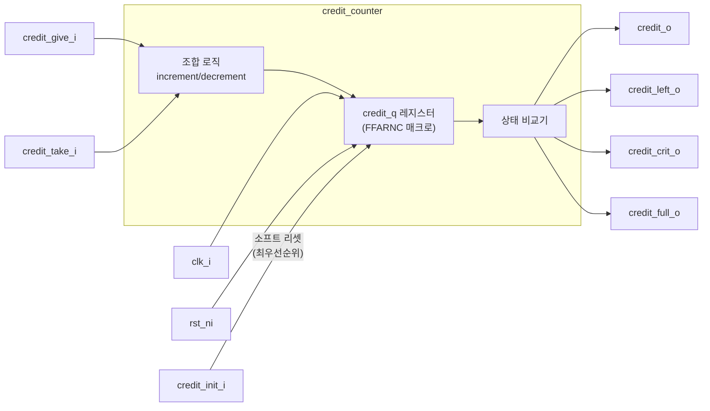

# credit_counter (`credit_counter.sv`)

## 개요

크레딧 기반 흐름 제어(flow control)를 위한 카운터 모듈입니다. 네트워크 온 칩(NoC), AXI 버스 인터페이스, FIFO 제어 등에서 송신 측이 수신 측의 버퍼 가용량(크레딧)을 추적하는 데 사용됩니다. 크레딧 부여(`credit_give_i`)와 소진(`credit_take_i`)을 동시에 처리하지 않는 한 증감이 가능하며, `credit_init_i`로 소프트 리셋이 가능합니다.

## 블록 다이어그램



## 포트 목록

| 포트명 | 방향 | 비트폭 | 설명 |
|--------|------|--------|------|
| `clk_i` | input | 1 | 클록 신호 |
| `rst_ni` | input | 1 | 비동기 액티브-로우 리셋 |
| `credit_o` | output | $clog2(NumCredits)+1 | 현재 크레딧 값 |
| `credit_give_i` | input | 1 | 크레딧 반환 (수신 완료 알림) |
| `credit_take_i` | input | 1 | 크레딧 소진 (데이터 전송) |
| `credit_init_i` | input | 1 | 크레딧 재초기화 (소프트 리셋, 최우선) |
| `credit_left_o` | output | 1 | 잔여 크레딧 존재 여부 (`credit_q != 0`) |
| `credit_crit_o` | output | 1 | 크레딧 임계 상태 (`credit_q == NumCredits-1`) |
| `credit_full_o` | output | 1 | 크레딧 가득 참 (`credit_q == NumCredits`) |

## 파라미터

| 파라미터명 | 기본값 | 설명 |
|-----------|--------|------|
| `NumCredits` | 0 | 최대 크레딧 수 (반드시 설정 필요) |
| `InitCreditEmpty` | 1'b0 | 0=리셋 시 가득 찬 상태, 1=리셋 시 빈 상태 |
| `InitNumCredits` | - | 파생 파라미터: 초기 크레딧 값 (변경 금지) |
| `credit_cnt_t` | - | 파생 파라미터: 카운터 타입 (변경 금지) |

## 동작 설명

크레딧 카운터는 단방향 연산만 허용합니다.

| `credit_take_i` | `credit_give_i` | 동작 |
|---|---|---|
| 0 | 0 | 유지 |
| 1 | 0 | 감소 (decrement) |
| 0 | 1 | 증가 (increment) |
| 1 | 1 | 유지 (동시 발생 시 상쇄) |

- **크레딧 초기화 (`credit_init_i`)**: 하드웨어 리셋 없이 카운터를 `InitNumCredits`로 복원합니다. `credit_take_i`/`credit_give_i`보다 높은 우선순위를 가집니다 (`FFARNC` 매크로의 클리어 입력).
- **언더플로/오버플로 방지**: `ASSERT_NEVER` 어서션으로 크레딧이 0일 때 소진하거나 최대값일 때 부여하는 잘못된 동작을 시뮬레이션 중 감지합니다.

### 출력 상태 신호

| 신호 | 어서트 조건 | 용도 |
|---|---|---|
| `credit_left_o` | `credit_q != 0` | 데이터 전송 가능 여부 |
| `credit_crit_o` | `credit_q == NumCredits-1` | 다음 Give로 가득 찼음을 알림 |
| `credit_full_o` | `credit_q == NumCredits` | 버퍼 완전 비어있음 (역방향 관점) |

## 내부 구조

- `FFARNC` 매크로: 비동기 리셋(`rst_ni`)과 동기 클리어(`credit_init_i`)를 지원하는 플립플롭
- `decrement = credit_take_i & ~credit_give_i`: 동시 발생 시 감소하지 않음
- `increment = ~credit_take_i & credit_give_i`: 동시 발생 시 증가하지 않음

## 의존성

- `common_cells/registers.svh` (FFARNC 매크로)
- `common_cells/assertions.svh` (ASSERT_NEVER 매크로)

## 사용 예시

```systemverilog
// 8크레딧, 리셋 시 가득 찬 상태로 시작
credit_counter #(
    .NumCredits      (8),
    .InitCreditEmpty (1'b0)
) u_credit_cnt (
    .clk_i         (clk),
    .rst_ni        (rst_n),
    .credit_o      (credits),
    .credit_give_i (rx_done),    // 수신 완료 시 크레딧 반환
    .credit_take_i (tx_valid),   // 전송 시 크레딧 소진
    .credit_init_i (flush),      // 재초기화
    .credit_left_o (can_send),
    .credit_crit_o (nearly_full),
    .credit_full_o (buf_empty)
);
```
