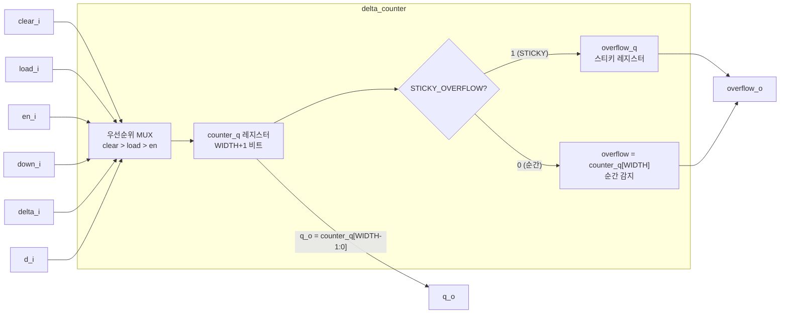

# delta_counter (`delta_counter.sv`)

## 개요

가변 델타(증감값)를 지원하는 범용 업/다운 카운터입니다. `counter`와 `max_counter`의 핵심 구현체로, 매 클록 사이클마다 임의의 양(delta)만큼 증가하거나 감소할 수 있습니다. 동기식 클리어, 임의 값 로드, 방향 전환, 두 가지 오버플로 감지 모드를 지원합니다.

## 블록 다이어그램



## 포트 목록

| 포트명 | 방향 | 비트폭 | 설명 |
|--------|------|--------|------|
| `clk_i` | input | 1 | 클록 신호 |
| `rst_ni` | input | 1 | 비동기 액티브-로우 리셋 |
| `clear_i` | input | 1 | 동기식 클리어 (최우선) |
| `en_i` | input | 1 | 카운터 인에이블 |
| `load_i` | input | 1 | 외부 값 로드 인에이블 |
| `down_i` | input | 1 | 다운카운트 선택 (0=업, 1=다운) |
| `delta_i` | input | WIDTH | 증감량 (가변 델타) |
| `d_i` | input | WIDTH | 로드할 입력 데이터 |
| `q_o` | output | WIDTH | 카운터 현재 값 |
| `overflow_o` | output | 1 | 오버플로/언더플로 플래그 |

## 파라미터

| 파라미터명 | 기본값 | 설명 |
|-----------|--------|------|
| `WIDTH` | 4 | 카운터 비트 폭 |
| `STICKY_OVERFLOW` | 1'b0 | 0=순간 감지, 1=스티키 오버플로 |

## 동작 설명

### 제어 신호 우선순위 (높음 → 낮음)

1. `clear_i=1`: `counter_d = 0` (모든 다른 신호 무시)
2. `load_i=1`: `counter_d = {1'b0, d_i}` (clear_i가 0일 때)
3. `en_i=1` + `down_i=0`: `counter_d = counter_q + delta_i` (업카운트)
4. `en_i=1` + `down_i=1`: `counter_d = counter_q - delta_i` (다운카운트)
5. 나머지: `counter_d = counter_q` (유지)

### 오버플로 감지

내부적으로 `WIDTH+1` 비트 레지스터 `counter_q`를 사용하여 오버플로를 감지합니다.

| 모드 | 감지 방법 | 클리어 조건 |
|---|---|---|
| `STICKY_OVERFLOW=0` | `counter_q[WIDTH]` (MSB, 순간 신호) | 자동 (다음 사이클 연산으로 복구) |
| `STICKY_OVERFLOW=1` | 별도 `overflow_q` 레지스터 유지 | `clear_i` 또는 `load_i` 시 클리어 |

스티키 모드에서 업카운트 오버플로 조건: `counter_q[WIDTH-1:0] > (2^WIDTH - 1 - delta_i)`
스티키 모드에서 다운카운트 오버플로 조건: `delta_i > counter_q[WIDTH-1:0]`

## 내부 구조

- 카운터 레지스터는 `WIDTH+1`비트로 선언되어 비트 `WIDTH`가 자연스럽게 캐리/버로우(borrow)를 나타냅니다.
- `gen_sticky_overflow`와 `gen_transient_overflow` 두 개의 generate 블록으로 컴파일 타임에 오버플로 모드를 선택합니다.
- `q_o`는 `counter_q[WIDTH-1:0]`으로, 항상 하위 WIDTH 비트만 출력됩니다.

## 의존성

없음 (독립 모듈)

## 사용 예시

```systemverilog
// 4씩 증가/감소하는 16비트 델타 카운터 (스티키 오버플로)
delta_counter #(
    .WIDTH           (16),
    .STICKY_OVERFLOW (1'b1)
) u_delta_cnt (
    .clk_i     (clk),
    .rst_ni    (rst_n),
    .clear_i   (clear),
    .en_i      (enable),
    .load_i    (load),
    .down_i    (count_down),
    .delta_i   (16'd4),
    .d_i       (init_val),
    .q_o       (count_out),
    .overflow_o(overflow)
);
```
