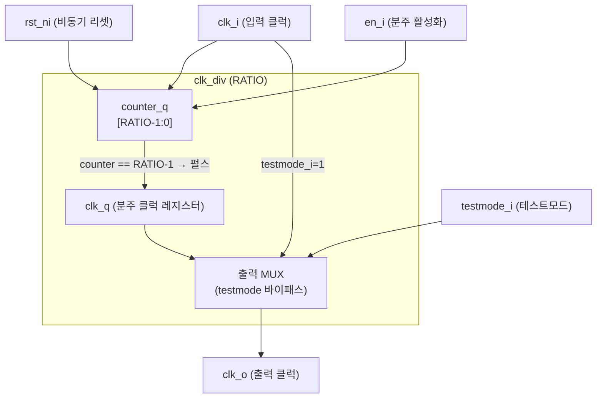

# clk_div.sv (Deprecated)

## 개요

`clk_div`는 입력 클럭을 정수 배율(`RATIO`)로 분주하는 모듈입니다. 비동기 저전력 리셋과 테스트모드 바이패스를 지원합니다.

**Deprecated 이유:** 생성되는 출력 클럭의 듀티 사이클이 `1/RATIO`로 매우 불균형합니다. 새로운 설계에는 항상 50% 듀티 사이클을 보장하며 런타임 설정이 가능한 `clk_int_div` 모듈 사용을 권장합니다.

**대안 모듈:** `clk_int_div`

```sv
clk_int_div #(
  .DIV_VALUE_WIDTH($clog2(RATIO+1)),
  .DEFAULT_DIV_VALUE(RATIO)
) i_clk_int_div(
  .clk_i,
  .rst_ni,
  .test_mode_en_i(testmode_i),
  .en_i,
  .div_i('1),         // 무시됨, 기본값 사용
  .div_valid_i(1'b0),
  .div_ready_o(),
  .clk_o
);
```

---

## 블록 다이어그램



---

## 포트/파라미터

### 파라미터

| 파라미터명 | 타입 | 기본값 | 설명 |
|---|---|---|---|
| `RATIO` | `int unsigned` | `4` | 클럭 분주 비율 (출력 주파수 = 입력 주파수 / RATIO) |
| `SHOW_WARNING` | `bit` | `1'b1` | 이레보레이션 시 deprecated 경고 출력 여부 |

### 포트

| 포트명 | 방향 | 너비 | 설명 |
|---|---|---|---|
| `clk_i` | input | 1 | 입력 클럭 |
| `rst_ni` | input | 1 | 비동기 액티브 로우 리셋 |
| `testmode_i` | input | 1 | 테스트모드 (1이면 clk_i를 그대로 출력) |
| `en_i` | input | 1 | 클럭 분주기 활성화 신호 |
| `clk_o` | output | 1 | 분주된 출력 클럭 |

---

## 동작 설명

- `rst_ni`가 Low이면 `counter_q`와 `clk_q`를 0으로 초기화합니다.
- `en_i`가 High일 때 매 클럭 사이클마다 `counter_q`를 증가시킵니다.
- `counter_q`가 `RATIO - 1`에 도달하면 `clk_q`를 1로 설정하고 카운터를 리셋합니다.
- 이 방식은 출력 클럭의 하이 구간이 한 사이클(`1/RATIO`)에 불과하여 **듀티 사이클 불균형** 문제가 있습니다.
- `testmode_i`가 High이면 분주 로직을 우회하여 입력 클럭 `clk_i`를 직접 출력합니다.

### 듀티 사이클 문제

| RATIO | 출력 하이 구간 | 출력 로우 구간 | 듀티 사이클 |
|---|---|---|---|
| 4 | 1 사이클 | 3 사이클 | 25% |
| 8 | 1 사이클 | 7 사이클 | 12.5% |
| 2 | 1 사이클 | 1 사이클 | 50% |

---

## 의존성 및 관계

- **의존 모듈:** 없음 (독립 모듈)
- **대안 모듈:** `clk_int_div` — 런타임 분주비 설정 가능, 항상 50% 듀티 사이클 보장
- **경고 제어:** `SHOW_WARNING = 1'b0`으로 설정하면 이레보레이션 경고 메시지를 억제할 수 있습니다.
