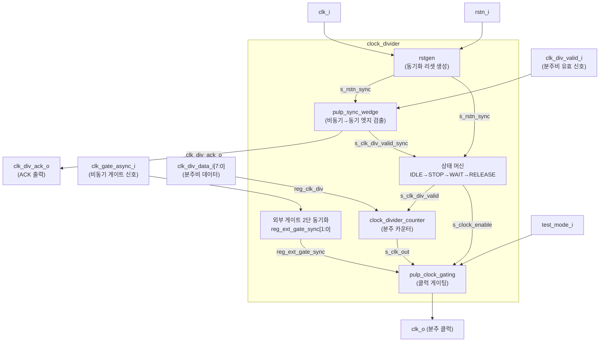

# clock_divider.sv (Deprecated)

## 개요

`clock_divider`는 PULP(Parallel Ultra-Low Power) 플랫폼의 ULPSoC 프로젝트를 위해 개발된 런타임 설정 가능한 클럭 분주 모듈입니다. 8비트 분주비 데이터를 비동기 핸드셰이크 인터페이스로 받아 클럭을 분주하고, 외부 게이팅 신호를 통해 클럭을 제어합니다.

**Deprecated 이유:** 레거시 PULP 인터페이스(비동기 핸드셰이크)와 내부 하위 모듈(`pulp_sync_wedge`, `clock_divider_counter`)에 의존하며, 현재 권장 설계 방식과 맞지 않습니다.

**대안 모듈:** `clk_int_div` (런타임 설정 가능한 표준 클럭 분주기)

---

## 블록 다이어그램

---

## 포트/파라미터

### 파라미터

| 파라미터명 | 타입 | 기본값 | 설명 |
|---|---|---|---|
| `DIV_INIT` | `int` | `0` | 초기 분주비 값 |
| `BYPASS_INIT` | `int` | `1` | 초기 바이패스 상태 (1=분주 없이 통과) |

### 포트

| 포트명 | 방향 | 너비 | 설명 |
|---|---|---|---|
| `clk_i` | input | 1 | 입력 클럭 |
| `rstn_i` | input | 1 | 비동기 액티브 로우 리셋 |
| `test_mode_i` | input | 1 | 테스트모드 활성화 |
| `clk_gate_async_i` | input | 1 | 비동기 외부 클럭 게이트 신호 |
| `clk_div_data_i` | input | 8 | 분주비 설정 데이터 |
| `clk_div_valid_i` | input | 1 | 분주비 데이터 유효 신호 (비동기) |
| `clk_div_ack_o` | output | 1 | 분주비 수신 응답 신호 |
| `clk_o` | output | 1 | 분주된 출력 클럭 |

---

## 동작 설명

### 상태 머신

클럭 분주비를 안전하게 변경하기 위해 4단계 FSM을 사용합니다.

| 상태 | `s_clock_enable` | `s_clk_div_valid` | 설명 |
|---|---|---|---|
| `IDLE` | 1 | 0 | 정상 클럭 출력, 새 분주비 대기 |
| `STOP` | 0 | 1 | 클럭 정지 후 새 분주비 카운터에 반영 |
| `WAIT` | 0 | 0 | 카운터 안정화 대기 |
| `RELEASE` | 0 | 0 | 안정화 완료 후 IDLE로 복귀 준비 |

### 비동기 핸드셰이크

- `pulp_sync_wedge`를 사용하여 비동기 `clk_div_valid_i`를 로컬 클럭 도메인으로 동기화합니다.
- 상승 엣지(`r_edge_o`)가 검출되면 `clk_div_data_i`를 `reg_clk_div` 레지스터에 샘플링합니다.

### 외부 게이트 동기화

- `clk_gate_async_i`를 2단 플립플롭(`reg_ext_gate_sync[1:0]`)으로 동기화합니다.
- 동기화된 값과 FSM의 `s_clock_enable`을 AND하여 최종 클럭 게이팅 신호를 생성합니다.

---

## 의존성 및 관계

| 하위 모듈 | 역할 |
|---|---|
| `rstgen` | 비동기 리셋을 클럭에 동기화하여 안정된 리셋 신호 생성 (`PULP_FPGA_EMUL` 미정의 시) |
| `pulp_sync_wedge` | 비동기 `clk_div_valid_i`를 동기화하고 엣지 검출 |
| `clock_divider_counter` | 실제 클럭 분주 카운터 로직 |
| `pulp_clock_gating` | 게이팅 셀로 클럭 출력 제어 |

- **대안 모듈:** `clk_int_div` — 표준화된 런타임 클럭 분주기
