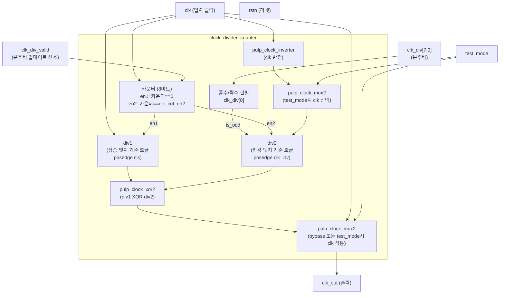

# clock_divider_counter.sv (Deprecated)

## 개요

`clock_divider_counter`는 `clock_divider` 모듈 내부에서 사용되는 클럭 분주 카운터 서브모듈입니다. 8비트 분주비를 입력받아 짝수/홀수 분주비 모두에 대해 50% 듀티 사이클에 근접한 출력 클럭을 생성합니다.

**Deprecated 이유:** `clock_divider` 모듈과 함께 레거시 PULP 플랫폼 전용으로 설계되었으며, `PULP_DFT`, `PULP_FPGA_EMUL` 등 PULP 특정 컴파일 플래그에 의존합니다.

**대안 모듈:** `clk_int_div` (내부적으로 동등한 분주 로직 포함)

---

## 블록 다이어그램

---

## 포트/파라미터

### 파라미터

| 파라미터명 | 타입 | 기본값 | 설명 |
|---|---|---|---|
| `BYPASS_INIT` | `int` | `1` | 초기 바이패스 상태 (1=분주 없이 clk 직통) |
| `DIV_INIT` | `int` | `0xFF` | 초기 분주비 카운트 값 |

### 포트

| 포트명 | 방향 | 너비 | 설명 |
|---|---|---|---|
| `clk` | input | 1 | 입력 클럭 |
| `rstn` | input | 1 | 비동기 액티브 로우 리셋 |
| `test_mode` | input | 1 | 테스트모드 (바이패스 강제) |
| `clk_div` | input | 8 | 분주비 설정값 |
| `clk_div_valid` | input | 1 | 분주비 유효 신호 (업데이트 트리거) |
| `clk_out` | output | 1 | 분주된 출력 클럭 |

---

## 동작 설명

### 바이패스 모드

- `clk_div`가 0 또는 1이면 바이패스 모드로 진입하여 `clk`를 직접 출력합니다.
- `test_mode`가 High이면 항상 바이패스 모드가 됩니다.

### 짝수 분주 (is_odd = 0)

- `div1`만 사용하여 클럭을 분주합니다.
- 카운터가 0이 될 때(`en1`) `div1`을 토글합니다.
- `clk_cnt_even = clk_div/2 - 1` (단, `clk_div==2`이면 0)

### 홀수 분주 (is_odd = 1)

- `div1`과 `div2`를 XOR하여 50%에 근접한 듀티 사이클을 생성합니다.
  - `div1`: 포지티브 엣지 기준 토글 (`posedge clk`)
  - `div2`: 네거티브 엣지 기준 토글 (`posedge clk_inv`)
- `clk_cnt_odd = clk_div - 1`

### 분주비 업데이트 절차

1. `clk_div_valid`가 High가 되면 카운터를 즉시 리셋하고 `div1`, `div2`를 0으로 초기화
2. 다음 클럭에서 새로운 `clk_div` 값으로 카운터 최댓값(`clk_cnt`) 재계산
3. `clk_div_valid_reg`로 1사이클 지연시켜 `div2`도 안전하게 리셋

### 사용되는 하위 모듈

| 하위 모듈 | 역할 |
|---|---|
| `pulp_clock_inverter` | 클럭 반전 생성 |
| `pulp_clock_mux2` | 테스트모드 클럭 선택, 바이패스 선택 |
| `pulp_clock_xor2` | div1과 div2 XOR로 최종 분주 클럭 합성 |

---

## 의존성 및 관계

- **상위 모듈:** `clock_divider`
- **의존 셀:** `pulp_clock_inverter`, `pulp_clock_mux2`, `pulp_clock_xor2` (PULP 클럭 셀 라이브러리)
- **컴파일 플래그:** `PULP_FPGA_EMUL`, `PULP_DFT` (FPGA 에뮬레이션 및 DFT 모드 분기)
- **대안 모듈:** `clk_int_div`
