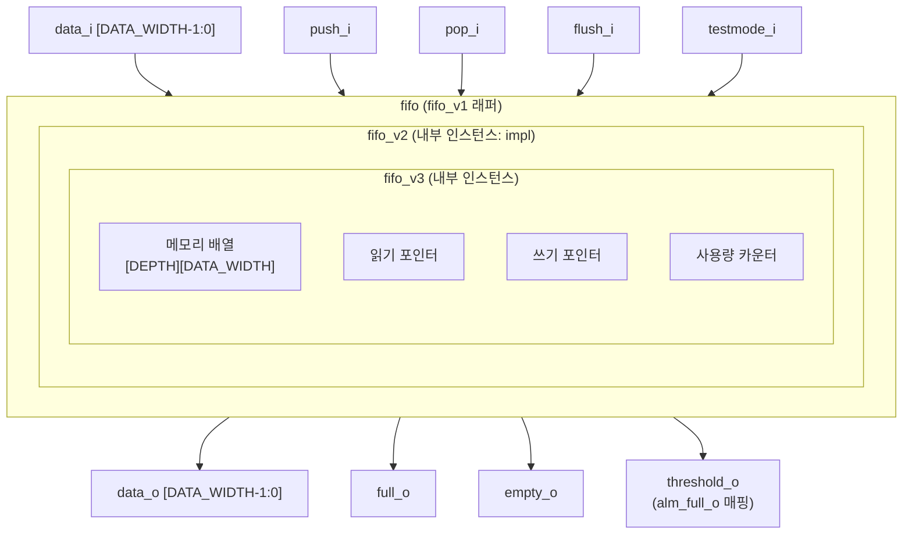

# fifo_v1.sv (Deprecated)

## 개요

`fifo_v1.sv`에는 `fifo`라는 이름의 래퍼(wrapper) 모듈이 정의되어 있습니다. 이 모듈은 `fifo_v2`를 내부적으로 인스턴스화하여 기존 `fifo` 인터페이스 호환성을 유지하는 호환성 래퍼입니다.

**Deprecated 이유:** 이 모듈은 단순히 `fifo_v2`를 감싸는 래퍼로, 직접 `fifo_v3`(최신 버전)를 사용하도록 마이그레이션할 것을 권장합니다. `threshold_o` 포트가 `fifo_v2`의 `alm_full_o`에 매핑되어 제한적입니다.

**대안 모듈:** `fifo_v3` (직접 사용 권장)

---

## 블록 다이어그램

---

## 포트/파라미터

### 파라미터

| 파라미터명 | 타입 | 기본값 | 설명 |
|---|---|---|---|
| `FALL_THROUGH` | `bit` | `1'b0` | 풀스루 모드 (push와 동시에 pop 가능) |
| `DATA_WIDTH` | `int unsigned` | `32` | 데이터 비트 폭 |
| `DEPTH` | `int unsigned` | `8` | FIFO 깊이 (항목 수) |
| `THRESHOLD` | `int unsigned` | `1` | `threshold_o` 어서트 기준 채움 수 |
| `dtype` | `type` | `logic [DATA_WIDTH-1:0]` | 데이터 타입 (파라미터화 가능) |

### 포트

| 포트명 | 방향 | 너비 | 설명 |
|---|---|---|---|
| `clk_i` | input | 1 | 클럭 |
| `rst_ni` | input | 1 | 비동기 액티브 로우 리셋 |
| `flush_i` | input | 1 | FIFO 전체 비우기 |
| `testmode_i` | input | 1 | 테스트모드 (클럭 게이팅 우회) |
| `full_o` | output | 1 | FIFO 가득 참 표시 |
| `empty_o` | output | 1 | FIFO 비어 있음 표시 |
| `threshold_o` | output | 1 | 채움 수가 THRESHOLD 이상임을 표시 |
| `data_i` | input | `dtype` | 푸시할 입력 데이터 |
| `push_i` | input | 1 | 데이터 푸시 요청 |
| `data_o` | output | `dtype` | 팝할 출력 데이터 |
| `pop_i` | input | 1 | 데이터 팝 요청 |

---

## 동작 설명

`fifo` 모듈은 `fifo_v2`의 얇은 래퍼입니다. 포트 매핑은 아래와 같습니다.

| `fifo` 포트 | `fifo_v2` 포트 | 비고 |
|---|---|---|
| `THRESHOLD` | `ALM_FULL_TH` | 임계값 매핑 |
| `threshold_o` | `alm_full_o` | Almost Full → Threshold |
| (없음) | `alm_empty_o` | 연결 안 됨 |

`fifo_v2`는 내부적으로 `fifo_v3`를 인스턴스화하여 실제 FIFO 동작을 수행합니다.

- `FALL_THROUGH=1`이면 푸시와 팝이 동시에 발생할 때 조합 경로로 데이터가 전달됩니다.
- `DEPTH=0`이면 순수 조합 경로(레지스터 없음)로 동작합니다.

---

## 의존성 및 관계

- **직접 의존:** `fifo_v2`
- **간접 의존:** `fifo_v3`
- **대안 모듈:** `fifo_v3` — 직접 인스턴스화하여 사용하는 것을 권장합니다. `usage_o` 포트를 통해 채움 수를 직접 확인할 수 있습니다.
