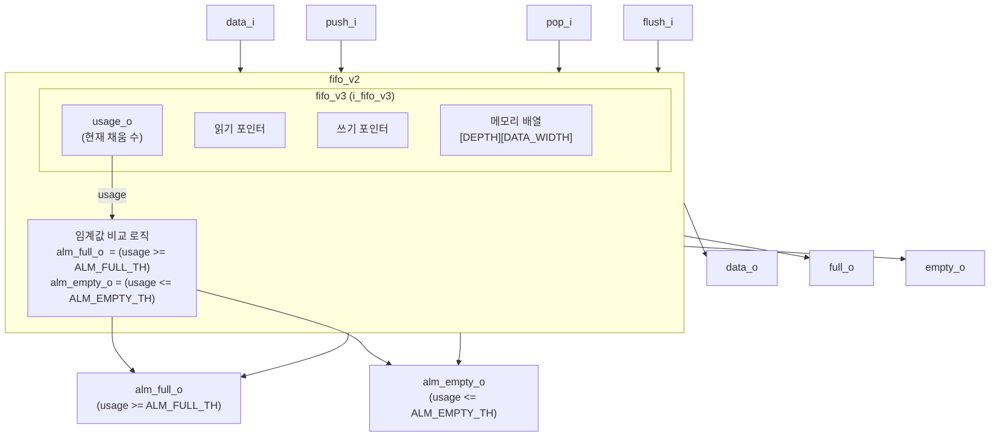

# fifo_v2.sv (Deprecated)

## 개요

`fifo_v2`는 Almost Full / Almost Empty 임계값 플래그를 추가로 제공하는 FIFO 모듈입니다. 내부적으로 `fifo_v3`를 인스턴스화하여 실제 FIFO 동작을 수행하며, `usage_o` 신호를 이용해 임계값 비교 로직을 추가합니다.

**Deprecated 이유:** `fifo_v2`의 기능은 `fifo_v3`에서 직접 제공되거나 더 깔끔한 인터페이스로 개선되었습니다. 신규 설계에서는 `fifo_v3`를 직접 사용할 것을 권장합니다.

**대안 모듈:** `fifo_v3`

---

## 블록 다이어그램

---

## 포트/파라미터

### 파라미터

| 파라미터명 | 타입 | 기본값 | 설명 |
|---|---|---|---|
| `FALL_THROUGH` | `bit` | `1'b0` | 풀스루 모드 |
| `DATA_WIDTH` | `int unsigned` | `32` | 데이터 비트 폭 |
| `DEPTH` | `int unsigned` | `8` | FIFO 깊이 |
| `ALM_EMPTY_TH` | `int unsigned` | `1` | Almost Empty 임계값 |
| `ALM_FULL_TH` | `int unsigned` | `1` | Almost Full 임계값 |
| `dtype` | `type` | `logic [DATA_WIDTH-1:0]` | 데이터 타입 |
| `ADDR_DEPTH` | `int unsigned` | `$clog2(DEPTH)` | 주소 비트 폭 (자동 계산, 오버라이드 금지) |

### 포트

| 포트명 | 방향 | 너비 | 설명 |
|---|---|---|---|
| `clk_i` | input | 1 | 클럭 |
| `rst_ni` | input | 1 | 비동기 액티브 로우 리셋 |
| `flush_i` | input | 1 | FIFO 전체 비우기 |
| `testmode_i` | input | 1 | 테스트모드 |
| `full_o` | output | 1 | FIFO 가득 참 표시 |
| `empty_o` | output | 1 | FIFO 비어 있음 표시 |
| `alm_full_o` | output | 1 | 채움 수 >= `ALM_FULL_TH` |
| `alm_empty_o` | output | 1 | 채움 수 <= `ALM_EMPTY_TH` |
| `data_i` | input | `dtype` | 푸시할 입력 데이터 |
| `push_i` | input | 1 | 데이터 푸시 요청 |
| `data_o` | output | `dtype` | 팝할 출력 데이터 |
| `pop_i` | input | 1 | 데이터 팝 요청 |

---

## 동작 설명

### 임계값 플래그

- `DEPTH == 0`인 경우: `alm_full_o`와 `alm_empty_o`는 모두 `1'b0`으로 고정됩니다 (의미 없음).
- `DEPTH > 0`인 경우:
  - `alm_full_o  = (usage >= ALM_FULL_TH)`
  - `alm_empty_o = (usage <= ALM_EMPTY_TH)`
  - `usage`는 `fifo_v3`의 `usage_o`에서 얻습니다.

### 파라미터 제약 (시뮬레이션 전용)

- `ALM_FULL_TH <= DEPTH` 이어야 합니다.
- `ALM_EMPTY_TH <= DEPTH` 이어야 합니다.
- 위반 시 `$error`로 경고합니다.

### 핵심 FIFO 동작

실제 FIFO 동작(읽기/쓰기 포인터, 메모리 배열, 풀스루 등)은 `fifo_v3`가 담당합니다.

---

## 의존성 및 관계

- **직접 의존:** `fifo_v3`
- **상위 모듈:** `fifo` (`fifo_v1.sv` 내의 래퍼)
- **대안 모듈:** `fifo_v3` — `usage_o`를 직접 사용하여 임계값 비교를 외부에서 처리하거나, 내장된 상태 플래그를 활용합니다.
