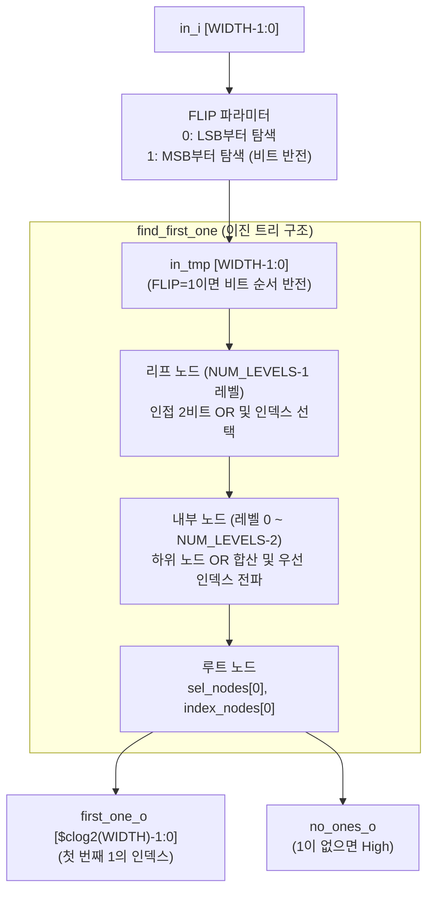

# find_first_one.sv (Deprecated)

## 개요

`find_first_one`은 입력 벡터에서 최초로 1이 나타나는 비트 위치(인덱스)를 찾는 조합 논리 모듈입니다. `FLIP` 파라미터에 따라 LSB 기준 첫 번째 1 탐색(find_first_one) 또는 MSB 기준 선행 0 카운터(leading zero counter) 두 가지 동작 모드를 지원합니다. 내부적으로 이진 트리 구조를 사용하여 효율적인 하드웨어를 생성합니다.

**Deprecated 이유:** 파일 상단 주석에 "Deprecated, use lzc unit instead."라고 명시되어 있습니다.

**대안 모듈:** `lzc` (Leading Zero Counter / Leading One Counter)

---

## 블록 다이어그램



---

## 포트/파라미터

### 파라미터

| 파라미터명 | 타입 | 기본값 | 설명 |
|---|---|---|---|
| `WIDTH` | `int` | `-1` (필수 지정) | 입력 벡터 비트 폭 |
| `FLIP` | `int` | `0` | 0: LSB 기준 첫 번째 1 탐색 / 1: MSB 기준 선행 0 카운트 |

### 포트

| 포트명 | 방향 | 너비 | 설명 |
|---|---|---|---|
| `in_i` | input | `WIDTH` | 탐색 대상 입력 벡터 |
| `first_one_o` | output | `$clog2(WIDTH)` | 첫 번째 1이 있는 비트 인덱스 |
| `no_ones_o` | output | 1 | 입력 벡터에 1이 하나도 없으면 High |

---

## 동작 설명

### FLIP 파라미터 동작

| `FLIP` 값 | 동작 | `first_one_o` 의미 |
|---|---|---|
| `0` | find_first_one | LSB 기준으로 처음 나타나는 1의 인덱스 |
| `1` | leading zero counter | MSB 기준으로 앞에 있는 0의 개수 (선행 0 카운트) |

`FLIP=1`이면 `in_tmp[i] = in_i[WIDTH-1-i]`로 비트 순서를 반전시켜 동일한 트리 구조로 두 가지 동작을 구현합니다.

### 이진 트리 구조

총 `NUM_LEVELS = $clog2(WIDTH)` 레벨의 이진 트리를 사용합니다.

- **리프 레벨 (`level == NUM_LEVELS-1`):** 인접한 두 입력 비트를 OR하여 선택(sel) 노드를 만들고, 1이 있는 쪽의 인덱스를 선택합니다.
- **내부 레벨:** 좌측 자식 노드에 1이 있으면 좌측 인덱스를, 없으면 우측 인덱스를 전파합니다.
- **루트 노드 (`index_nodes[0]`):** 최종 인덱스를 출력합니다.
- **경계 처리:** `WIDTH`가 2의 거듭제곱이 아닌 경우 범위를 벗어난 리프 노드는 `sel=0`, `index=0`으로 처리합니다.

### 에지 케이스

- `NUM_LEVELS == 0` (즉, `WIDTH == 1`)이면 `first_one_o = 0`, `no_ones_o = 1`로 고정됩니다.
- 시뮬레이션 시 `WIDTH >= 0` 조건을 `assert`로 검증합니다.

---

## 의존성 및 관계

- **의존 모듈:** 없음 (순수 조합 논리)
- **대안 모듈:** `lzc` — Leading Zero/One Counter 전용 모듈로, 동일한 기능을 표준화된 인터페이스로 제공합니다.

```sv
// lzc 사용 예시 (FLIP=0 대체 - 첫 번째 1 탐색)
lzc #(
  .WIDTH(WIDTH),
  .MODE(1'b0)  // 0: trailing zeros (LSB 기준), 1: leading zeros (MSB 기준)
) i_lzc (
  .in_i    ( in_i       ),
  .cnt_o   ( first_one_o ),
  .empty_o ( no_ones_o  )
);
```
