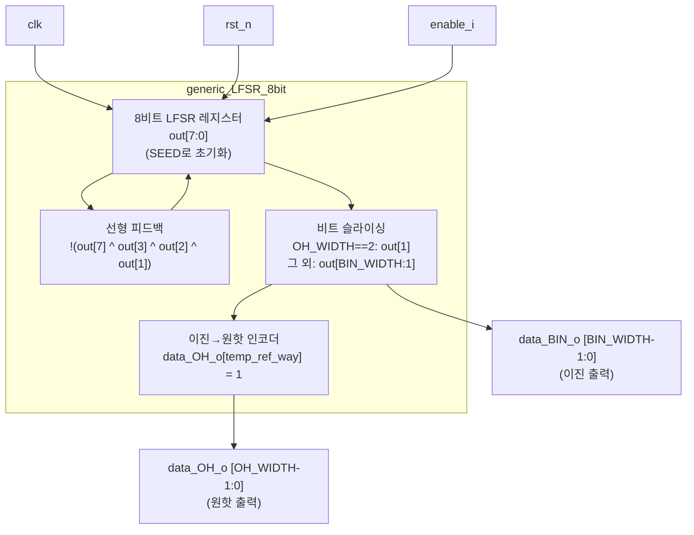

# generic_LFSR_8bit.sv (Deprecated)

## 개요

`generic_LFSR_8bit`는 8비트 LFSR(Linear Feedback Shift Register)을 기반으로 의사 난수(pseudo-random) 출력을 생성하는 모듈입니다. 출력은 이진(binary) 인코딩과 원핫(one-hot) 인코딩 두 가지 형태로 제공되며, 캐시 웨이(way) 선택 등의 랜덤 정책 구현에 활용됩니다.

**Deprecated 이유:** 8비트 고정 LFSR로 일반성이 부족하고, `OH_WIDTH`에 따른 비트 슬라이싱 방식(`out[BIN_WIDTH:1]`)이 파라미터 변화에 취약합니다. 또한 SEED가 0이면 LFSR이 고착(lock-up) 상태에 빠질 수 있습니다.

**대안 모듈:** `lfsr` (common_cells의 범용 LFSR 모듈)

---

## 블록 다이어그램



---

## 포트/파라미터

### 파라미터

| 파라미터명 | 타입 | 기본값 | 설명 |
|---|---|---|---|
| `OH_WIDTH` | `int` | `4` | 원핫 출력 비트 폭 (선택 가능한 후보 수) |
| `BIN_WIDTH` | `int` | `$clog2(OH_WIDTH)` | 이진 출력 비트 폭 (자동 계산) |
| `SEED` | `logic [7:0]` | `8'b00000000` | LFSR 초기값 (0이면 고착 주의) |

### 포트

| 포트명 | 방향 | 너비 | 설명 |
|---|---|---|---|
| `data_OH_o` | output | `OH_WIDTH` | 원핫 인코딩 출력 |
| `data_BIN_o` | output | `BIN_WIDTH` | 이진 인코딩 출력 |
| `enable_i` | input | 1 | LFSR 동작 활성화 (High일 때 매 클럭 갱신) |
| `clk` | input | 1 | 클럭 |
| `rst_n` | input | 1 | 비동기 액티브 로우 리셋 |

---

## 동작 설명

### LFSR 피드백 로직

탭(tap) 위치: bit[7], bit[3], bit[2], bit[1]

```
linear_feedback = !(out[7] ^ out[3] ^ out[2] ^ out[1])
```

매 클럭 사이클에 `enable_i`가 High이면 아래와 같이 시프트합니다.

```
out <= {out[6], out[5], out[4], out[3], out[2], out[1], out[0], linear_feedback}
```

### 출력 생성

- **이진 출력 (`data_BIN_o`):**
  - `OH_WIDTH == 2`인 경우: `out[1]` (1비트)
  - 그 외: `out[BIN_WIDTH:1]` (`BIN_WIDTH`비트 슬라이스)

- **원핫 출력 (`data_OH_o`):**
  - `data_BIN_o`(= `temp_ref_way`) 값에 해당하는 비트 위치만 1로 설정

### 주의 사항

| 항목 | 내용 |
|---|---|
| SEED = 0 | LFSR 고착 상태 발생 가능 (피드백이 항상 1이지만 레지스터 전체가 0이면 탈출 불가) |
| OH_WIDTH 범위 | LFSR 출력 범위(최대 255)가 `OH_WIDTH`보다 커야 유효한 인덱스를 생성할 수 있음 |
| 랜덤 균일성 | LFSR 특성상 균일하지 않을 수 있음 |

---

## 의존성 및 관계

- **의존 모듈:** 없음 (독립 모듈)
- **대안 모듈:** `lfsr` — common_cells에 포함된 범용 LFSR 모듈로, 다양한 비트 폭과 초기값을 유연하게 지원합니다.
