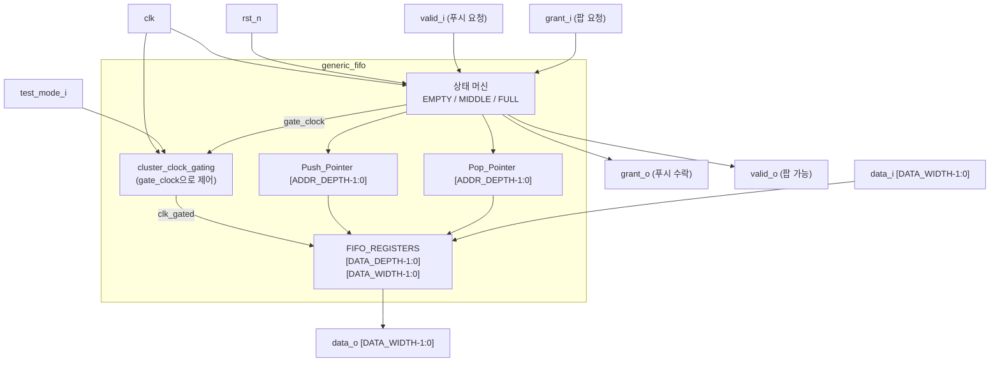

# generic_fifo.sv (Deprecated)

## 개요

`generic_fifo`는 PULP 플랫폼의 데이터 경로 구성 요소(D_address_decoder, D_allocator 등)에서 목적지 포트 정보를 저장하기 위해 설계된 범용 FIFO 모듈입니다. valid/grant 핸드셰이크 인터페이스를 사용하며, 클럭 게이팅(clock gating)을 통한 저전력 동작을 지원합니다.

**Deprecated 이유:** PULP 특정 클럭 게이팅 셀(`cluster_clock_gating`)에 의존하고, 상태 머신 기반 구현으로 `fifo_v3` 대비 복잡성이 높습니다. 신규 설계에서는 표준 인터페이스를 제공하는 `fifo_v3` 사용을 권장합니다.

**대안 모듈:** `fifo_v3`

---

## 블록 다이어그램



---

## 포트/파라미터

### 파라미터

| 파라미터명 | 타입 | 기본값 | 설명 |
|---|---|---|---|
| `DATA_WIDTH` | `int unsigned` | `32` | 데이터 비트 폭 (최소 1) |
| `DATA_DEPTH` | `int unsigned` | `8` | FIFO 깊이 (최소 1) |

### 포트

| 포트명 | 방향 | 너비 | 설명 |
|---|---|---|---|
| `clk` | input | 1 | 클럭 |
| `rst_n` | input | 1 | 비동기 액티브 로우 리셋 |
| `data_i` | input | `DATA_WIDTH` | 푸시할 입력 데이터 |
| `valid_i` | input | 1 | 푸시 요청 (데이터 유효) |
| `grant_o` | output | 1 | 푸시 수락 (FIFO가 가득 차지 않음) |
| `data_o` | output | `DATA_WIDTH` | 팝할 출력 데이터 |
| `valid_o` | output | 1 | 팝 가능 (FIFO가 비어 있지 않음) |
| `grant_i` | input | 1 | 팝 요청 (데이터 소비 준비) |
| `test_mode_i` | input | 1 | 테스트모드 (클럭 게이팅 우회) |

---

## 동작 설명

### 상태 머신

| 상태 | `grant_o` | `valid_o` | 설명 |
|---|---|---|---|
| `EMPTY` | 1 | 0 | FIFO 비어 있음, 쓰기 가능 |
| `MIDDLE` | 1 | 1 | 일부 데이터 있음, 읽기/쓰기 모두 가능 |
| `FULL` | 0 | 1 | FIFO 가득 참, 읽기만 가능 |

### 상태 전이

```
EMPTY  + valid_i=1                              → MIDDLE (푸시)
MIDDLE + valid_i=1, grant_i=0 (마지막 슬롯)    → FULL
MIDDLE + valid_i=0, grant_i=1 (마지막 데이터)  → EMPTY
FULL   + grant_i=1                              → MIDDLE (팝)
```

### 포인터 관리

- Push/Pop 포인터는 `DATA_DEPTH`에서 순환(wrap-around)합니다.
- `DATA_DEPTH-1`에 도달하면 0으로 리셋됩니다.

### 클럭 게이팅

- 불필요한 메모리 쓰기를 방지하기 위해 `gate_clock` 신호로 `cluster_clock_gating`을 제어합니다.
- `EMPTY` 상태에서 `valid_i=0`이거나, `MIDDLE`에서 쓰기/읽기 없을 때, `FULL` 상태에서 클럭이 게이팅됩니다.
- FPGA 에뮬레이션(`PULP_FPGA_EMUL`)에서는 클럭 게이팅 없이 `clk`를 직접 사용합니다.

### 파라미터 검증 (시뮬레이션)

- `DATA_WIDTH < 1` 또는 `DATA_DEPTH < 1`이면 `$display`로 오류를 출력합니다.

---

## 의존성 및 관계

| 하위 모듈 | 역할 |
|---|---|
| `cluster_clock_gating` | 저전력 클럭 게이팅 셀 (`PULP_FPGA_EMUL` 미정의 시) |

- **유사 모듈:** `generic_fifo_adv` — `clear_i` 포트(동기 클리어)가 추가된 확장 버전
- **대안 모듈:** `fifo_v3` — push/pop 인터페이스를 사용하는 표준화된 FIFO
