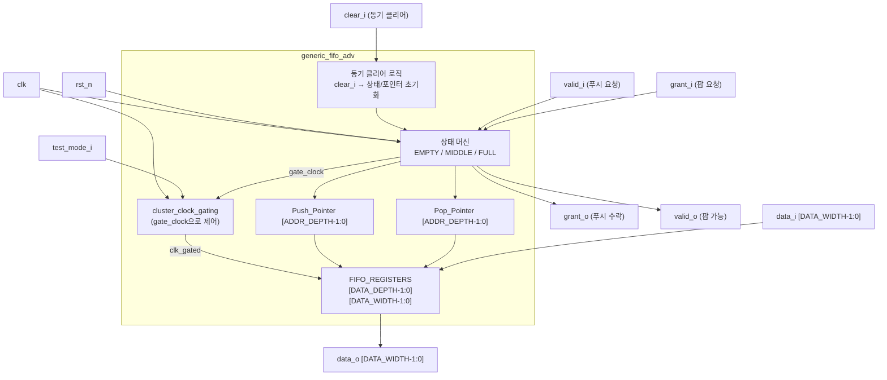

# generic_fifo_adv.sv (Deprecated)

## 개요

`generic_fifo_adv`는 `generic_fifo`의 확장 버전으로, 동기 클리어(`clear_i`) 포트가 추가된 고급(advanced) FIFO 모듈입니다. `clear_i`를 통해 리셋 없이도 FIFO 상태를 즉시 초기화할 수 있습니다. 나머지 동작(valid/grant 핸드셰이크, 클럭 게이팅, 상태 머신)은 `generic_fifo`와 동일합니다.

**Deprecated 이유:** `generic_fifo`와 마찬가지로 PULP 특정 클럭 게이팅 셀(`cluster_clock_gating`)에 의존하며, `fifo_v3`의 `flush_i` 포트로 동일한 기능을 더 표준화된 인터페이스로 대체할 수 있습니다.

**대안 모듈:** `fifo_v3` (`flush_i` 포트 사용)

---

## 블록 다이어그램



---

## 포트/파라미터

### 파라미터

| 파라미터명 | 타입 | 기본값 | 설명 |
|---|---|---|---|
| `DATA_WIDTH` | `int unsigned` | `32` | 데이터 비트 폭 (최소 1) |
| `DATA_DEPTH` | `int unsigned` | `8` | FIFO 깊이 (최소 1) |

### 포트

| 포트명 | 방향 | 너비 | 설명 |
|---|---|---|---|
| `clk` | input | 1 | 클럭 |
| `rst_n` | input | 1 | 비동기 액티브 로우 리셋 |
| `clear_i` | input | 1 | 동기 클리어 (`1`이면 다음 클럭에서 FIFO 초기화) |
| `data_i` | input | `DATA_WIDTH` | 푸시할 입력 데이터 |
| `valid_i` | input | 1 | 푸시 요청 (데이터 유효) |
| `grant_o` | output | 1 | 푸시 수락 (FIFO 여유 있음) |
| `data_o` | output | `DATA_WIDTH` | 팝할 출력 데이터 |
| `valid_o` | output | 1 | 팝 가능 (FIFO에 데이터 있음) |
| `grant_i` | input | 1 | 팝 요청 |
| `test_mode_i` | input | 1 | 테스트모드 (클럭 게이팅 우회) |

---

## 동작 설명

### `generic_fifo`와의 차이점: 동기 클리어

```sv
always_ff @(posedge clk, negedge rst_n) begin
    if (!rst_n) begin
        CS              <= EMPTY;
        Pop_Pointer_CS  <= 0;
        Push_Pointer_CS <= 0;
    end else begin
        if (clear_i) begin
            CS              <= EMPTY;   // 동기 클리어
            Pop_Pointer_CS  <= 0;
            Push_Pointer_CS <= 0;
        end else begin
            CS              <= NS;
            Pop_Pointer_CS  <= Pop_Pointer_NS;
            Push_Pointer_CS <= Push_Pointer_NS;
        end
    end
end
```

- `rst_n`은 비동기 리셋, `clear_i`는 동기 클리어입니다.
- `clear_i`가 High이면 상태 머신과 포인터를 모두 `EMPTY` 상태로 초기화합니다.
- 메모리 배열(`FIFO_REGISTERS`) 내용은 클리어되지 않지만, 포인터가 초기화되므로 이전 데이터에는 접근할 수 없습니다.

### 상태 머신 (generic_fifo와 동일)

| 상태 | `grant_o` | `valid_o` | 설명 |
|---|---|---|---|
| `EMPTY` | 1 | 0 | FIFO 비어 있음 |
| `MIDDLE` | 1 | 1 | 일부 데이터 있음 |
| `FULL` | 0 | 1 | FIFO 가득 참 |

### 클럭 게이팅

- `generic_fifo`와 동일하게 `cluster_clock_gating`을 사용하여 메모리 쓰기 클럭을 게이팅합니다.
- FPGA 에뮬레이션(`PULP_FPGA_EMUL`)에서는 게이팅 없이 `clk` 직접 사용합니다.

---

## 의존성 및 관계

| 하위 모듈 | 역할 |
|---|---|
| `cluster_clock_gating` | 저전력 클럭 게이팅 셀 |

- **유사 모듈:** `generic_fifo` — `clear_i` 포트 없는 기본 버전
- **대안 모듈:** `fifo_v3` — `flush_i` 포트로 동기 플러시 기능 제공
