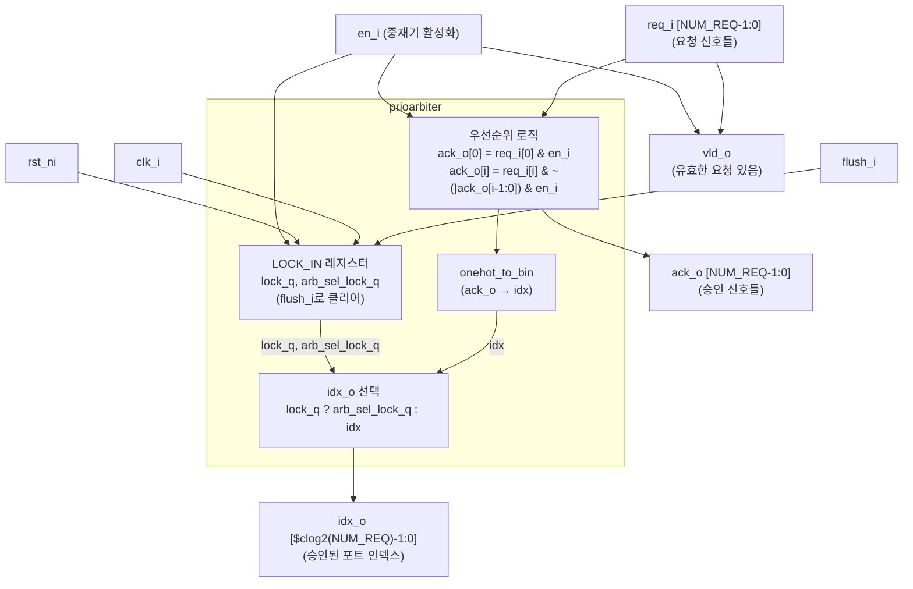

# prioarbiter.sv (Deprecated)

## 개요

`prioarbiter`는 고정 우선순위 중재기(fixed-priority arbiter) 모듈입니다. 포트 0이 가장 높은 우선순위를 가지며, 포트 번호가 높아질수록 우선순위가 낮아집니다. 선택적으로 `LOCK_IN` 기능을 활성화하면 `en_i`가 Low일 때 직전 중재 결정을 유지합니다.

**Deprecated 이유:** `onehot_to_bin` 모듈에 의존하며, 동일한 기능을 `rr_arb_tree`를 기반으로 더 유연하게 구현할 수 있습니다.

**대안 모듈:** `rr_arb_tree` (우선순위 모드 지원 가능), `prio_mux`

---

## 블록 다이어그램



---

## 포트/파라미터

### 파라미터

| 파라미터명 | 타입 | 기본값 | 설명 |
|---|---|---|---|
| `NUM_REQ` | `int unsigned` | `13` | 요청 포트 수 |
| `LOCK_IN` | `int unsigned` | `0` | 1이면 `en_i=0`일 때 이전 중재 결과를 래치 |

### 포트

| 포트명 | 방향 | 너비 | 설명 |
|---|---|---|---|
| `clk_i` | input | 1 | 클럭 |
| `rst_ni` | input | 1 | 비동기 액티브 로우 리셋 |
| `flush_i` | input | 1 | FSM 및 락 레지스터 클리어 |
| `en_i` | input | 1 | 중재기 활성화 (`0`이면 승인 없음) |
| `req_i` | input | `NUM_REQ` | 요청 신호 배열 (비트 0이 최고 우선순위) |
| `ack_o` | output | `NUM_REQ` | 승인 신호 배열 |
| `vld_o` | output | 1 | 유효한 요청이 있고 중재기가 활성화되어 있음 |
| `idx_o` | output | `$clog2(NUM_REQ)` | 승인된 포트 인덱스 |

---

## 동작 설명

### 우선순위 로직

조합 논리로 구현되며, 포트 0이 가장 높은 우선순위를 가집니다.

```sv
assign ack_o[0] = req_i[0] ? en_i : 1'b0;
// i >= 1: 낮은 번호의 포트 중 하나라도 승인된 경우 현재 포트는 승인 안 됨
assign ack_o[i] = (req_i[i] & ~(|ack_o[i-1:0])) ? en_i : 1'b0;
```

### 유효 신호

```sv
assign vld_o = (|req_i) & en_i;
```

요청이 하나라도 있고 중재기가 활성화된 경우 High입니다.

### LOCK_IN 기능 (LOCK_IN=1 시 활성화)

| 조건 | 동작 |
|---|---|
| `(|req_i) & ~en_i` | 이전 인덱스를 `arb_sel_lock_q`에 래치, `lock_q` High |
| `flush_i` | `lock_q`, `arb_sel_lock_q` 모두 0으로 클리어 |
| `lock_q = 1` | `idx_o = arb_sel_lock_q` (래치된 이전 결과 출력) |
| `lock_q = 0` | `idx_o = idx` (현재 중재 결과 출력) |

LOCK_IN=0이면 `lock_d`, `arb_sel_lock_d`는 항상 0으로 고정됩니다.

### 인덱스 변환

`onehot_to_bin` 모듈을 사용하여 원핫 인코딩된 `ack_o`를 이진 인덱스 `idx`로 변환합니다.

---

## 의존성 및 관계

| 하위 모듈 | 역할 |
|---|---|
| `onehot_to_bin` | 원핫 인코딩 ACK를 이진 인덱스로 변환 |

- **유사 모듈:** `rrarbiter` — 라운드 로빈 방식의 공정 중재기
- **대안 모듈:** `rr_arb_tree` — 라운드 로빈 기반이지만 정적 우선순위 설정도 지원, `prio_mux`
